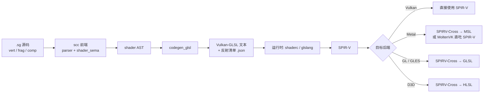

## sc 图形着色扩展手册（syntax-g）

本手册是 [syntax.md](syntax.md)（sc 语言主手册）的**独立配套文档**，专门描述 sc 的
GPU / 着色器（shader）开发扩展。定位与主手册一致——既是**参考规范**，也是**演进路线图**；
但 shader 扩展作为独立特性单独维护，避免与语言核心混为一谈。

> **当前状态（重要）**
>
> 本文档描述的是**设计方案与路线图**，shader 扩展尚未实现（Beta 0.9 未含）。文中语法为
> **提案**，标注「（待定）」处表示实现前仍可调整。已确定的架构决策（中枢 IR、一期产物、
> 后端选型、模块划分）已在下文明确记录，作为落地时的一致依据。

> **两条硬约束（贯穿全文）**
>
> 1. **语言仍是 sc**：不引入新语言。shader 是 sc 的一个**方言子集**——复用 sc 的词法、
>    parser、类型系统与模块机制，只增加 stage 关键字、向量/矩阵类型与资源绑定语义。
> 2. **能力对齐 SPIR-V**：SPIR-V（Khronos 着色器中枢 IR）支持什么，sc-shader 才开放什么。
>    这是「反向裁剪」——不是先设计语言再找后端，而是以 SPIR-V 能力集为上界，用语义分析 +
>    语法插件把 sc 在 shader 语境下**收窄**到可安全下译的子集。

---

## 1. 设计原则

- **中枢 IR 是 SPIR-V**。整个着色器工具链在业界已收敛到 SPIR-V 作为交换格式；sc 不重新发明，而是把它当作事实标准的目标中枢（与 sc→C99→系统 cc 的哲学同构：生成中间表示，交给成熟后端）。
- **一期产物是 Vulkan-GLSL 文本**，而非直接发射 SPIR-V 二进制。理由见 §2、§11。
- **Mac 优先**：作者主力平台为 macOS，Metal 后端优先级高于 D3D/GLES。落地路径见 §2.3。
- **零运行时膨胀**：一期 scc 不链接任何 shader 库；SPIR-V 编译交给**运行时**的
  glslang/shaderc（见 §10）。
- **子集而非超集**：shader 方言是 sc 的严格子集——禁用堆分配、裸/自动指针、递归、函数指针
  等 GPU 无法表达的构造（见 §4、§9）。

### 1.1 技术栈边界（自研 vs 开源）

**一句话**：前端全自研；后端自研到 GLSL 文本发射（二期可延伸到 SPIR-V 发射），GLSL→SPIR-V
及 SPIR-V→各后端全部用成熟开源件（glslang/shaderc/SPIRV-Cross/MoltenVK），**后端不重复造轮子**。

| 层 | 归属 | 对应件 | 理由 |
|----|------|--------|------|
| 词法 / 语法 / 语义 | **自研** | lexer / parser / `shader_sema` | 复用 sc 现有前端，这是「语言是 sc」的根本 |
| codegen（sc AST → Vulkan-GLSL 文本） | **自研** | `codegen_glsl.cpp` | 「sc→GLSL 的映射」无现成件可做；但仅文本发射，复杂度与现有 `codegen_c.cpp` 同级 |
| GLSL 文本 → SPIR-V | **开源** | glslang / shaderc | 跟踪整个 GLSL/SPIR-V 规范的成熟编译器，自研 = 数年工作 + 永久维护负担 |
| SPIR-V → MSL / HLSL / GLSL | **开源** | SPIRV-Cross | 各后端绑定/精度/寄存器怪癖已被它解决 |
| Vulkan+SPIR-V → Metal（运行时） | **开源** | MoltenVK | Mac 落地，无需自研 |

这就是 sc 现有架构照搬到 GPU：sc 现在自研 前端 + `codegen_c`（sc→C 文本）→ 交给系统 C 编译器
（gcc/clang）；shader 则自研 前端 + `codegen_glsl`（sc→GLSL 文本）→ 交给着色器工具链
（glslang+SPIRV-Cross）。glslang/SPIRV-Cross 就是 GLSL/SPIR-V 世界里的「gcc」。

两点澄清：

- **二期 `codegen_spirv`（sc→SPIR-V 二进制直发）算自研后端**，但它可选、为拿更强的语义/优化
  控制而设；**即便做了它，SPIR-V→各后端的扇出仍用 SPIRV-Cross**——自研范围最多到「发射
  SPIR-V」，绝不下探到跨后端翻译。
- **开源依赖不污染 sc「转 C、少依赖」的定位**：一期按 §10，glslang/shaderc 是**应用的运行时
  依赖**，不是 `scc` 的链接依赖——`scc` 一期零 shader 库依赖，产物仍是干净的 GLSL 文本 +
  反射清单。

---

## 2. 编译管线与路线

### 2.1 一期管线（sc → Vulkan-GLSL 文本）



关键点：**scc 只负责到「Vulkan-GLSL 文本 + 反射清单」为止**。SPIR-V 生成与跨后端扇出全部
交给成熟的开源件（glslang / shaderc / SPIRV-Cross），sc 一个后端都不用自己写。

### 2.2 二期管线（sc → SPIR-V 直发）

成熟后，`codegen_spirv` 模块直接发射 SPIR-V 二进制，跳过文本 GLSL，获得更强的语义控制与
优化空间（例如 sc 特有的类型/约束信息可直接编码为 SPIR-V decoration）。文本 GLSL 后端
保留作为可读产物与调试通道。

### 2.3 Mac 优先的落地路径

macOS 无原生 Vulkan，两条推荐路径（一期均可用，运行时侧集成，scc 无差别）：

| 路径 | 链路 | 适用 |
|------|------|------|
| **MoltenVK（推荐用于开发）** | Vulkan-GLSL → SPIR-V →（MoltenVK 运行时翻译）→ Metal | 一套 Vulkan 代码直接在 Metal 上跑，零额外离线转译 |
| **SPIRV-Cross → MSL（推荐用于发行）** | Vulkan-GLSL → SPIR-V → SPIRV-Cross → MSL → Metal 编译 | 产出原生 `.metal`/`.metallib`，无 MoltenVK 依赖 |

远期可加 `codegen_msl` 直接产 MSL（跳过 SPIRV-Cross），但一期不做。

### 2.4 文件模型与扩展名 `.sg`

shader 代码放在**独立的 `.sg` 文件**（sc graphics），**不与宿主 `.sc`（编向 C）混编**；
一个 `.sg` 文件内可**混编多个 stage**（vert/frag/comp）+ 辅助函数 + 共享类型，stage 由
关键字标出入口。这与现代着色语言的共识一致：

| 语言 | 文件 | stage 区分 | 与宿主混编 |
|------|------|-----------|-----------|
| GLSL（传统） | `.vert` / `.frag` 各一 | **靠扩展名** | 否 |
| HLSL | 单个 `.hlsl` | 多入口函数 | 否 |
| Metal | 单个 `.metal` | `vertex`/`fragment`/`kernel` 限定词 | 否 |
| WGSL | 单个 `.wgsl` | `@vertex`/`@fragment`/`@compute` | 否 |
| Slang | 单个 `.slang` | `[shader("vertex")]` 属性 | 否 |
| **sc** | **单个 `.sg`** | **`vert`/`frag`/`comp` 关键字** | **否** |

**扩展名与关键字职责不同，二者不冗余**：
- `.sg` 扩展名 → 编译器/编辑器识别「整文件是 shader 方言」，路由到 `codegen_glsl`、全文件
  套用 §9 子集规则、LSP 用 shader 语义。
- `vert`/`frag`/`comp` 关键字 → 在文件内标出**哪个函数是入口**（一个 `.sg` 可含多个入口）。

这正是 Metal 的模型（`.metal` 扩展名已确定是 shader 文件，函数前照样写 `vertex`/`kernel`
限定词）。**只有传统 GLSL「一个 `.vert` 一个 `.frag`」的模型才让 stage 关键字冗余**——而它
还强行拆开几乎总要共享同一 varying 结构体（`VsOut`）的 vert 与 frag，故不采用。

**为何不选 host + shader 同文件混编**：一个 TU 同时产出 C 与 GLSL 两种目标、语义域要在文件
内劈开，复杂度陡增；且无主流生态如此做；类型共享用共享模块即可达成（见下）。

**host↔shader 类型共享**：宿主 `.sc` 与着色 `.sg` 各自 `inc` 同一个**共享 `@def` 模块**——
host 侧编成 C 结构体、shader 侧编成 GLSL block，编译期校验 std140 偏移一致（见 §7）。分文件
不妨碍共享，边界反而更干净。

---

## 3. 顶层语法：stage 关键字

`vert` / `frag` / `comp` 是与 `fnc` / `rpc` 平级的**新顶层关键字**，声明着色器阶段入口
（位于 `.sg` 文件，一个文件可混编多个 stage，见 §2.4）：

| 关键字 | 阶段 | SPIR-V ExecutionModel | GLSL 阶段 |
|--------|------|----------------------|-----------|
| `vert` | 顶点着色 | Vertex | `.vert` |
| `frag` | 片元着色 | Fragment | `.frag` |
| `comp` | 计算着色 | GLCompute | `.comp` |

阶段入口形似函数，但语义受限（无副作用堆操作、参数即阶段 I/O）：

```
# —— 提案语法（待定）——

# 顶点属性输入（按 location 绑定到顶点缓冲）
@def VsIn: {
    pos: vec3   loc 0
    uv:  vec2   loc 1
}

# 传给片元阶段的 varying（内建 position + 自定义插值量）
@def VsOut: {
    clip: vec4   builtin position   # → gl_Position / SV_Position / [[position]]
    uv:   vec2
}

# uniform 块（set/binding 绑定；见 §6）
@def Camera: { mvp: mat4 }   uniform set 0 binding 0

vert vs_main: VsOut, in: VsIn
    var o: VsOut
    o.clip = Camera.mvp * vec4(in.pos, 1.0)
    o.uv = in.uv
    return o

frag fs_main: vec4, in: VsOut
    return texture(albedo, in.uv)
```

> `loc N` / `builtin X` / `uniform set..binding..` 的**属性附着语法待定**。sc 的 `@` 前缀已
> 用于导出（见主手册 §8），故 shader 属性倾向用**后缀限定词**（如上）或专门的属性括号语法，
> 具体在实现前定稿。此处仅示意语义。

---

## 4. shader 类型系统（SPIR-V 能力子集）

在 shader 语境下，sc 的类型系统按 SPIR-V 能力**收窄并扩展**：

### 4.1 新增：向量 / 矩阵

| sc 类型 | 含义 | GLSL |
|---------|------|------|
| `vec2/3/4` | f4 向量 | `vec2/3/4` |
| `ivec2/3/4` | i4 向量 | `ivec*` |
| `uvec2/3/4` | u4 向量 | `uvec*` |
| `bvec2/3/4` | bool 向量 | `bvec*` |
| `mat2/3/4` | f4 方阵 | `mat*` |
| `mat3x4` 等 | 非方阵 | `matCxR` |

- **Swizzle**：`v.xyz` / `v.rgba` / `v.st`（读写皆可，遵循 GLSL 规则）。
- **构造**：`vec4(v3, 1.0)`、`vec3(1.0)`（标量广播）。
- 标量沿用 sc：`f4`(float) / `i4`(int) / `u4`(uint) / `bool`；`f8`(double) 仅在后端支持
  时开放（SPIR-V `Float64` 能力，多数移动 GPU 不支持——语义分析按目标裁剪）。

### 4.2 新增：不透明资源类型

`sampler2D` / `sampler3D` / `samplerCube` / `image2D` / `texture2D` + `sampler` 等
（对齐 Vulkan-GLSL / SPIR-V 的分离式 texture+sampler 模型）。

### 4.3 禁用（GPU 无法表达）

- 堆分配、`chunk`/`recycle`、`mem` 模块。
- 裸指针 `T&`、自动指针 `T@`/`object@`、瘦指针 `T*`、单例指针 `T@1`。
- 递归、函数指针字段、`rpc`、`async`、可变参数。
- 大部分 C 互通 `::`（除非映射到 GPU 内置）。

违反即**编译期报错**，报错信息指明「shader 方言不支持 X」（见 §9）。

---

## 5. 阶段 I/O 与 varying

阶段间数据流用**结构体**表达（比 GLSL 的全局 `in`/`out` 更结构化）：

- **顶点属性**：`vert` 入参结构体，字段带 `loc N` → GLSL `layout(location=N) in`。
- **varying**：`vert` 返回结构体 → 下译为 `out` block；`frag` 同名入参 → `in` block，
  location 自动配对。
- **内建变量映射**（跨后端由 SPIRV-Cross 处理，sc 只需标注语义）：

| sc 标注 | GLSL | HLSL | MSL |
|---------|------|------|-----|
| `builtin position` | `gl_Position` | `SV_Position` | `[[position]]` |
| `builtin vertex_id` | `gl_VertexIndex` | `SV_VertexID` | `[[vertex_id]]` |
| `builtin frag_coord` | `gl_FragCoord` | `SV_Position` | `[[position]]` |
| `builtin frag_depth` | `gl_FragDepth` | `SV_Depth` | `[[depth]]` |

---

## 6. 资源绑定

对齐 Vulkan 描述符模型（descriptor set / binding）：

- **Uniform 块**：`@def X: {...} uniform set S binding B` → `layout(set=S, binding=B) uniform`。
- **Storage 块（SSBO）**：`... storage set S binding B` → `buffer`。
- **Push constant**：`... push` → `layout(push_constant)`。
- **纹理/采样器**：`albedo: sampler2D  set S binding B`。

内存布局：uniform 默认 `std140`，storage 默认 `std430`；由 codegen 显式发射
`layout(std140/std430)`，并在反射清单里导出每字段偏移（供 §7 校验）。

---

## 7. CPU↔GPU 数据共享（`@def` 复用，opt-in）

**决策：默认分开**（CPU 侧 `@def` 与 shader 侧类型互不可见），**但对 uniform/SSBO 结构体
提供可选的「共享布局」能力**。

**为什么值得提供**：shader 开发最高频、最难查的一类 bug 是——CPU 侧上传 uniform 的 C 结构体
与 GPU 侧 shader 里的 block 声明，二者 `std140/std430` 字节偏移不一致（错位后画面错乱但不
报错、不崩溃）。让**同一份 `@def` 同时生成 C 布局和 GLSL block**，编译期校验偏移一致，能从
根上消灭它——这是 GLSL/HLSL 手写做不到、而 sc（同时能编 CPU 和 GPU）天然能做的差异化价值。

一期先把语法「门」留好、默认分开；共享作为二期特性：

```
# —— 提案（二期）——
@def Camera: { mvp: mat4; eye: vec3; _pad: f4 }  shared uniform binding 0
# scc 同时产出：
#   · C 侧 struct sc_Camera（供 CPU 填充上传）
#   · GLSL uniform block（供 shader 使用）
#   · 编译期断言两者 std140 偏移逐字段一致，否则报错
```

---

## 8. 内置函数库

shader 内置函数映射到各后端的原生内置（由 codegen 转名，SPIRV-Cross 保证跨后端一致）：

- **数学**：`dot` / `cross` / `normalize` / `length` / `mix` / `clamp` / `pow` / `min` /
  `max` / `abs` / `floor` / `fract` / `mod` …
- **纹理**：`texture(sampler, uv)` / `textureLod` / `texelFetch` …
- **导数（frag）**：`dFdx` / `dFdy` / `fwidth`。
- **计算（comp）**：`barrier` / `groupMemoryBarrier` / 内建 `gl_GlobalInvocationID` 等。

考虑作为 shader 专属 builtins 模块（如 `builtins/shader/` 或 `templates/shader/`）暴露给
用户，声明这些内置的 sc 签名 + 到 GLSL 内置的桥接（细节待定）。

---

## 9. 语义限制与语法插件

按 Q4 决策——**SPIR-V 支持什么，sc-shader 才开放什么**，用两层机制强制：

1. **语义分析层（`shader_sema`）**：在 stage 函数体内做子集检查——遇到禁用构造（堆/指针/
   递归/rpc/…）即报错，报错文案对齐主手册「零误报」风格，明确指出「shader 方言不支持」。
   向量/矩阵/资源类型的类型检查、swizzle 合法性、stage I/O 配对、binding 冲突检测均在此。
2. **语法插件（vscode-sc / vscode-sc-ast）**：在 shader 上下文中高亮 stage 关键字、
   向量类型、内建变量，并对禁用构造给出编辑期提示（与编译期一致，早失败）。

---

## 10. 运行时集成

按 Q3 决策——**一期运行时嵌 glslang/shaderc 动态编译**，scc 只产文本：

- scc 产物：每个 stage 一份 `.vert/.frag/.comp` GLSL 文本 + 一份**反射清单**（JSON）：
  stage 类型、入口名、各 uniform/纹理的 set/binding、顶点属性 location、uniform 布局偏移。
- 运行时：应用链接 `libshaderc`（或 glslang），加载时把 GLSL 文本编成 SPIR-V，按反射清单
  建立管线绑定；Mac 上再经 MoltenVK 或 SPIRV-Cross→MSL 落到 Metal（见 §2.3）。
- scc 一期**完全不碰 SPIR-V 二进制**，也不链接任何 shader 库——保持单二进制、零膨胀。

---

## 11. 与业界方案的关系

按 Q5 决策——**有成熟方案就不重新发明轮子**：

| 方案 | 角色 | sc 的取用 |
|------|------|-----------|
| **SPIR-V** | 中枢 IR | 直接作为目标中枢 |
| **glslang / shaderc** | GLSL→SPIR-V | 运行时依赖（一期） |
| **SPIRV-Cross** | SPIR-V→MSL/GLSL/HLSL | 跨后端扇出，尤其 Mac 的 MSL |
| **MoltenVK** | Vulkan+SPIR-V→Metal（运行时） | Mac 开发期首选 |
| **Slang** | 「一语言多后端」着色语言（Khronos 托管） | **借鉴其资源/参数模型概念**；远期可作**可选后端**（sc→Slang 白嫖其 autodiff/泛型多后端），一期不依赖 |
| **WGSL** | WebGPU 着色语言 | 参照其可移植子集；能力被 WebGPU 最小公共集限制，非一期目标 |

**为何一期选 Vulkan-GLSL 而非直连 Slang/SPIR-V**：Vulkan-GLSL 是 glslang/SPIRV-Cross 直接
消费的格式、文本可读可调试、工作量最小，完全复刻 sc「先产文本、后接成熟工具」的既有哲学。
Slang 的 autodiff/泛型多后端很诱人，但引入它是一个大依赖，留待远期评估。

---

## 12. 编译器模块划分

按用户要求——**shader 相关功能独立成模块，被整合而非混入现有文件**。落地时的模块规划：

| 模块 | 职责 | 关系 |
|------|------|------|
| `lexer.cpp`（既有，微改） | 新增 `vert`/`frag`/`comp` 及向量类型关键字 token | 仅加 token，主体不变 |
| `parser.cpp`（既有，挂钩） | stage 顶层声明的解析入口，转调 shader 专属解析 | 只加一个分发钩子 |
| `shader_ast.h`（新） | shader 专属 AST 节点（stage 入口、向量/矩阵类型、绑定属性、swizzle） | 独立头，最小侵入 ast.h |
| `shader_sema.cpp/.h`（新） | shader 方言子集强制、类型检查、stage I/O 配对、binding 冲突检测 | 独立于 semantic.cpp |
| `codegen_glsl.cpp/.h`（新） | shader AST → Vulkan-GLSL 文本 + 反射清单 | 独立于 codegen_c.cpp |
| `codegen_spirv.cpp/.h`（新，二期） | shader AST → SPIR-V 二进制直发 | 二期 |
| `codegen_msl.cpp/.h`（新，远期） | 直产 MSL（跳过 SPIRV-Cross） | 远期 |

**整合方式**：`main.cpp` 按**文件扩展名**分派——`.sg` 走 shader 子管线
（`shader_sema` → `codegen_glsl`），`.sc` 走现有 sc→C 管线，二者并列而非交织；共享
lexer/parser 基础设施但各自的语义/代码生成完全独立。CMakeLists 相应新增这些独立编译单元。

---

## 13. 路线图

### 13.1 一期（最小可用）
- `vert`/`frag` 关键字 + `vec/mat` 类型 + swizzle + stage I/O 结构体。
- `codegen_glsl`：产 Vulkan-GLSL 文本 + 反射清单。
- `shader_sema`：子集强制 + 基础类型检查。
- 运行时侧样例（templates/demo）：GLSL 文本经 shaderc→SPIR-V→MoltenVK 在 Mac 上跑通一个
  三角形/纹理四边形。

### 13.2 二期
- `comp` 计算着色器 + storage/SSBO。
- `@def` 共享布局（CPU↔GPU uniform 一致性校验，见 §7）。
- `codegen_spirv`：SPIR-V 直发。
- SPIRV-Cross→MSL 离线路径（发行用原生 Metal）。

### 13.3 远期
- `codegen_msl` 直产 MSL。
- 评估 Slang 作为可选后端（autodiff/泛型多后端）。
- 与 sc 的 `tok` 依赖图 / dnn 模板联动（compute shader 加速训练？——研究向）。

---

## 14. 当前未决 / 待定

- shader 属性附着语法（`loc`/`builtin`/`uniform` 的确切写法，见 §3）。
- 向量/矩阵类型是内置关键字还是 shader builtins 模块提供（见 §4、§8）。
- 反射清单 JSON 的确切 schema。
- 是否需要一个「主机侧」sc 运行时封装（把 shaderc/MoltenVK 调用包成 sc 模块），还是留给
  用户在 C 侧自行集成。
- 计算着色器与 sc `tok`/dnn 体系的结合边界（远期研究）。
