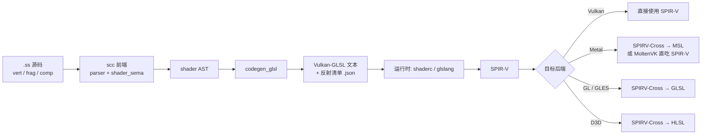
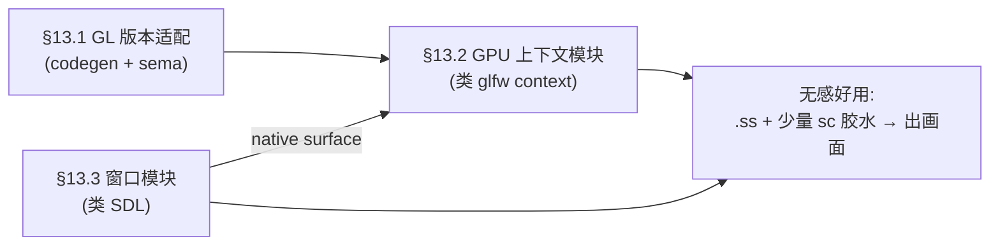

## sc 空间计算扩展手册（syntax-s）

本手册是 [syntax.md](syntax.md)（sc 语言主手册）的**独立配套文档**，专门描述 sc 的
GPU **空间计算**（渲染着色 + 并行计算）开发扩展。定位与主手册一致——既是**参考规范**，
也是**演进路线图**；但作为独立特性单独维护，避免与语言核心混为一谈。

> **命名旨趣（syntax-g → syntax-s）**
>
> sc 的 **s = space（空间）**：cpu 是串行·逻辑·时间，gpu 是并行·变换·空间——正好一对。
> 现代 GPU 已超越图像渲染（graphics），扩展到空间计算/AI 并行计算；本方言同时
> 承载 `vert`/`frag`（渲染）与 `comp`（计算），故从“g”改名“s”。源文件扩展名同步
> 由 `.sg` 改为 **`.ss`**（space source）。运行时消费侧对应三个模块：
> [utils/gfx](templates/utils/gfx/)（渲染）、[utils/spc](templates/utils/spc/)（计算），
> 共同架在 [utils/gpu](templates/utils/gpu/)（运行环境）之上。

> **当前状态（重要）**
>
> **一期（最小可用）已落地**：`.ss` 文件路由、`vert`/`frag`/`comp` stage 解析、
> `shader_sema` 子集强制、`codegen_glsl` 产 Vulkan-GLSL 文本 + 反射清单 JSON、
> 属性语法（`loc`/`builtin`/`uniform`/`storage`/`push` + `set`/`binding`）、stage I/O
> 成员改写、std140/std430 布局偏移均已实现并回归通过。
>
> **原 §13 的 P0–P2 已全部落地成模块体系**：GL 版本适配（`tar` 多目标，§13.1）、
> 运行环境与渲染（utils/gpu + utils/gfx，Metal/GL 双后端三角形实机验证）、
> 窗口层（utils/wsi）。`comp` 计算链路亦已打通（计算内建映射、local_size、
> 反射携带），由 utils/spc 消费（Metal compute 实机验证）。文中未落地部分仍为
> **提案**，标注「（待定）」处实现前可调整。

> **两条硬约束（贯穿全文）**
>
> 1. **语言仍是 sc**：不引入新语言。shader 是 sc 的一个**方言子集**——复用 sc 的词法、
>    parser、类型系统与模块机制，只增加 stage 关键字、向量/矩阵类型与资源绑定语义。
> 2. **能力对齐 SPIR-V**：SPIR-V（Khronos 着色器中枢 IR）支持什么，sc-shader 才开放什么。
>    这是「反向裁剪」——不是先设计语言再找后端，而是以 SPIR-V 能力集为上界，用语义分析 +
>    语法插件把 sc 在 shader 语境下**收窄**到可安全下译的子集。

---

## 1. 设计原则

- **中枢 IR 是 SPIR-V**。整个着色器工具链在业界已收敛到 SPIR-V 作为交换格式；sc 不重新发明，而是把它当作事实标准的目标中枢（与 sc→C99→系统 cc 的哲学同构：生成中间表示，交给成熟后端）。
- **一期产物是 Vulkan-GLSL 文本**，而非直接发射 SPIR-V 二进制。理由见 §2、§11。
- **Mac 优先**：作者主力平台为 macOS，Metal 后端优先级高于 D3D/GLES。落地路径见 §2.3。
- **零运行时膨胀**：一期 scc 不链接任何 shader 库；SPIR-V 编译交给**运行时**的
  glslang/shaderc（见 §10）。
- **子集而非超集**：shader 方言是 sc 的严格子集——禁用堆分配、裸/自动指针、递归、函数指针
  等 GPU 无法表达的构造（见 §4、§9）。

### 1.1 技术栈边界（自研 vs 开源）

**一句话**：前端全自研；后端自研到 GLSL 文本发射（二期可延伸到 SPIR-V 发射），GLSL→SPIR-V
及 SPIR-V→各后端全部用成熟开源件（glslang/shaderc/SPIRV-Cross/MoltenVK），**后端不重复造轮子**。

| 层 | 归属 | 对应件 | 理由 |
|----|------|--------|------|
| 词法 / 语法 / 语义 | **自研** | lexer / parser / `shader_sema` | 复用 sc 现有前端，这是「语言是 sc」的根本 |
| codegen（sc AST → Vulkan-GLSL 文本） | **自研** | `codegen_glsl.cpp` | 「sc→GLSL 的映射」无现成件可做；但仅文本发射，复杂度与现有 `codegen_c.cpp` 同级 |
| GLSL 文本 → SPIR-V | **开源** | glslang / shaderc | 跟踪整个 GLSL/SPIR-V 规范的成熟编译器，自研 = 数年工作 + 永久维护负担 |
| SPIR-V → MSL / HLSL / GLSL | **开源** | SPIRV-Cross | 各后端绑定/精度/寄存器怪癖已被它解决 |
| Vulkan+SPIR-V → Metal（运行时） | **开源** | MoltenVK | Mac 落地，无需自研 |

这就是 sc 现有架构照搬到 GPU：sc 现在自研 前端 + `codegen_c`（sc→C 文本）→ 交给系统 C 编译器
（gcc/clang）；shader 则自研 前端 + `codegen_glsl`（sc→GLSL 文本）→ 交给着色器工具链
（glslang+SPIRV-Cross）。glslang/SPIRV-Cross 就是 GLSL/SPIR-V 世界里的「gcc」。

两点澄清：

- **二期 `codegen_spirv`（sc→SPIR-V 二进制直发）算自研后端**，但它可选、为拿更强的语义/优化
  控制而设；**即便做了它，SPIR-V→各后端的扇出仍用 SPIRV-Cross**——自研范围最多到「发射
  SPIR-V」，绝不下探到跨后端翻译。
- **开源依赖不污染 sc「转 C、少依赖」的定位**：一期按 §10，glslang/shaderc 是**应用的运行时
  依赖**，不是 `scc` 的链接依赖——`scc` 一期零 shader 库依赖，产物仍是干净的 GLSL 文本 +
  反射清单。

---

## 2. 编译管线与路线

### 2.1 一期管线（sc → Vulkan-GLSL 文本）



关键点：**scc 只负责到「Vulkan-GLSL 文本 + 反射清单」为止**。SPIR-V 生成与跨后端扇出全部
交给成熟的开源件（glslang / shaderc / SPIRV-Cross），sc 一个后端都不用自己写。

### 2.2 二期管线（sc → SPIR-V 直发）

成熟后，`codegen_spirv` 模块直接发射 SPIR-V 二进制，跳过文本 GLSL，获得更强的语义控制与
优化空间（例如 sc 特有的类型/约束信息可直接编码为 SPIR-V decoration）。文本 GLSL 后端
保留作为可读产物与调试通道。

### 2.3 Mac 优先的落地路径

macOS 无原生 Vulkan，两条推荐路径（一期均可用，运行时侧集成，scc 无差别）：

| 路径 | 链路 | 适用 |
|------|------|------|
| **MoltenVK（推荐用于开发）** | Vulkan-GLSL → SPIR-V →（MoltenVK 运行时翻译）→ Metal | 一套 Vulkan 代码直接在 Metal 上跑，零额外离线转译 |
| **SPIRV-Cross → MSL（推荐用于发行）** | Vulkan-GLSL → SPIR-V → SPIRV-Cross → MSL → Metal 编译 | 产出原生 `.metal`/`.metallib`，无 MoltenVK 依赖 |

远期可加 `codegen_msl` 直接产 MSL（跳过 SPIRV-Cross），但一期不做。

### 2.4 文件模型与扩展名 `.ss`

shader 代码放在**独立的 `.ss` 文件**（sc graphics），**不与宿主 `.sc`（编向 C）混编**；
一个 `.ss` 文件内可**混编多个 stage**（vert/frag/comp）+ 辅助函数 + 共享类型，stage 由
关键字标出入口。这与现代着色语言的共识一致：

| 语言 | 文件 | stage 区分 | 与宿主混编 |
|------|------|-----------|-----------|
| GLSL（传统） | `.vert` / `.frag` 各一 | **靠扩展名** | 否 |
| HLSL | 单个 `.hlsl` | 多入口函数 | 否 |
| Metal | 单个 `.metal` | `vertex`/`fragment`/`kernel` 限定词 | 否 |
| WGSL | 单个 `.wgsl` | `@vertex`/`@fragment`/`@compute` | 否 |
| Slang | 单个 `.slang` | `[shader("vertex")]` 属性 | 否 |
| **sc** | **单个 `.ss`** | **`vert`/`frag`/`comp` 关键字** | **否** |

**扩展名与关键字职责不同，二者不冗余**：
- `.ss` 扩展名 → 编译器/编辑器识别「整文件是 shader 方言」，路由到 `codegen_glsl`、全文件
  套用 §9 子集规则、LSP 用 shader 语义。
- `vert`/`frag`/`comp` 关键字 → 在文件内标出**哪个函数是入口**（一个 `.ss` 可含多个入口）。

这正是 Metal 的模型（`.metal` 扩展名已确定是 shader 文件，函数前照样写 `vertex`/`kernel`
限定词）。**只有传统 GLSL「一个 `.vert` 一个 `.frag`」的模型才让 stage 关键字冗余**——而它
还强行拆开几乎总要共享同一 varying 结构体（`VsOut`）的 vert 与 frag，故不采用。

**为何不选 host + shader 同文件混编**：一个 TU 同时产出 C 与 GLSL 两种目标、语义域要在文件
内劈开，复杂度陡增；且无主流生态如此做；类型共享用共享模块即可达成（见下）。

**host↔shader 类型共享**：宿主 `.sc` 与着色 `.ss` 各自 `inc` 同一个**共享 `@def` 模块**——
host 侧编成 C 结构体、shader 侧编成 GLSL block，编译期校验 std140 偏移一致（见 §7）。分文件
不妨碍共享，边界反而更干净。

---

## 3. 顶层语法：stage 关键字

`vert` / `frag` / `comp` 是与 `fnc` / `rpc` 平级的**新顶层关键字**，声明着色器阶段入口
（位于 `.ss` 文件，一个文件可混编多个 stage，见 §2.4）：

| 关键字 | 阶段 | SPIR-V ExecutionModel | GLSL 阶段 |
|--------|------|----------------------|-----------|
| `vert` | 顶点着色 | Vertex | `.vert` |
| `frag` | 片元着色 | Fragment | `.frag` |
| `comp` | 计算着色 | GLCompute | `.comp` |

> **另有顶层指令 `tar`**（与 stage 关键字平级）声明该 `.ss` 的 GPU 目标与版本，如
> `tar vulkan@450` 或 `tar gles@100, gles@300`；它同时驱动 codegen 输出形态与 sema 能力
> 裁剪（源码内声明而非 CLI，以支撑编辑期诊断与整体构建），详见 §13.1。

阶段入口形似函数，但语义受限（无副作用堆操作、参数即阶段 I/O）：

```
# —— 提案语法（待定）——

# 顶点属性输入（按 location 绑定到顶点缓冲）
@def VsIn: {
    pos: vec3   loc 0
    uv:  vec2   loc 1
}

# 传给片元阶段的 varying（内建 position + 自定义插值量）
@def VsOut: {
    clip: vec4   builtin position   # → gl_Position / SV_Position / [[position]]
    uv:   vec2
}

# uniform 块（set/binding 绑定；见 §6）
@def Camera: { mvp: mat4 }   uniform set 0 binding 0

vert vs_main: VsOut, in: VsIn
    var o: VsOut
    o.clip = Camera.mvp * vec4(in.pos, 1.0)
    o.uv = in.uv
    return o

frag fs_main: vec4, in: VsOut
    return texture(albedo, in.uv)
```

> `loc N` / `builtin X` / `uniform set..binding..` 的**属性附着语法待定**。sc 的 `@` 前缀已
> 用于导出（见主手册 §8），故 shader 属性倾向用**后缀限定词**（如上）或专门的属性括号语法，
> 具体在实现前定稿。此处仅示意语义。

---

## 4. shader 类型系统（SPIR-V 能力子集）

在 shader 语境下，sc 的类型系统按 SPIR-V 能力**收窄并扩展**：

### 4.1 新增：向量 / 矩阵

| sc 类型 | 含义 | GLSL |
|---------|------|------|
| `vec2/3/4` | f4 向量 | `vec2/3/4` |
| `ivec2/3/4` | i4 向量 | `ivec*` |
| `uvec2/3/4` | u4 向量 | `uvec*` |
| `bvec2/3/4` | bool 向量 | `bvec*` |
| `mat2/3/4` | f4 方阵 | `mat*` |
| `mat3x4` 等 | 非方阵 | `matCxR` |

- **Swizzle**：`v.xyz` / `v.rgba` / `v.st`（读写皆可，遵循 GLSL 规则）。
- **构造**：`vec4(v3, 1.0)`、`vec3(1.0)`（标量广播）。
- 标量沿用 sc：`f4`(float) / `i4`(int) / `u4`(uint) / `bool`；`f8`(double) 仅在后端支持
  时开放（SPIR-V `Float64` 能力，多数移动 GPU 不支持——语义分析按目标裁剪）。

### 4.2 新增：不透明资源类型

`sampler2D` / `sampler3D` / `samplerCube` / `image2D` / `texture2D` + `sampler` 等
（对齐 Vulkan-GLSL / SPIR-V 的分离式 texture+sampler 模型）。

### 4.3 禁用（GPU 无法表达）

- 堆分配、`chunk`/`recycle`、`mem` 模块。
- 裸指针 `T&`、自动指针 `T@`/`object@`、瘦指针 `T*`、单例指针 `T@1`。
- 递归、函数指针字段、`rpc`、`async`、可变参数。
- 大部分 C 互通 `::`（除非映射到 GPU 内置）。

违反即**编译期报错**，报错信息指明「shader 方言不支持 X」（见 §9）。

---

## 5. 阶段 I/O 与 varying

阶段间数据流用**结构体**表达（比 GLSL 的全局 `in`/`out` 更结构化）：

- **顶点属性**：`vert` 入参结构体，字段带 `loc N` → GLSL `layout(location=N) in`。
- **varying**：`vert` 返回结构体 → 下译为 `out` block；`frag` 同名入参 → `in` block，
  location 自动配对。
- **内建变量映射**（跨后端由 SPIRV-Cross 处理，sc 只需标注语义）：

| sc 标注 | GLSL | HLSL | MSL |
|---------|------|------|-----|
| `builtin position` | `gl_Position` | `SV_Position` | `[[position]]` |
| `builtin vertex_id` | `gl_VertexIndex` | `SV_VertexID` | `[[vertex_id]]` |
| `builtin frag_coord` | `gl_FragCoord` | `SV_Position` | `[[position]]` |
| `builtin frag_depth` | `gl_FragDepth` | `SV_Depth` | `[[depth]]` |

---

## 6. 资源绑定

对齐 Vulkan 描述符模型（descriptor set / binding）：

- **Uniform 块**：`@def X: {...} uniform set S binding B` → `layout(set=S, binding=B) uniform`。
- **Storage 块（SSBO）**：`... storage set S binding B` → `buffer`。
- **Push constant**：`... push` → `layout(push_constant)`。
- **纹理/采样器**：`albedo: sampler2D  set S binding B`。

内存布局：uniform 默认 `std140`，storage 默认 `std430`；由 codegen 显式发射
`layout(std140/std430)`，并在反射清单里导出每字段偏移（供 §7 校验）。

---

## 7. CPU↔GPU 数据共享（`@def` 复用，opt-in）

**决策：默认分开**（CPU 侧 `@def` 与 shader 侧类型互不可见），**但对 uniform/SSBO 结构体
提供可选的「共享布局」能力**。

**为什么值得提供**：shader 开发最高频、最难查的一类 bug 是——CPU 侧上传 uniform 的 C 结构体
与 GPU 侧 shader 里的 block 声明，二者 `std140/std430` 字节偏移不一致（错位后画面错乱但不
报错、不崩溃）。让**同一份 `@def` 同时生成 C 布局和 GLSL block**，编译期校验偏移一致，能从
根上消灭它——这是 GLSL/HLSL 手写做不到、而 sc（同时能编 CPU 和 GPU）天然能做的差异化价值。

一期先把语法「门」留好、默认分开；共享作为二期特性：

```
# —— 提案（二期）——
@def Camera: { mvp: mat4; eye: vec3; _pad: f4 }  shared uniform binding 0
# scc 同时产出：
#   · C 侧 struct sc_Camera（供 CPU 填充上传）
#   · GLSL uniform block（供 shader 使用）
#   · 编译期断言两者 std140 偏移逐字段一致，否则报错
```

---

## 8. 内置函数库

shader 内置函数映射到各后端的原生内置（由 codegen 转名，SPIRV-Cross 保证跨后端一致）：

- **数学**：`dot` / `cross` / `normalize` / `length` / `mix` / `clamp` / `pow` / `min` /
  `max` / `abs` / `floor` / `fract` / `mod` …
- **纹理**：`texture(sampler, uv)` / `textureLod` / `texelFetch` …
- **导数（frag）**：`dFdx` / `dFdy` / `fwidth`。
- **计算（comp）**：`barrier` / `groupMemoryBarrier` 等。计算内建已支持（经 `builtin`
  属性标注，见 §5）：`global_invocation_id` / `local_invocation_id` / `workgroup_id` /
  `num_workgroups`（uvec3；字段声明为标量 u4/i4 时自动取 `.x`，1D 调度惯用）、
  `local_invocation_index`（uint）。工作组尺寸暂无 `.ss` 语法，编译器固定发射
  `local_size = 64×1×1` 并在反射清单 stages[] 携带，运行时（utils/spc）据此设
  线程组；自定义 local_size 语法属二期。

考虑作为 shader 专属 builtins 模块（如 `builtins/shader/` 或 `templates/shader/`）暴露给
用户，声明这些内置的 sc 签名 + 到 GLSL 内置的桥接（细节待定）。

---

## 9. 语义限制与语法插件

按 Q4 决策——**SPIR-V 支持什么，sc-shader 才开放什么**，用两层机制强制：

1. **语义分析层（`shader_sema`）**：在 stage 函数体内做子集检查——遇到禁用构造（堆/指针/
   递归/rpc/…）即报错，报错文案对齐主手册「零误报」风格，明确指出「shader 方言不支持」。
   向量/矩阵/资源类型的类型检查、swizzle 合法性、stage I/O 配对、binding 冲突检测均在此。
2. **语法插件（vscode-sg / vscode-ast）**：在 shader 上下文中高亮 stage 关键字、
   向量类型、内建变量，并对禁用构造给出编辑期提示（与编译期一致，早失败）。

---

## 10. 运行时集成

按 Q3 决策——**一期运行时嵌 glslang/shaderc 动态编译**，scc 只产文本：

- scc 产物：每个 stage 一份 `.vert/.frag/.comp` GLSL 文本 + 一份**反射清单**（JSON）：
  stage 类型、入口名、各 uniform/纹理的 set/binding、顶点属性 location、uniform 布局偏移。
- 运行时：应用链接 `libshaderc`（或 glslang），加载时把 GLSL 文本编成 SPIR-V，按反射清单
  建立管线绑定；Mac 上再经 MoltenVK 或 SPIRV-Cross→MSL 落到 Metal（见 §2.3）。
- scc 一期**完全不碰 SPIR-V 二进制**，也不链接任何 shader 库——保持单二进制、零膨胀。

---

## 11. 与业界方案的关系

按 Q5 决策——**有成熟方案就不重新发明轮子**：

| 方案 | 角色 | sc 的取用 |
|------|------|-----------|
| **SPIR-V** | 中枢 IR | 直接作为目标中枢 |
| **glslang / shaderc** | GLSL→SPIR-V | 运行时依赖（一期） |
| **SPIRV-Cross** | SPIR-V→MSL/GLSL/HLSL | 跨后端扇出，尤其 Mac 的 MSL |
| **MoltenVK** | Vulkan+SPIR-V→Metal（运行时） | Mac 开发期首选 |
| **Slang** | 「一语言多后端」着色语言（Khronos 托管） | **借鉴其资源/参数模型概念**；远期可作**可选后端**（sc→Slang 白嫖其 autodiff/泛型多后端），一期不依赖 |
| **WGSL** | WebGPU 着色语言 | 参照其可移植子集；能力被 WebGPU 最小公共集限制，非一期目标 |

**为何一期选 Vulkan-GLSL 而非直连 Slang/SPIR-V**：Vulkan-GLSL 是 glslang/SPIRV-Cross 直接
消费的格式、文本可读可调试、工作量最小，完全复刻 sc「先产文本、后接成熟工具」的既有哲学。
Slang 的 autodiff/泛型多后端很诱人，但引入它是一个大依赖，留待远期评估。

---

## 12. 编译器模块划分

按用户要求——**shader 相关功能独立成模块，被整合而非混入现有文件**。落地时的模块规划：

| 模块 | 职责 | 关系 |
|------|------|------|
| `lexer.cpp`（既有，微改） | 新增 `vert`/`frag`/`comp` 及向量类型关键字 token | 仅加 token，主体不变 |
| `parser.cpp`（既有，挂钩） | stage 顶层声明的解析入口，转调 shader 专属解析 | 只加一个分发钩子 |
| `shader_ast.h`（新） | shader 专属 AST 节点（stage 入口、向量/矩阵类型、绑定属性、swizzle） | 独立头，最小侵入 ast.h |
| `shader_sema.cpp/.h`（新） | shader 方言子集强制、类型检查、stage I/O 配对、binding 冲突检测 | 独立于 semantic.cpp |
| `codegen_glsl.cpp/.h`（新） | shader AST → Vulkan-GLSL 文本 + 反射清单 | 独立于 codegen_c.cpp |
| `codegen_spirv.cpp/.h`（新，二期） | shader AST → SPIR-V 二进制直发 | 二期 |
| `codegen_msl.cpp/.h`（新，远期） | 直产 MSL（跳过 SPIRV-Cross） | 远期 |

**整合方式**：`main.cpp` 按**文件扩展名**分派——`.ss` 走 shader 子管线
（`shader_sema` → `codegen_glsl`），`.sc` 走现有 sc→C 管线，二者并列而非交织；共享
lexer/parser 基础设施但各自的语义/代码生成完全独立。CMakeLists 相应新增这些独立编译单元。

---

## 13. 待做能力（近期优先）——**已全部落地**（保留作设计依据）

> 本节三项能力已实现并模块化：P0 = `tar` 多目标（§13.1）；P1 = utils/gpu +
> utils/gfx（运行环境/渲染，Metal+GL 双后端）；P2 = utils/wsi（自研窗口层）。
> 计算路另落地为 utils/spc（kernel/graph/model 三入口，含 ANE 推理）。
> 下文保留当时的设计取舍作历史依据，细节以各模块 README 为准。

一期已把「`.ss` → Vulkan-GLSL 450 → SPIR-V → MoltenVK 三角形」的**最小闭环**跑通，但要达到
「写 `.ss` + 少量 sc 胶水就能出画面、且能跑在不止一个平台」的**无感好用**，还差三块能力。
按优先级排列，前置依赖关系为：**P0 编译器侧（版本/能力）** 先行，**P1/P2 主机侧模块** 随后
（后两者合起来正是要替换掉 demo 里手写的 C + glfw + Vulkan 样板）。

### 13.1 GL 语言版本适配与能力裁剪（P0，最高优先级；已实现）

**现状**：`tar <api>@<version>` 顶层指令声明转义目标；`shader_caps.h` 统一维护能力表
（能力 × api/version），`shader_sema` 按契约门控，`codegen_glsl` 按目标发射对应
`#version`、profile、precision、绑定语法与（多目标）产物命名。

**要做的**：让「输出什么 GL 版本 / profile」成为一个**目标（target）参数**，贯穿 codegen 与 sema。

- **目标矩阵（至少覆盖）**：

  | target | 版本头 | 典型场景 |
  |--------|--------|----------|
  | `vulkan` | `#version 450`（或 460） | 一期现状；glslang/MoltenVK |
  | `gl-core` | `#version 330/410/430 core` | 桌面 OpenGL（Linux/Win/Mac 兼容 profile） |
  | `gles` | `#version 300 es` / `310 es` | 移动端 / 嵌入式 |
  | `webgl` | `#version 300 es`（WebGL2）/ `100`（WebGL1） | 浏览器 |

- **codegen 按 target 分叉的差异点**（已在 `codegen_glsl` 参数化；legacy ES = gles@100/
  webgl@100 整体切换发射形态）：
  - **版本头 + profile**：`#version N [core|es]`（ES 100 / GL<150 无 profile 词）。
  - **精度限定符**：ES 发 `precision`；legacy frag 用 `mediump`（ES2 硬件不保证片元
    highp），其余 `highp`。
  - **绑定语法**：Vulkan 用 `layout(set=,binding=)`；桌面 GL 无 `set`、`binding` 需 GL≥4.2；
    ES3.1 才有显式 binding；更低版本退化为运行时按名字 `glGetUniformLocation` → 反射清单需带名字。
  - **uniform 块平铺（legacy，已实现）**：ES 100 无 uniform 块——块字段平铺为普通
    uniform（名 = `块_字段`，如 `Params_tint`），块成员访问自动改写；反射清单 target 增
    `"flattenUniforms": true`，运行时按名逐字段 `glUniform*` 上传。
  - **内建变量名**：`gl_VertexIndex`↔`gl_VertexID`（Vulkan vs GL/ES）；legacy frag_depth →
    `gl_FragDepthEXT`（GL_EXT_frag_depth）。
  - **I/O 关键字（legacy，已实现）**：现代用 `in`/`out` + `layout(location=)`；
    legacy 用 `attribute`（vert 入）/`varying`（vert 出 + frag 入）无 layout；
    frag 输出写 `gl_FragColor`（单）/`gl_FragData[i]`（MRT，需 GL_EXT_draw_buffers）。
  - **采样（legacy，已实现）**：`texture()` → `texture2D()`。
  - **数组构造器（legacy，已实现）**：ES 100 无 `vec2[3](...)` —— 初始化列表降级为
    声明 + 逐元素赋值（`const` 随之丢弃）。

- **shader_sema 按 target 收窄能力**（已实现，能力行见 `shader_caps.h`）：
  - `storage`/SSBO、`comp` → 需 GL≥4.3 / ES≥3.1（或 ARB 后向移植扩展）。
  - `f8`（double）→ 仅桌面 GL≥4.0（或 GL_ARB_gpu_shader_fp64）；ES/WebGL/Metal 无。
  - `u*`/`uvec*` 无符号整型 → 需 GL≥1.30 / ES≥3.0（ES 100 无 uint）。
  - `builtin vertex_id/instance_id` → 需 ES≥3.0（ES 100 无 gl_VertexID，无标准扩展）。
  - `builtin frag_depth` → ES 100 经 GL_EXT_frag_depth（发射名改 gl_FragDepthEXT）。
  - frag 多输出（MRT）→ ES 100 经 GL_EXT_draw_buffers（gl_FragData[i]）。
  - 校验产出**明确的版本相关报错**：「目标 `gles100` 不支持 vertex_id/instance_id 内建
    （需 gles≥300）」；有替代扩展途径时报错文案告知两条补救方式。

- **目标声明（已定稿）——源码内 `tar` 指令，不走 CLI**：

  目标是**构建契约**而非命令行临时参数。三条理由决定它必须内嵌源码：
  ① 编辑期语法插件解析源码即得目标，才能给出目标相关的**实时诊断**（CLI 传参插件看不到 →
  报不了错，开发实用性掉一个量级）；② `.ss` 作为 `.sc` 依赖**整体构建**时，源码自描述、免透传
  flag；③ 避开与**交叉编译 target** 的语义歧义（`.ss` 内的 `tar` 作用域隔离，专指 GPU 目标）。

  语法（`.ss` 顶部，`tar` 是与 `vert`/`frag`/`comp` 平级的顶层指令）：

  ```
  tar vulkan@450                 # 单目标
  tar gles@100, gles@300         # 多目标（逗号分隔，可同 api 多版本）
  tar "boards/rk3588.caps"       # 外部设备能力档案（见下），可与内联目标混用
  ```

  - `<api>@<version>`：**版本必须显式指定，无默认**；`@N` 为**精确锚定**，codegen 直接发
    `#version N`，能力判定按「该 api 起始支持版本 ≤ N」。
  - api 取值：`vulkan` / `glcore` / `gles` / `webgl`。
  - **版本白名单（已实现）**：GLSL 版本号非连续数，写错当场拒绝并提示。
    gles 只有 `100(ES2.0)/300(ES3.0)/310(ES3.1)/320(ES3.2)`——典型误区
    `gles@200` 会报「ES2.0 的着色语言是 gles@100」；glcore 限
    `110–150/330/400–460`；webgl 限 `100/300`；vulkan 限 `450/460`。
  - **多目标 = 兼容性契约**：声明的每个目标都必须支持所用能力，任一不满足即**硬报错**
    （不降级、不静默跳过）；codegen 逐目标各出一份产物。
  - 共享：一期只支持**每文件声明**（将来再加 inc 共享 / 项目级默认，见 §15）。
  - 反射清单 JSON 增 `"target": {"api","version"}`；无显式 binding 的低版本目标，resources
    项保留 `"name"` 供运行时按名绑定。

- **设备能力档案（caps profile，已实现）——外部文件配置目标 + 扩展**：

  「API@版本」网格点不足以描述真实设备：嵌入式板卡常见「基线版本低但带关键扩展」
  （如 GLES2 + `GL_OES_standard_derivatives`，GL3.3 + ARB 后向移植扩展）。
  `tar "file.caps"` 把一个目标锚定到具体设备的能力档案（行式通用协议）：

  ```
  # rk3588.caps —— 设备能力档案（# 行注释）
  api gles
  version 3.1            # 或 310；同 tar 版本规则归一化
  ext GL_EXT_texture_border_clamp
  ext GL_OES_sample_variables
  ```

  - 路径相对 `.ss` 源文件解析；产物/反射 tag 用文件 stem（如 `cs_main.rk3588.comp`），
    不同板卡档案互不覆盖。
  - **扩展参与能力判定**：能力矩阵每格除核心起始版本外可挂**替代扩展**（含扩展版本
    下限）；版本不够但档案声明了该扩展 → 能力成立，codegen 在 `#version` 后自动发射
    `#extension <名> : require`。报错文案告知两条途径：
    「目标 rk3588 不支持 storage 缓冲（需 glcore≥430 或 扩展 GL_ARB_...（caps profile 声明，需版本≥400））」。
  - 解析器（`parseCapsProfile`）住 `shader_caps.h`，纯文本无 I/O；文件加载在
    `compileShaderSource` 里、能力门控前完成。

- **能力表架构（单一事实源，sema 与 codegen 共用）**：

  用一张二维表取代散落各处的版本 `if` 判断——**行 = sg 能力全集（含方言构造）**，
  **列 = API 族**，格值 = `{ 核心起始版本, 替代扩展, 扩展版本下限 }`。
  新增能力加一行、新增目标加一列，天然不易漏、易扩展。

  ```cpp
  // shader_caps.h —— sg 能力 × 目标 的需求矩阵（核心版本 或 替代扩展）
  enum class Cap { StorageBuffer, ComputeStage, PushConstant, DoubleType,
                   DescriptorSet, ExplicitBinding, /* … */ CapCount };
  struct CapReq { int core; const char* ext; int extFrom; };  // -1/NULL = 无该途径
  struct CapRow { const char* name; CapReq vulkan, glcore, gles, webgl, metal; };
  // 例：StorageBuffer.glcore = {430, "GL_ARB_shader_storage_buffer_object", 400}
  //   → 核心 430 直接支持；400–429 若档案声明该扩展亦成立（发 #extension）
  enum class CapVia { No, Core, Ext };
  CapVia capResolve(Cap c, const GlslTarget& t, const char** outExt);
  bool   capSupported(Cap c, const GlslTarget& t);   // 任一途径成立
  ```

  - **sema 用法**：遍历 AST 收集「已用能力集」（`storage` 属性→StorageBuffer、出现 `comp`
    →ComputeStage、用到 `f8`→DoubleType…）并存入 `prog.shaderUsedCaps`；对**每个声明目标**
    查表，不满足即报错并点名「能力 × 目标 × 两条补救途径」。
  - **codegen 用法**：查「策略类能力」（DescriptorSet/ExplicitBinding/精度/内建名）决定**怎么发**
    ——同一份 AST，vulkan 发 `set=/binding=`、glcore@410 省 `set` 只留名字绑定等；
    对 `capResolve == Ext` 的已用能力在 `#version` 后发 `#extension : require`。

- **落点**：新增独立 `shader_caps.*`（能力表）；`codegen_glsl` 引入
  `struct GlslTarget { enum class Api{Vulkan,GLCore,GLES,WebGL}; Api api; int version; }`，
  `emitStage`/`emitResources`/`builtinGlsl`/`#version` 头均接收它；`shader_sema` 接收同一目标
  列表、查同一张 `CAP_TABLE` 做能力门控；`lexer`/`parser` 在 shaderMode 识别 `tar` 顶层指令。

### 13.2 GL/EGL 上下文环境模块（P1）——类 glfw 的「上下文/表面」层

**现状**：`examples/shader-tri` 的 host 是手写 C（实例→设备→交换链→管线→渲染循环），且
运行时靠环境变量硬指 MoltenVK/loader。用户要「无感好用」，这套样板必须被**可复用的 sc 模块**取代。

**要做的**：一个 sc 侧 GPU 上下文模块（暂名 `templates/gpu/` 或未来 stdlib `gfx`），职责：

- **上下文/设备创建**：
  - Vulkan 路径（MoltenVK）：实例 + 物理/逻辑设备 + 队列 + 交换链，封装 portability 相关细节。
  - EGL 路径（GLES）：`eglGetDisplay`/`eglCreateContext`/`eglCreateWindowSurface`。
  - 桌面 GL 路径：CGL(Mac)/GLX(X11)/WGL(Win) 或直接复用窗口库给的 context。
- **管线自动装配**：读 scc 产出的**反射清单 JSON**，据此建立管线布局、描述符集/绑定、顶点属性
  绑定——把 §10「运行时按反射清单建管线」这段做成模块，而不是每个应用重抄一遍。
- **着色器加载**：按 target 加载 `.spv`（Vulkan）或 GLSL 源（GL/ES，运行时 `glShaderSource`）。
- **分层**：底层用 sc 的 C 互操作（`inc` Vulkan/EGL 头）做 FFI 绑定；上层给出 sc 友好的
  「创建 context → 载入 .ss 产物 → 拿到可用管线」三步 API。

对标 glfw 的「context」部分（不含窗口），但聚焦「把 `.ss` 产物变成可直接 draw 的管线」这条链。

### 13.3 UI / 窗口跨平台环境模块（P2）——类 SDL 的「窗口/输入/事件」层

**现状**：demo 直接依赖 glfw 建窗口、收输入、跑事件循环。

**要做的**：一个跨平台窗口/输入的 sc 模块，与 §13.2 的上下文模块**解耦**（窗口只负责产出
native handle / surface，交给上下文模块消费）：

- **能力**：窗口创建/尺寸/全屏、事件循环、键鼠/触摸输入、时间/帧率、DPI。
- **平台**：macOS(Cocoa + CAMetalLayer)、Linux(X11/Wayland)、Windows(Win32)、Web(canvas)。
- **策略（待定）**：
  - **(a) 薄封装现成 glfw/SDL**：sc 封装其 C API——快、省事，契合「不重复造轮子」，一期倾向此。
  - **(b) 自研跨平台窗口层**：重，远期再评估。
- 这是「无感好用」的最外层：用户写 `.ss` + 少量 sc 胶水（窗口 + 上下文两个模块）即可出画面。

### 13.4 三者关系与推进顺序



- **P0（§13.1）先做**：没有多 target，产物只能喂 Vulkan，谈不上跨平台。且它纯编译器侧、
  与现有 `codegen_glsl`/`shader_sema` 同构，风险最低、收益最直接。
- **P1（§13.2）次之**：把 demo 的手写 C host 沉淀为模块，是「好用」的核心。
- **P2（§13.3）最后**：窗口层可先薄封装 glfw/SDL，快速替掉 demo 的裸 glfw 依赖。

---

## 14. 路线图

### 14.1 一期（最小可用）——**已完成**
- ✅ `vert`/`frag`/`comp` 关键字 + stage I/O 结构体 + swizzle + `vec/mat` 透传。
- ✅ `codegen_glsl`：产 Vulkan-GLSL 文本 + 反射清单 JSON。
- ✅ `shader_sema`：子集强制 + 基础类型检查 + `(set,binding)` 冲突检测。
- ✅ 运行时样例（`examples/shader-tri`）：GLSL 经 `glslangValidator`→SPIR-V→MoltenVK 在 Mac 上
  跑通彩色三角形。

### 14.2 紧接一期（原近期优先，§13）——**已全部落地**
- ✅ **P0**：GL 版本/profile 适配（`tar metal@2.0` / `glcore@410` / `gles@300` 多目标，
  多目标产物带标签名）+ 按版本的 sema 能力裁剪。
- ✅ **P1**：GPU 运行环境与渲染模块：[utils/gpu](templates/utils/gpu/)（device/surface/
  memimg，含无表面渲染）+ [utils/gfx](templates/utils/gfx/)（读反射清单自动装配管线，
  Metal/GL 双后端）。
- ✅ **P2**：跨平台窗口/输入模块 [utils/wsi](templates/utils/wsi/)（自研，glfw 同构）。

### 14.3 二期（部分已提前落地）
- ✅ `comp` 计算链路：计算内建映射 + `local_size` 发射/反射携带 + storage/SSBO；
  消费侧 [utils/spc](templates/utils/spc/)（多维空间并行计算：kernel=Metal compute、
  graph=MPSGraph、model=CoreML/ANE）实机验证。待深化：`local_size` 语法、
  barrier/共享内存语法。
- `@def` 共享布局（CPU↔GPU uniform 一致性校验，见 §7）。
- `codegen_spirv`：SPIR-V 直发。
- ✅ SPIRV-Cross→MSL 离线路径（`tar metal@2.0` 直产 MSL，已是默认发行路径）。

### 14.4 远期
- `codegen_msl` 直产 MSL。
- 评估 Slang 作为可选后端（autodiff/泛型多后端）。
- 与 sc 的 `tok` 依赖图 / dnn 模板联动（compute shader 加速训练？——研究向）。

---

## 15. 当前未决 / 待定

- ~~GL 版本适配的接口形态~~：已定——`.ss` 内 `tar` 顶层指令（可多目标）；多目标
  产物带标签名（如 `vs_main.glcore410.vert`）。
- ~~上下文/窗口模块的边界与命名~~：已定——utils/wsi（窗口）、utils/gpu（运行环境）、
  utils/gfx（渲染）、utils/spc（计算），均自研。
- 向量/矩阵类型是内置关键字还是 shader builtins 模块提供（见 §4、§8）。
- `local_size` 的 `.ss` 语法形态（现为编译器固定 64×1×1）。
- 计算着色器与 sc `tok`/dnn 体系的结合边界（远期研究；utils/spc 的 graph/model
  面已提供运行时路径）。
- **已定**（一期落地时确定，此处存档）：属性附着语法（`loc N` / `builtin X` 跟在字段后；
  `uniform|storage|push [set S binding B]` 跟在 `@def` 结构后）；反射清单 JSON schema
  （`stages[].{inputs,outputs,location,builtin}` + `resources[].{kind,set,binding,layout,members[].{offset,size}}`）。

