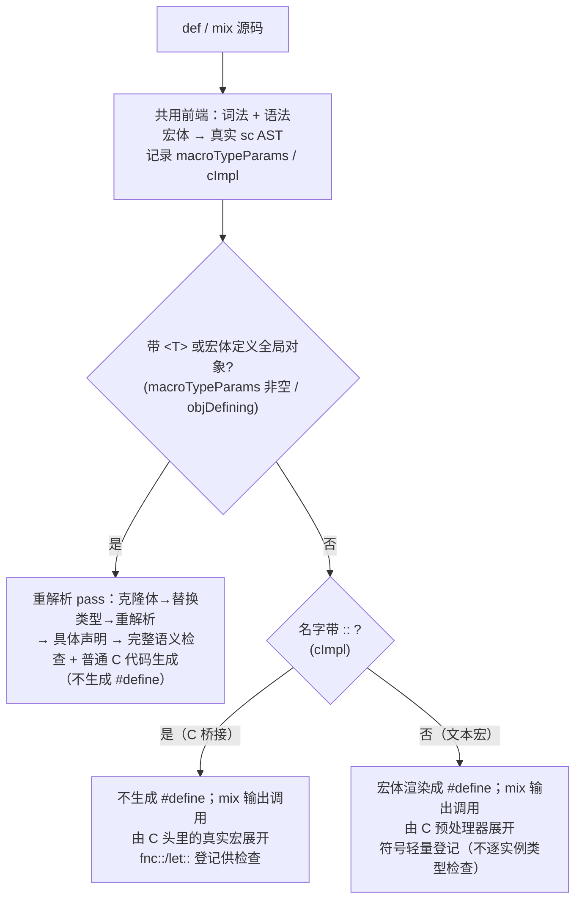

## sc 语言手册

sc 是一门基于 C 的结构化语言。它不取代 C，而是作为 C 的前台语言与 C 共生：
sc 专注更高层的语言逻辑特性，低级的平台与设备能力依然交给 C 完成（经 `inc` 互操）。
sc 语言自身的设计理念是“程序即结构”：顶层程序由 `inc` / `def` / `fnc` / `rpc` / `let` / `var` / `tls` / 这些结构对象组成，语法尽量和 C 对齐，但在类型、方法和模块上提供更高层的表达。

> **关于目标 C 标准（重要）**
>
> sc 转译生成的 C 代码以 **C99 为基线语义**：定长整型（`stdint.h`）、`//` 行注释、
> 混合声明、复合字面量、**指定成员初始化**（`{.field = x}`，由 sc 的 `{a=5}` 降级生成）
> 等均属 C99 级特性。原子操作 `<atom>` **不硬性依赖 C11**：它经由平台层
> （`builtins/platform.h`）的 `sc_<op>` 操作数原子机制分级选择实现——优先 C11 `stdatomic.h`，
> 在 MSVC 上回退到 `Interlocked*`，在 GCC/Clang 上回退到 `__atomic_*` 内建（`auto_ptr` 的
> `T<atom>()` 引用计数即直接走 `__atomic_*`）。因此即便使用 `<atom>`，生成的 C 仍可在
> 仅 C99 的工具链上编译，无强制 C11 要求。
>
> 当前 `scc` 生成 C 时**不强制注入 `-std=` 选项**，沿用所连工具链（cc/clang/gcc）的默认
> 标准档位；只要默认档位 ≥ C99（现代工具链均满足）即可正常编译。
>
> 远期规划支持 `--cstd=c99|c11|c17` 显式选择输出档位（见 §21），以适配老旧或受限工具链。

## 1. 语言原则

- 程序是一个由结构对象组成的树。
- 顶层对象包括：类型、变量、常量、线程局部存储、函数、远程调用、导入。
- 结构对象本身也是可递归嵌套的子节点。
- 缩进表达层级，换行表达语义边界，逗号表达同层并列项。
- 空格不参与语法。

## 2. 语言风格

sc 的布局规则是“缩进 + 换行”为主：

- 缩进表示层级。
- 同层项目可以用换行分隔，也可以在单行中用逗号并列。
- 多行条件、参数列表、字段列表都可以写成竖排。
- 当一个声明的头部和主体需要明显分隔时，可以用单独一行 `-`。

### 2.1 严格缩进格式（强约束）

- 一级缩进固定为 4 个空格。
- 不允许使用 Tab。
- 不允许混用 Tab 和空格。
- 子块相对父块只能增加 1 级缩进，不允许跳级。
- 同一语法层级的行必须完全对齐。
- 缩进只表达结构，不参与表达式拼写。

“4 空格 + 严格对齐”是编译器强制规则，不满足将直接报错。

示例：

```sc
var a:i1, b: i1&, c[32]:i1

var a:i1
    b: i1&
    c[32]:i1
```

## 3. 顶层语句

顶层目前支持：

- `def`：定义类型、枚举、结构体、联合体、类型别名、宏（见 §18.1「结构化宏」）。
- `var`：定义变量。
- `let`：定义常量。
- `tls`：定义线程局部变量（static 存储期，见 §13.1）。
- `fnc`：定义函数、函数类型、方法。
- `rpc`：定义伪形参函数（参数/返回值展开为同名结构体，见 §12）。
- `tst`：定义单元测试用例（块内用 `assert` 断言，`scc --test` 运行，见 §19）。
- `mix`：展开一个 `def` 宏（顶层展开声明，函数体内展开语句，见 §18.1「结构化宏」）。
- `inc`：引入头文件或 sc 模块。
- `add`：把实现文件（`.c`）或库文件（`.a`/`.so`/`.o`）添加进工程，参与编译/链接。
- `@` 前缀：标记导出对象，供 `--emit-c` 生成头文件声明；根（集成单元）的导出
  对象在可执行构建下对所有依赖单元可见（根模块导出注入，见模块章节）。
- `@@` 标记：在模块头部单独成行，声明本单元为**根模块**（全局前奏提供者），
  开启「根模块导出注入」，见模块章节。

### 顶层示例

```sc
inc stdio.h
inc io.sc
inc adt.sc

@def Point: {
    x: i4
    y: i4
}

@var total: i4 = 0
@let limit: i4 = 100

@fnc add: i4, a:i4, b:i4
    return a + b
```

## 4. 基础类型

当前内置类型如下：

```sc
i1  -> int8_t
i2  -> int16_t
i4  -> int32_t
i8  -> int64_t
u1  -> uint8_t
u2  -> uint16_t
u4  -> uint32_t
u8  -> uint64_t
f4  -> float
f8  -> double
bool -> uint8_t
char -> char
ret  -> int32_t
```

其中 `ret` 是 `i4` 的语义别名，用作 fnc/rpc 的返回码（`ok`=0 成功，非 0
失败）。此外还有内置字面量常量：

- `true`
- `false`
- `nil`
- `ok`（值为 `0`）

其中 `bool` 是布尔类型（u1 的语义别名），`char` 即 C 中的 char 类型（`s: char&` 即 `char *s`）
注意，char 和 i1/u1 是不完全等价的。C 中 char 在不同平台下可能是 signed char 也可能是 unsigned char。
`nil` 用于空指针/空值判断。此外，这里没有 void 类型：函数省略返回类型即无返回值（见 §11），void 指针用
省略类型名的裸指针表示（字段 `p: &`，返回类型裸 `&`）。

### 4.1 数值字面量后缀

数值字面量可携带后缀以标注字面量的类型，兼容 C 标准后缀并扩展出按字节宽度区分的
`b` / `w`。后缀大小写均可（`100u` 与 `100U` 等价）。

**整数后缀**：由「无符号标记 `u`/`U`」与「大小标记」自由组合，`u` 可置于大小标记之前
或之后，大小标记至多取一种：

| 大小标记 | 含义 | 加 `u` 后 |
| --- | --- | --- |
| 无 | 默认整型 | `u` → 无符号 |
| `b` / `B` | 单字节 `i1`（扩展） | `ub` → `u1` |
| `w` / `W` | 双字节 `i2`（扩展） | `uw` → `u2` |
| `l` / `L` | C 标准 long | `ul` → unsigned long |
| `ll` / `LL` | C 标准 long long | `ull` → unsigned long long |

**浮点后缀**：`f` / `F` 表示 `f4`（float），`l` / `L` 表示 long double。带小数点的字面量
即为浮点（见上文），浮点后缀仅接受 `f` 或 `l`。

```sc
let a = 100u      # 无符号整型
let b = 42b       # 单字节 i1（扩展后缀）
let c = 7uw       # 无符号双字节 u2（u 与 w 自由组合）
let d = 1024ull   # C 标准 unsigned long long
let e = 0xFFw     # 十六进制亦可加后缀
let f = 3.14f     # f4（float）
```

非法后缀组合（如重复大小标记 `bw`、或浮点上用整数后缀）会在词法阶段报错。

## 5. 指针与数组

sc 的指针标记 `&` 写在**类型一侧**（冒号之后），数组标记 `[]`
写在**名字一侧**（冒号之前）：

```sc
name: type        # 普通对象
name: type&       # 指针
name: type&&      # 指针的指针
name: &           # 裸指针（void*，省略类型名）
name[]: type      # 数组
name[x][y]: type  # 多维数组
name[x][y]: type& # 多维指针数组
```

规则：

- `&` 写在类型名之后，可叠加表示更高层级的指针（`type&&` 即二级指针）。
- 省略类型名的裸 `&` / `&&` 即 `void*` / `void**`。
- `[]` 写在名字之后，可叠加表示多维数组。
- `name: type&` 这类写法表示“变量名 + 显式类型 + 指针元类型”。
- 强制类型转换的指针也写在类型侧：`(p: type&)`、`(p: type&&)`（见 §14）。

#### 类型限定符 `const` / `volatile` / `restrict`

限定符以**上下文标识符**书写（非关键字），与 C 的语义对齐但位置遵循 sc 的“类型侧/名字侧”约定：

```sc
var a: volatile i4            # volatile int32_t a
var reg: volatile u4&         # volatile uint32_t *reg（MMIO 寄存器）
var p: const node&            # const node *p（指针可改，指向只读）
var x: const volatile u4&     # const volatile uint32_t *x
let q: node&                  # node *const q（指针只读，由 let 提供）
let r: const node&            # const node *const r（指针与指向皆只读）
let n: i4                     # const int32_t n（标量常量）
fnc copy: dst: i4& restrict, src: const i4& restrict   # int32_t *restrict / const int32_t *restrict
```

规则：

- `const` / `volatile` 写在**类型名之前**（类型侧），限定“**指向对象 / 对象本身**”是否只读/易变。
- “**指针本身**”是否只读由 `let` / `var` 决定：`let p: T&` → `T *const p`（指针常量），`var` 则指针可改。
  因此类型侧 `const` 与 `let` 正交：`let p: const T&` 同时锁定指针与指向（`const T *const p`）。
- `restrict` **尾置**（写在 `&` 之后），声明该指针不与其他指针别名（仅对指针有意义），
  常用于函数形参以启用别名优化。
- **约定**：只读的指针形参应在类型侧加 `const`（如只读 C 字符串入参写 `s: const char&`）。
  内建库（`builtins`）即按此约定：`string.assign/append/find`、`io.file`、`shm.make` 等的
  只读字符串参数均为 `const char&`。`::` 接口在 `.sc`/`.h`/`_impl.c` 三处的 `const` 必须一致
  （拼接为同一 TU 时签名不一致会编译报错，见 §9）。

强制类型转换的目标类型同样可写限定符，规则与声明侧一致（见 §14）：

```sc
let ro: const i4& = (p: const i4&)        # ((const int32_t*)(p))
var vp: volatile u4& = (&reg: volatile u4&)  # ((volatile uint32_t*)(&reg))
use((&x: i4& restrict))                    # ((int32_t* restrict)(&x))
```

`const` / `volatile` 前缀到目标类型，`restrict` 尾置于指针（用于非指针强转会编译报错）。


### 5.1 自动指针 `T@`（引用图与释放点验证）

`T@` 是与裸指针 `T&` **完全独立**的一条 opt-in 路径：裸指针 8 字节、纯 C 语义、不追踪；
自动指针 24 字节，参与引用图维护与释放点验证，谁用谁付内存/时间。完整机制见
[builtins/auto_ptr.md](builtins/auto_ptr.md)，这里给出语言手册视角的用法约定。

```sc
var raw: node&        # 裸指针，不追踪
var p:   node@        # 自动指针，参与引用图
```

**核心模型——指针是双向边。** 一次赋值 `a->child = b` 物理上是一条从 a 出发的边，
但它同时约束两端：目标不能先死（否则悬挂），持有者不能丢边就死（否则泄露）。
所以系统对每条边在两端各记一次账：

- `in`（入边数）：多少自动指针指向本对象。`in > 0` 时释放 → **悬挂**。
- `out`（出边数）：本对象持有多少自动指针。`out > 0` 时释放 → **未清理/泄露**。
- **释放不变式**：`in == 0 且 out == 0` 才可释放（完全孤立节点）。

**分配与生命周期。**

```sc
@def node: { v: i4, child: node@ }

@fnc main: i4
    var p: node@ = node()     # 带头堆分配，p 为栈根指针（域退出自动拆边）
    p->v = 7
    var q: node@ = p          # 绑定新边，目标 in=2（共享）
    p->child = node()         # a->child 出边记账：p.out++，子对象 in++
    p->child = nil            # 拆边：p.out--，子对象 in--（归零则 ARC 自动 free）
    return 0                  # 域退出：先拆全部边，再断言（两阶段）
```

- `T()` 为自动指针目标做**带头堆分配**（对象前置 `sc_ref` 头）。
- `T<atom>()` 为目标做**原子计数**带头堆分配：该对象的 `in`/`out` 增减走原子 RMW
  （`__atomic_*`，SEQ_CST），可被多个线程安全地并发绑定/解绑；普通 `T()` 的计数是非原子裸增减。
  原子性逐对象判定（头 `flags` 记 `SC_REF_ATOM` 位），原子与非原子对象可在同一引用图共存。
  `<atom>` 仅用于自动指针目标构造，用在普通堆构造 `T()`（赋给 `T&` 或表达式位）上会**编译报错**。
- 赋值 = 绑定新边（先拆旧边再绑新边）；`= nil` = 拆边；同名再赋值自动先拆旧。
- **域退出自动拆**栈/全局根指针的边；堆对象 `free`、子节点拆引用由用户负责（同 C）。
- 任意对象 `in→0 且 out==0` → **ARC 自动 free**（不级联释放子节点，子节点各自经同一套计数释放）；
  `in→0 且 out>0` → 报“未清理”错误。
- `return p` 是**移动**（跳过 p 的退域拆边，所有权转给调用方）。

**`&` 取址的传染性。** 对自动指针目标的（递归）子成员取址，结果也是自动指针，
共享访问路径上最近一个自动指针 hop 的堆对象 `in`（借用延寿）：

```sc
var x: node@ = &p->child      # x 借用 p->child 指向的堆对象，使其 in++
```

对普通栈变量取址（`x = &localStruct`）时，仅在 `--check=ref` 下给该栈变量注入伴生
引用头并纳入 `in` 计数，退域断言捕获“借用比目标活得久”的悬挂。

**边界约束（编译期硬报错或退化为纯 C）。**

- **禁止经裸 base 写自动指针成员**：`(raw: node&)->child = b` 报错，须经 `T@` base 访问。
- **`T@` 数组**：仅支持**局部一维**（`var arr[N]: node@`）——声明零初始化，下标赋值 `arr[i] = node()`
  带头分配并绑根边，退域/`return`/`break` 处逐元素 `unbind` 清理整张引用图；元素可借用、可取成员
  出边（`arr[i]->child = ...`）。多维 `T@` 数组与**字段/全局/参数/返回**位置仍未实现引用图记账 → 报错，
  请改用裸指针 `T&` 数组。（局部 `T@` 数组元素的嵌套出边与标量同理，须在释放前显式清理或置 `nil`。）
- 含 `T@` 成员的结构体**不得跨 C ABI**（被 C 侧 memcpy/fread 会让内部指针成垃圾地址）。
- 自动指针目标须**地址稳定**：不得把按值塞进可扩容容器的对象当作目标。
- `T@ → T&` 显式转裸（`r: node& = p`，取 `p.p`）是唯一的 opt-out 出口，转裸后不再追踪。


## 6. 内存安全（构建期检查开关）

sc 的内存安全分两层：**默认始终在线**的 ARC 引用计数与孤立对象自动 `free`（见 §5.1
自动指针），以及下列**默认关闭、按需开启**的构建期检查开关。开关只增加诊断与运行时
守卫，不改变绑定/解绑语义，可单独或组合启用，遵循「谁用谁付」按需取舍开销。

**构建选项 `--check=ref`（默认关闭）。**

- 关闭（默认）：ARC 计数与孤立对象自动 `free` 仍在；栈释放点断言编译为 no-op 省开销。
- 开启（`scc --check=ref ...` 或环境变量 `SCC_REF_CHECK=1`）：为栈对象注入引用头并在退域处
  断言悬挂，报错带源码定位，如「悬挂：local@a.sc:8 释放时仍被 1 个引用指向」。

**构建选项 `--check=mem`（越界 canary，默认关闭）。**

- 关闭（默认）：堆对象按 `[sc_ref 头 | 实体]` 紧凑分配，无额外开销。
- 开启（`scc --check=mem ...` 或环境变量 `SCC_MEM_CHECK=1`）：每个带头堆对象（`T()`/`T<atom>()`）
  扩成 `[头哨兵 | sc_ref 头 | 实体 | 尾哨兵]`，头尾哨兵存同一**地址派生魔数**（块首地址异或盐，
  每块各异、定值 memcpy 无法伪造）。对象在释放点（`in→0` ARC、显式 `free`）校验头尾哨兵，
  检出缓冲区上溢（尾哨兵损坏）或下溢/野写（头哨兵损坏）并报 `stderr`。`sc_ref` 头位置不变，
  绑定/解绑路径零改动。
- 开启时还覆盖**栈侧**两类越界：
  - **栈数组尾哨兵**：函数内 `var buf[N]: T`（含多维 `var m[R][C]: T`）超额分配尾哨兵元素
    （多维仅外层加若干「行」覆盖 16 字节尾区），声明后填入地址派生模式，退域/`return`/`break` 处校验
    尾区。尾哨兵紧贴有效元素，越界写先撞哨兵、**就地拦截、不波及邻接对象**，报错带源码定位
    （如「越界：栈数组 buf@a.sc:6 尾哨兵被破坏」）。`sizeof(buf)` 仍回报逻辑大小（各维元素积×元素），
    故 `memset(buf, 0, sizeof buf)` 不会误触哨兵。**全局栈数组**同样超额分配尾哨兵，填充/校验改由
    启动（`constructor`）/退出（`destructor`）钩子托管，捕获持续到退出的全局缓冲区上溢；`const` 数组不覆盖。
  - **返回地址保护**：托管目标编译注入 `-fstack-protector-strong`，由 C 编译器在局部缓冲与返回地址之间
    插入栈哨兵，捕获栈溢出破坏函数返回跳转地址这类最难追踪的随机崩溃；裸机（freestanding）跳过。
- 与 `--check=ref` 正交：前者查堆/栈越界，后者查栈悬挂，可分别或同时开启。

**构建选项 `--check=ptr`（运行时指针/下标守卫，默认关闭）。**

- 关闭（默认）：解引用与下标按原生 C 语义，无额外开销。
- 开启（`scc --check=ptr ...` 或环境变量 `SCC_PTR_CHECK=1`）：在裸指针解引用（`*p` / `p->m`）与裸指针
  下标处注入 `nil` 校验；在**编译期已知维度**的栈/全局数组下标处注入越界校验。命中即报 `stderr`
  并 `abort`（致命，阻止未定义行为继续扩散），报错带源码定位（如「空指针解引用：成员访问@a.sc:6」
  「数组下标越界：数组下标@a.sc:4（下标 5，长度 3）」）。胖指针 `T@` 走独立绑定路径不重复拦截。
- 与 `--check=ref`/`--check=mem` 正交，可分别或同时开启。

## 7. 导入与加入

### 导入头文件

```sc
inc stdio.h
inc "my.h"
```

对应 C 的：

- `inc stdio.h` -> `#include <stdio.h>`
- `inc "my.h"` -> `#include "my.h"`

### 导入 sc 模块

```sc
inc io.sc
```

当前采用“模块单元编译 + 链接”模型：

- 每个 `.sc` 文件独立转成 C 单元并编译为对象文件。
- `inc x.sc` 表示模块依赖，C 侧通过模块头文件连接接口，不做源码文本展开。
  同时依赖模块的 `@` 导出声明会被合并进导入方的符号表，
  使跨模块的方法调用糖、声明即构造等语法糖生效。
- scc 在运行模式下会按依赖图编译并链接多个单元。
- 仓库根下 `builtins/` 作为内置模块搜索路径；`inc x.sc` 会依次尝试
  `builtins/x.sc` 与子项目形态 `builtins/x/x.sc`（如 adt），
  也可用环境变量 `SCC_BUILTINS` 指定额外搜索目录。
- `builtins/op.sc` 是**默认导入**模块（无需 `inc`），声明基础类型上的设备
  操作数通用指令（`operand`），透传为 `platform.h` 的 `sc_<op>` 宏，详见 §13.2。
- 内置模块参考手册见 `builtins/REFERENCE.md`。

#### 根模块导出注入（root-prelude）

首个根模块（项目入口，通常含 `main`）一般作为**集成单元**，其 `@` 导出的结构
定义与操作往往是全局通用的。为省去每个依赖单元逐一回引根的全局接口，编译器在
**可执行（EXE）构建**下提供「根模块导出注入」。

开启方式由**源码显式声明**：在根模块头部单独写一行 `@@`，标记本单元为「根」
（全局前奏提供者）。编译器在构建/分析时会**扫描该单元所在目录**的 `.sc`，定位被
`@@` 标注的根模块——无需任何命令行选项。一个目录应只有一个 `@@` 根（多于一个
时取排序最前者并告警）。这样**语法插件**也能静态发现根：编辑某个依赖单元时，根
注入的全局对象不再显示为「未定义」。

- **语义层**：根的 `@` 导出声明以 `external` 并入每个递归依赖单元，使根的全局
  类型/操作在依赖单元的 sc 源码中**直接可见**（无需 `inc` 根模块）。**由宏展开
  产生的导出**亦在此列：注入前会先解析根的依赖、展开根的顶层 `mix`，故 `mix`
  落地的 `@var`/`@fnc`（如 `mix ARGS_B(...)` 展开出的 `@var ARGS_verbose`）同样被
  消费单元看见——与根自身编译时 `scm_<root>.h` 收录这些符号保持一致。
- **代码层**：根的接口头 `scm_<root>.h` 作为每个依赖单元 `.c` 的**末位
  `#include`**（排在该单元所有 `inc` 之后），提供 extern 原型与类型定义；
  链接时由根目标文件提供符号实体。

注入发生在**代码生成阶段**（不是 `inc` 依赖边），依赖方向不反转，故**不形成
模块环**——这与「新增一个所有人都 `inc` 的 prelude 模块」效果一致，但无需在
每个单元写那行 `inc`。

生效与排除：

- 仅**可执行构建**（`run` / `--build` 产 EXE）生效；库构建（`.a`/`.so`/`.dylib`）
  不注入。
- 根可与入口**不同**：`@@` 标注的模块即根（全局前奏提供者），不要求含 `main`；
  根≠入口且未被 `inc` 时也会被补加载进构建，使其导出实体参与链接。
- 根模块**无 `@` 导出对象**时，接口头为空，注入自动不发生（自门控）：要启用就
  从根显式 `@` 导出。
- **内置库**（`builtins/` 下单元，如 `m`/`mem`/`adt`/`op`）排除，不被污染。
- 根模块的**导出 inc（`@inc`）上游闭包**排除：这些单元的类型本就被
  `scm_<root>.h` 反向引用（`@inc` 会令接口头 `#include` 它们的头），若再把
  `scm_<root>.h` 注入其 `.c`，会在该单元自身类型定义之前先引用这些类型而编译
  失败。普通 `inc`（非 `@inc`）的依赖不在此列，正常接受注入（这正是「消费者」
  场景）。
- 开启/关闭：根模块头部有无 `@@` 即开关——写上 `@@` 开启，移除即关闭（关闭后
  引用根全局接口的依赖单元将因找不到对应类型/操作而报错）。一个目录内应只放一个
  项目（同目录多个独立程序会被同一 `@@` 根波及）。

```sc
# app.sc（根 / 集成单元）
@@                                  # 根模块标记：开启「导出注入」
inc stdio.h
inc sensor.sc                       # 普通 inc 一个消费单元
@def metric: { tag: char&, value: i4 }     # 全局通用类型
@fnc app_report: m: metric           # 全局通用操作
    printf("[report] %s = %d\n", m.tag, m.value)
fnc main: i4
    sensor_sample("temp", 21)
    return 0

# sensor.sc（消费单元，不 inc app.sc）
inc stdio.h
@fnc sensor_sample: label: char&, v: i4
    var m: metric                   # 直接用根导出的类型（经注入可见）
    m.tag = label
    m.value = v
    app_report(m)                   # 直接调根导出的操作
```

生成的 `sensor.c` 在其 `inc` 之后追加 `#include "scm_app.h"`，链接时由 `app.o`
提供 `metric`/`app_report` 的实体。可运行示例见
[examples/feature30/feature30.sc](examples/feature30/feature30.sc) 与其消费单元
[examples/feature30/feature30_mod.sc](examples/feature30/feature30_mod.sc)。

> 说明：单文件 `--emit-c`（输出到 stdout）为自包含转译，不生成各依赖单元的 `.c`，
> 故注入只在完整可执行构建中体现；对根单元自身 `--emit-c` 不会注入（根本就定义
> 着自己的导出）。


`inc` 解决「接口声明」的引入，但对于**由 C 实现的接口**（`fnc name::` 形态，
声明在 sc、实现在 C 侧），其对应的 `.c` 文件此前没有并入工程的机制；
自定义库也只能靠构建脚本手写 `-l` / 路径链接。`add` 填补这两点：

```sc
add impl.c           # C 实现源文件：现场编译为 .o 并链接
add libfoo.a         # 静态库：直接参与链接
add libbar.so        # 动态库：直接参与链接
add prebuilt.o       # 预编译对象：直接参与链接
```

规则：

- 路径相对**声明 `add` 的 `.sc` 文件所在目录**解析（也支持绝对路径）。
- 按扩展名分流：`.c`/`.cpp`/`.cc`/`.cxx` 现场编译为对象文件后链接；
  `.o`/`.a`/`.so`/`.dylib` 直接参与链接；其它类型报错。
- 文件不存在直接报错；同一文件被多个模块或多次 `add` 时按规范化路径去重。
- `add` 是纯构建指令，**不产生 C 输出**，也**不支持 `@` 导出**。
- 凡是被依赖图（经 `inc` 链）拉入的模块，其 `add` 指令都会被收集生效——
  因此一个声明 `::` 接口的模块只要自带 `add impl.c`，使用方 `inc` 它即可
  自动带上实现，无需关心链接细节。
- 面向**自定义实现与库文件**；跨平台**系统库**仍走编译选项机制
  （`-l` / `SCC_LIBS` / 配置键 `libs`，见下）。

搭配 `fnc ::` 接口的典型用法：

```sc
# mymath.sc —— 声明 C 实现的接口 + 自带实现
add mymath_impl.c
@fnc square:: i4, x: i4
```

```c
/* mymath_impl.c */
#include <stdint.h>
int32_t square(int32_t x) { return x * x; }
```

```sc
# main.sc —— 仅 inc 即可，实现随模块自动链接
inc stdio.h
inc mymath.sc

fnc main: i4
    printf("%d\n", square(9))   # 81
    return 0
```

## 8. 导出

`@` 前缀表示导出对象，`--emit-c` 时会额外生成头文件声明（即下文 §9「导出生成的 `.h`」）；
`@inc` 也生效，会把该 include 同步输出到生成的 `.h`。

```sc
@def Point: {
    x: i4
    y: i4
}

@var total: i4

@fnc add: i4, a:i4, b:i4
    return a + b

@inc stdio.h
```

导出规则：

- `@def` -> 生成类型声明。
- `@var` / `@let` -> 生成外部变量声明。
- `@fnc` -> 生成函数原型。

## 9. 与 C 互通

sc 与 C 的互通围绕一个核心接缝符 `::` 展开：凡 `::` 出现处即「此名 / 此声明活在
C 侧」。本章汇总三件事——为何不做条件编译而把平台适配下沉到 C 头、`::` 映射符的
各种形态、以及一个 `.sc` 与 `.h` 之间两个方向相反的关系。结构化宏与 `def name::`
C 宏桥接另见 §18「宏与语言级泛型」。

### 无条件预处理设计与 C 头文件互操作

sc 通过 `def`/`mix` 提供**受控的结构化宏**（一一映射到 C 的 `#define`，见下文
「结构化宏」一节），但**有意不提供** `#if/#ifdef` 条件编译、预定义平台宏这类
与环境相关的预处理能力。设计目标是：sc 源码表面应该像脚本语言一样**平台无关**，
不出现平台分支。

平台适配不是不要，而是下沉到 C 层完成：把 `#ifdef` 判断写在 C 头文件里，
sc 通过 `inc` 导入后直接使用适配后的结果：

```c
/* platform.h —— 平台适配留在 C 头文件中 */
#if defined(__APPLE__)
#define OS_NAME "macos"
#define OS_ID   1
#elif defined(_WIN32)
#define OS_NAME "windows"
#define OS_ID   2
#else
#define OS_NAME "linux"
#define OS_ID   3
#endif
#define SQUARE(x) ((x) * (x))
```

```sc
inc stdio.h
inc limits.h
inc "platform.h"

fnc main: i4
    printf("os: %s id=%d\n", OS_NAME, OS_ID)   # 宏常量直接当标识符用
    printf("int max: %d\n", INT_MAX)            # 标准头中的宏常量
    printf("square: %d\n", SQUARE(9))           # 函数式宏直接当函数调用
    return 0
```

互操作规则：

- C 宏常量（`INT_MAX`、自定义 `OS_NAME` 等）直接作为标识符使用，原样透传到生成的 C 代码。
- C 函数式宏（`SQUARE(x)`、`va_start` 等）直接按函数调用语法使用。
- `#if/#ifdef` 等条件编译只存在于 C 头文件中，sc 源码只看到适配后的最终结果。
- 运行模式下，每个模块单元编译时会自动附加源 `.sc` 文件所在目录为头文件搜索路径，
  因此 `inc "platform.h"` 能找到与源码同目录的本地头。

### `::` —— sc↔C 映射符（关键互通特性）

`::` 是 sc 与 C 之间的**接缝符**：凡 `::` 出现处，即「此名/此声明活在 C 侧」

**直接用 C 名 —— 调用/取用未声明的 C 函数、宏、符号**

表达式位置上，凡 sc 不认识的名字一律**原样落到 C**：无需事先 `inc`/声明，直接按
名字调用任意 C 函数或函数式宏，裸写名字则取 C 符号/宏常量的值（前提是该名字所在
头已 `inc` 进来，或属 libc 常用符号白名单）：

```sc
inc stdio.h

fnc main: i4
    printf("hello\n")            # 调用 C 变参函数
    var n: i4 = abs(-7)          # 调用 C 函数，结果赋给 sc 变量
    var big: i4 = INT_MAX        # 取 C 宏常量的值
    return 0
```

> sc 对来自未解析头的名字放宽未定义检查（`lenientCalls`），因此「直接写 C 名」即可
> 覆盖**表达式位置**的全部 C 互通：调用 C 函数、求值函数式宏、读取宏常量。唯一够不着的
> 是**顶层/语句位置展开声明的宏**（sc 顶层是固定的几种声明形式，不能执行函数调用）——
> 那一类用 `mix`（见「结构化宏」）。

**`let X:: T` / `var X:: T` —— 认领 C 侧已定义的全局符号**

名字后尾置 `::` 表示「把一个 C 已定义的全局符号登记进 sc 类型系统」。
转 C 生成 `extern T X;`（不分配存储、无初值），此后即可在 sc 里像普通全局一样
按类型 `T` 引用 `X`、访问其成员。`let`/`var` 仅决定 sc 侧可变性（C 端恒为 `extern T`）：

```sc
let CLOCKS:: i8           # extern int64_t CLOCKS;  —— 认领 C 全局常量视图
var g_state:: app_ctx     # extern app_ctx g_state; —— 认领可变 C 全局，可读写其成员
```

借此，sc 即可在不破坏「平台无关」设计的前提下，**调用一切 C 函数/宏**并**桥接一切
C 全局符号**——边界清晰（只生成调用形/声明形，不退化为裸文本）。

> **结构化宏（`def`/`mix`）、把 C 实现的宏映射进 sc（`def name::`）、宏即模板与语言级泛型
> （`<T>` 单态化）** 已独立成章，集中详述于 [§18 宏与语言级泛型](#18-宏与语言级泛型)。
> 速查：表达式位置求值 C 宏 → 直接写名（本节上文）；顶层/语句位置展开声明的宏 → `mix`（§18.1）；
> 映射 C 头里的 `#define` → `def name::`（§18.2）；按类型实例化的真泛型 → `def 名: <T>, N`（§18.4）。

### 两类 `.h`：导出生成 vs 依赖导入

一个 `.sc` 与 `.h` 之间存在**两种方向相反**的关系，务必分清——`::` 与 C 互通的
各条规则正好分别对应一种：

**A. 导出生成的 `.h`（出站，本模块发布的接口）**

`.sc` 模块的 `@` 导出对象（`@def` / `@fnc` / `@let` / `@var` / `@fnc f::`）共同构成它的
C 接口。这是一条**通用机制，不限于 builtins**：任何被 `inc` 的 `.sc` 模块，编译器都会据其
`@` 导出对象**自动生成**接口头（运行/构建模式下为内部 `scm_<token>.h`；`--emit-c -o` /
`--build -o` 则写出 `<模块>.h` / `lib<名>.h`），文件头标注「由 scc 生成，请勿手工修改」。

> builtins「三要素」模块（`<root>/<名>/<名>.sc` + 同目录手写 `<名>.h` + `<名>_impl.c`，
> 如 `env`/`io`/`adt`）是一个特例：其 `.h` 由**手工编写并与 `.sc` 同步维护**，承担「导出
> 生成的 .h」这一逻辑角色。编译器对 `inc <名>.sc` 的处理有专门分支：发现同名同目录手写
> 头时，直接 `#include "<root>/<名>/<名>.h"` 引用它（不再生成内部 `scm_<token>.h`）。
> 因此手写头必须与 `scc` 本会生成的接口形状一致。
>
> 推论：手写头是**可选的覆盖**而非必需品——删掉 builtins 的 `<名>.h`，`inc <名>.sc` 即回退
> 到自动生成的 `scm_<名>.h`（由 `@` 导出对象生成）。手写它，只是为了承载 sc 表达不了的纯 C
> 细节（宏族、平台 `#if`、`union`/匿名结构布局等）。机制细节见 [compiler.md](compiler.md) §5.7。

**B. 依赖导入的 `.h`（入站，本模块消费的外部 C 头）**

`inc stdio.h`、`inc "xxx.h"` 引入的是**别处定义**的外部 C 头，转 C 为
`#include <stdio.h>` / `#include "xxx.h"`。sc 不解析其内容（除可选 `--clang` 描述符
分析外），其中的符号对 sc 类型系统是不透明的。

**`::` 两形态与两类 `.h` 的对应**

| 互通形式 | 方向 | 对应的 `.h` | 谁定义符号 |
|---|---|---|---|
| 直接写 C 名 `name(...)` / `name` | 入站（调用/取用） | **B 依赖导入** | 被导入的头（如 `stdio.h`、第三方 `xxx.h`） |
| `fnc f::` | 出站（声明接口） | **A 导出生成** | 本模块配套 `_impl.c` |
| `let/var X:: T` | 出站（声明符号） | **A 导出生成** | 本模块配套 `_impl.c` |

精确地说：**直接写 C 名是「伸手进一个被导入的头去用 C」**；**尾置 `::` 是「向本模块导出的
接口里登记一个由 C 兑现的名字」**——`fnc f::` 登记函数、`let/var X:: T` 登记带类型的全局，
sc 为它生成 `extern`，其本体由模块配套 C 提供。

> **`X:: T` 与配套 `.h`/`_impl.c` 一致**：`let/var X:: T` 和 `fnc f::` 同属「由 C 实现的接口」，
> 其权威定义在模块配套的 `.h` 与 `_impl.c` 里；sc 这条声明只是登记符号的名字与类型，编译器
> 据此生成一个**与既有 C 定义匹配一致**的引用（当前实现为 `extern T X;`，落地形式属实现细节）。
> 因此手写 `.h`/`_impl.c` 与 `.sc` 三者须就此符号保持一致——`let X:: T` 的类型 `T` 要对得上
> C 侧定义。这里 `let`/`var` 决定 **sc 侧可变性**（`let` 不可重新赋值），不改变它「引用 C 既有
> 定义」的本质。
>
> 适用范围：`let/var X:: T` 用于「sc 当前**看不到**任何声明」的 C 符号；若 X 已能从某个被导入的
> `.h` 直接取用，就直接写名 `X` 而非再 `let X:: T`，否则即为重复声明。注意**宏在调用点现场展开
> 出来的全局已由语义层自动登记**（见 §18.1「结构化宏」），无需再 `::` 认领——例如某模块
> `inc env.sc` 后写 `mix ARGS_B(abc, ...)`，该宏内部定义出全局 `ARGS_abc` 与 `ARGS_DEF_abc`，
> 编译器展开 `mix` 时即把二者登记进 sc。其中 `ARGS_DEF_abc` 的类型 `arg_def_st` 带无参 `init`，
> 由「声明即构造」在 `main` 序言自动把自身挂入全局注册链表 `arg_defs`；故只需
> `ARGS_parse(argc, argv, nil)` 即可——`ARGS_parse` 优先遍历 `arg_defs`，无需再手工把
> `&ARGS_DEF_abc` 逐个传入（纯 C 用户仍可走 `ARGS_DEF(...)` 变参回退路径）。

> 关于编译选项、链接库、`.sc` 配置文件等工具链配置
> 详见 [compiler.md](compiler.md) §4「工具链配置」。

### 模块实现的并入：拼接机制（`_impl.c` 与单元同 TU）

上一节说清了「谁定义符号」——`fnc f::` / `let/var X:: T` 的本体由**模块配套 C** 兑现。
这一节说清「配套 C 如何并入工程编译」。规则对**任意** `.sc` 模块统一适用，builtins
只是其一个透明特例。

**单元模型。** 工程构建（运行 / `--build`）时，模块图里每个 `M.sc` 各自转译为**一个 C 翻译
单元** `M.c`，并据 `@` 导出对象生成接口头。各单元独立编译为 `M.o`，最后统一链接。

**拼接。** 若 `M.sc` 同目录存在配套源实现 `M_impl.c`，编译器把它的内容**并入** `M.c`
末尾，编成**同一个翻译单元（TU）**，而非单独编译再链接。这带来两点能力：

- `M_impl.c` 里的手写 C 实现可**直接引用 `M.sc` 侧的模块私有 `static` 全局**——二者在
  同一 TU，模块私有全局以原名 `static` 落地，C 实现按名即可访问（跨 TU 时这是不可能的）。
- `M.sc` 中 `::` 接口（`fnc f::`、`fnc m::` 成员）声明的 `extern` 符号，其定义就在本 TU 内，
  无需任何单独编译/链接步骤。

**头的处理。** 当模块为「三件套子项目形态」（`<root>/<M>/<M>.sc` + 同目录手写 `<M>.h`，
见上节）时，`M.c` 在 `platform.h` 之后直接 `#include "<root>/<M>/<M>.h"`，并**跳过自身
`@` 导出类型的内联定义**（由手写头统一提供）——使本单元对自身模块的视图与**消费方完全对称**，
既避免拼接 `M_impl.c` 时类型重定义，又让手写头里**仅头部存在的宏**（如尺寸/标志位常量）
随之带入，供拼接进来的 `M_impl.c` 使用。无手写头的模块则照常在 `M.c` 内联自身类型，
`M_impl.c` 直接复用之。

**二进制实现走链接。** 配套实现若是**预编译二进制**（`<M>.o` / `<M>.a`，如内嵌发行版释放的
库、或 `--adt <x.a>` 指定的替换实现），无法拼接进源 TU，则作为目标文件**单独参与链接**——
此形态下 C 实现与 sc 侧**不共享**模块私有 `static`（跨 TU），只对接公开的 `::` 接口符号。

**builtins 是透明特例。** `adt`/`io`/`mem`/`env`/`m`/`async`/`os` 等内置模块的全部函数均为
`::` C 实现（没有 sc 普通函数与 `::` 混排），其 `<名>_impl.c` 正是经上述拼接机制并入各自单元，
与用户自定义模块走**完全相同**的路径，不存在专属代码路径。

**`op.sc` 是特例中的特例。** 它是语言自有的运行时机制模块（`chain` 侵入式链表、异步内核
`future`/`async_*`、设备 `com` 等），**自动导入**（无需 `inc`，与 `platform.h` 的「默认带入」
对应）。它同样作为正式单元进入模块图、生成 `op.c`，其 `op_impl.c` 经同一拼接机制并入；其唯一
特殊性退化为「自动导入」与「`op.h` 由 `platform.h` 默认带入（故 `op.c` 整体跳过自身类型/原型
输出，全部由 `op.h` 提供）」。异步内核所需的线程库（及编译器以 libuv 后端构建时的 `libuv`）
由编译器随该单元自动登记进链接。

> 单一真相是 `.sc`：手写 `<M>.h` 与 `M_impl.c` 的签名须与 `M.sc` 一致。拼接成同一 TU 后，
> 任何不一致（如 `const` 限定、函数指针层级偏差）会在编译期即暴露为「类型冲突 / 重定义」，
> 而非潜伏到运行期——这正是拼接相较「各自独立 TU」的额外收益。机制实现细节见
> [compiler.md](compiler.md) §5.7。


## 10. 类型定义

### 10.1 枚举

枚举项写在方括号 `[ ]` 内，类型 `: ty` 尾置于 `]` 之后。项之间用换行或逗号分隔：

```sc
def color: [
    Red = 0
    Green
    Blue
] : i1
```

单行写法也支持：

```sc
def color: [ Red = 0, Green, Blue ] : i1
```

枚举支持显式赋值，也支持自动递增。

### 10.2 结构体

```sc
def point: {
    x: i4
    y: i4
}
```

单行写法也支持：

```sc
def rect: { lt: point, rb: point }
```

### 10.3 联合体

```sc
def value: (
    i: i4
    f: f4
)
```

### 10.3.1 标签联合（tagged union / sum type）

裸联合 `( )` 不带标签，取值全靠程序员自觉，是 C 里取错分支的经典隐患来源。
在联合前加 `@` 前缀即得**带标签的安全联合**：编译器托管一个隐藏 `tag`，强制
「先判分支再取载荷」。

```sc
def Rect: { w: f4, h: f4 }

# 三类变体：无载荷 / 标量载荷 / 具名类型载荷
def Shape: @( Empty, Circle: f4, Rect: Rect )
```

- **无载荷变体**：只写变体名（`Empty`）。
- **载荷变体**：`变体名: 类型`，载荷须为标量或具名类型；多字段载荷请先 `def`
  一个具名结构体（不支持内联 `{}` 载荷，保持纯数据布局的 C ABI）。

**构造**：`T.Variant(载荷)`，无载荷写 `T.Variant`。

```sc
var a: Shape = Shape.Circle(2.0)
var b: Shape = Shape.Empty
var c: Shape = Shape.Rect(rc)          # rc: Rect
```

**解构**：用 `case`（见 §15），`Variant as x` 把当前变体载荷**拷贝**为只读
视图 `x`；无 `default :` 分支时必须**穷尽**覆盖全部变体，否则编译报错。

转 C：展开为 `struct { enum {...} tag; union {...} u; }`，变体常量名为
`T__Variant`，构造即指定初值器复合字面量，零运行时开销。

### 10.4 类型别名

```sc
def byte -> u1
```

### 10.5 内联类型

变量、字段都可以直接写内联结构/联合类型：

```sc
var tmp: {
    x: i4
    y: i4
}
```

### 10.6 链表结构体

结构体名后写 `~` 标记，使该类型对象具备双向链表链接能力：

```sc
def task: ~ {
    id: i4
}
```

转 C 时编译器在成员**首部**注入两个隐藏指针成员 `_prev` / `_next`（类型为
`void*`）。它们是真实字段，可直接读写遍历，但不可在结构体内显式定义，
`--emit-sc` 也不会输出。`~` 仅支持结构体 `{}`，不支持联合体/枚举/别名。

链表结构体配合内置双向链表 `chain` 使用。`chain` 是 op.sc 的默认导入机制
（无需 `inc`，其 C 运行时由 builtins/op.h + op_impl.c 自动提供），详见
builtins/REFERENCE.md：

```sc
var l: chain
var t: task
l.append(&t)                    # 编译器自动注入 _prev 偏移
var it: task& = l->first(): task&
while it != nil
    printf("%d\n", it->id)
    it = it->next               # 尾元素 next 为 nil
```

成员访问位提供上下文关键字 `prev` / `next`：当基址是链表结构体时，
`o.prev` / `p->next` 等价 `_prev` / `_next`（转 C 时映射）。它们仅在成员
访问位生效，不是保留字：普通结构体仍可定义名为 `prev`/`next` 的字段；
链表结构体内则禁止显式定义 `prev`/`next`/`_prev`/`_next`。

约定：`head` 指向首元素；首元素的 `prev` 指向尾元素（即 rear 指针）；
尾元素的 `next` 为 `nil`。同一 `chain` 只能存放同一种结构体；chain 不拥有
元素，移除操作不释放元素内存。

内置伪函数 `base(o)`：返回对象**首个真实成员**的地址（跳过前置注入的隐藏
成员），用于在已知节点指针时取回业务数据首址。`base(o: T&)` 形式则把节点
首址直接重解释为 `T*`（零偏移）。

### 10.7 容器结构体

与 `~` 对称的另一套机制：`~` 提供内置的 prev/next 链接，`<C, I>` 则让元素
绑定到一套**自定义抽象数据类型（ADT）集合实现**。

```sc
def task: <slist, tnode> {       # T=元素类型；C=容器类型；I=链接节点类型
    id: i4
}
```

- `I`（如 `tnode`）被整体注入为 `T` 的**首个隐藏成员** `_adt`（offset 0）。
  因此 `T&` 与 `I&` 可零偏移互相重解释。`_adt` 不可显式定义，`--emit-sc` 也
  不输出。`<C, I>` 仅支持结构体 `{}`。
- `C`（如 `slist`）是用户自定义容器（普通伪类结构体），必须具备必备成员
  函数（接收者为容器自身）：

  | 成员函数 | 签名 | 说明 |
  |----------|------|------|
  | `insert` | `ret, item: I&, tag: ...` | 插入元素 |
  | `remove` | `ret, item: I&` | 移除元素 |
  | `find`   | `ret, out: I&&, ...` | 查找（出参回填节点） |
  | `first`  | `I&` | 首元素 |
  | `next`   | `I&, item: I&` | 后继 |
  | `last`   | `I&`（可选） | 尾元素 |
  | `prev`   | `I&, item: I&`（可选） | 前驱 |

  容器成员函数既可用 sc 函数体实现，也可用 `fnc m::` 交由 C 实现。

导航只经容器方法。`first` / `next` / `last` / `prev` 返回 `I&`，用显式
`: T&` 下转回元素类型（零偏移重解释）：

```sc
var lst: slist
var a[4]: task
lst.insert(&a[0], 0)             # 传 task&，编译器自动转 tnode&
var it: task& = lst.first(): task&
while it != nil
    printf("%d\n", it->id)
    it = lst.next(it): task&     # 实参 task& 自动转 tnode&，返回值 : task& 下转

var found: task&
if lst.find(&found, 20) == ok    # &found（task&&）自动转 tnode&&
    printf("%d\n", found->id)
```

**实参自动转换**：当容器成员函数形参声明为 `I&`（或出参 `I&&`），而实参是
元素 `T&`（或 `T&&`）时，编译器自动作零偏移重解释（`I` 注入在 `T` 首位）。
返回值方向则用显式 `: T&` 强转。

**`ret` 类型与 `ok` 字面量**：`ret` 是 `i4` 的语义别名，作 ADT 接口返回码；
`ok` 是值为 `0` 的成功返回码（与 `true`/`false`/`nil` 同类的内置字面量）。

**`base(&t)`**：跳过注入的 `I`，返回 `T` 首个真实成员的地址（与链表 `base`
对称）。

**`[]` 运算符重载（检索下标糖）**：容器结构体把方括号 `[]` 重载为「检索」语义
——对容器**实例** `c` 写 `c[key, ...]`，等价调用 `find`，命中返回元素节点 `I&`
（用 `: T&` 下转回元素类型），未命中或出错（`find` 返回非 `ok`）返回 `nil`。
方括号内为透传给 `find` 的检索键（逗号分隔多键）：

```sc
var hit: task& = lst[30]: task&      # 命中：等价 find，返回 tnode&，: task& 下转
var miss: task& = lst[99]: task&     # 未命中：返回 nil
```

等价展开：`c[k]  <==>  { var _o: I&; (c.find(&_o, k) == ok) ? _o : nil }`。仅对
容器类型 `C` 生效，普通数组/指针下标语义不变。

> **注意 `[]` 的两种重载**：容器在**实例**位置重载 `c[key]`（运行期检索，本节）；
> 分身/切片在**类型**位置重载 `T[...]`（声明句柄类型，见 §10.8）。二者都是对
> 方括号的语法糖，但作用对象与时机不同，互不冲突。

### 10.8 分身 / 切片结构体

结构体名后写 `<S>` 标记，声明该类型**实体 `T`** 的「分身 / 切片」类型为 `S`。
它是与 `~`（链表 §10.6）、`<C, I>`（容器 §10.7）并列的第三套「结构注入」机制：
为一个**本体实体 `T`** 派生出轻量的**视图 / 切片句柄**，句柄按需向本体借取一份
分身实例（如缓冲视图、有界读视图），用后归还。

```sc
def view: {                       # S：分身 / 切片类型（实体的一个「视图」）
    p: char&
    n: i4
}

def buffer: <view> {              # T：实体类型，<view> 标记其分身 / 切片类型
    data[256]: char
    alloc: fnc: view&, off: i4, len: i4   # 分身构造器：隐式 this=buffer&，余参=切片参数
        var v: view& = malloc(sizeof(view)): view&
        v->p = &this->data[off]
        v->n = len
        return v
    free: fnc: v: view&                    # 分身析构器
        free(v)
}
```

**回指成员 `_self`**：编译器在 `S` 首部注入隐藏成员 `_self: T&`（synthetic），
使分身能反查所属本体 `T`。`S` 的成员函数内用上下文关键字 `self`（等价
`_this->_self`）访问本体。`<S>` 仅支持结构体 `{}`。

**实体 `T` 必备成员函数**：`alloc`（分身构造器，隐式接收者 `this: T&`，余参为
切片参数，返回 `S&`）与 `free`（分身析构器，参数 `S&`）。二者既可为**类方法**
（带函数体，所有对象共享实现，如上例），也可为**每对象方法指针**（`fnc alloc::`
/ `fnc free::` 前置声明、运行时逐对象绑定）——用于「设备相关」场景，不同实体各
持不同实现（如 com 通讯：各设备各有 io 实现）。

**`[]` 运算符重载（句柄类型糖）**：分身/切片把方括号 `[]` 重载为「构造句柄
类型」语义——对**实体类型** `T` 写 `T[...]`，本质是匿名结构体
`{ <alloc 切片参数...>; _: S& }`，方括号内为 `alloc` 切片实参初值，`_` 指向
当前绑定的分身实例（`nil`=未绑定）。这与容器结构体在**实例**位置重载的
`c[key]` 检索糖（§10.7）正好相对：此处 `[]` 作用于**类型**、用于声明。

**赋值语法糖**：`s = 本体` 展开为 `s._ = T_alloc(&本体, 切片参数...);
s._->_self = &本体`（构造 + 回写回指）；`s = nil` 展开为
`if s._ { T_free(s._->_self, s._); s._ = nil }`（经回指取本体析构 + 置空）。


```sc
var b: buffer
var s: buffer[2, 5]               # 句柄：切片参数 off=2, len=5（未绑定，_=nil）
s = b                             # 绑定：经 b.alloc 构造分身 + 回写 _self
var j: i4
for j = 0; j < s._->n; j++
    printf(" %c", s._->p[j])      # 经分身视图访问本体数据
s = nil                           # 解绑：经 _self->free 析构 + 置空
```

> **应用：com 通讯端点**——内置 `com` 类型即用本机制，以「每对象方法指针」形态
> 把 `com[size, ending]` 作为**有界读视图句柄**（分身）：`size`/`ending` 为切片
> 参数，`s = com` 构造、`s = nil` 析构，仅用于 `>>` 读流程，详见 §16.3。

## 11. 函数、函数类型、函数指针和方法

### 11.1 函数类型

`fnc` 后面直接跟签名时，表示函数类型：

```sc
fnc binop_t: i4, a:i4, b:i4
```

这类类型可以用于变量、字段和常量声明。

### 11.2 普通函数

```sc
fnc add -> binop_t
    return a + b
```

或者直接定义签名和函数体：

```sc
fnc area: i4
    r: rect&
    -
    var w: i4 = r->rb.x - r->lt.x
    var h: i4 = r->rb.y - r->lt.y
    return w * h
```

说明：

- `->` 表示实现一个已命名的函数类型或别名。
- 函数体如果和参数列表分成两段，使用单独一行 `-` 分隔。
- 单行参数定义和多行参数定义都支持。
- **省略返回类型即无返回值**（void）：首项是否参数由“是否带内嵌
  冒号”区分，如 `fnc add: i4, a:i4, b:i4` 返回 i4，而
  `fnc show: a:i4, b:i4` 无返回值。无返回值且无参数时 `:` 可一并
  省略（如 `fnc tick`）。无返回值函数不能 `return 表达式`。
- void 指针返回类型写裸 `&`（如 `@fnc list::pop: &`）。

### 11.3 方法（成员函数）

成员函数直接在结构体定义内部实现：写法与函数签名字段一致，随后的缩进块即函数体。

```sc
def obj: {
    v: i4
    cb: fnc: i4, x:i4           # 无函数体, fnc 后置 → 普通函数指针字段（见 §11.4）
    fnc add: i4, x:i4, y:i4     # 有函数体, fnc 前置 → 成员函数
        return this->v + x + y
}
```

这是一个 C 语言的语法糖
成员函数会被规范化成一个带接收者的 C 函数（修饰名 `obj_add`，首参
`obj *_this`），函数体内用 `this` 访问接收者，调用时自动注入：

```sc
var o: obj
o.add(1, 2)     # → obj_add(&o, 1, 2)
var p: obj& = &o
p->add(1, 2)    # → obj_add(p, 1, 2)
```

布局（`:` 方法不占字段、不进结构体内存）
限制：成员函数只能在顶层 `{}` 结构体内实现（联合体 `()` 括号内
不产生缩进层级，局部 def 不支持）；不能带初值。

#### `::` 方法 —— 由 C 实现的成员方法

`::` 作为 sc↔C 接缝符的完整语义见 §9「`::` —— sc↔C 映射符」；这里只讲它
用在**成员方法**上的形态：方法名后紧跟 `::`（无函数体）表示该方法由 C 侧实现，
sc 只声明接口、生成 `extern` 原型与调用糖，结构体本身保持纯数据。

```sc
@def string: {
    data: char&                   # 纯数据字段
    size: u8
    cap: u8
    fnc len:: u8                  # C 实现：uint64_t string_len(string*)
    fnc append:: bool, s: char&   # C 实现：bool string_append(string*, char*)
    fnc clear::                   # C 实现：无返回、无额外参数
}
```

要点（方法专属）：
- `::` 方法**不占字段、不进结构体内存**，且**不能有函数体**（有体即报错）；
  如需 sc 实现请用普通 `fnc name: 签名` + 缩进体形态。
- 调用糖与 sc 实现的成员方法完全一致，首参自动注入接收者：`s.len()` →
  `string_len(&s)`，`p->append("x")` → `string_append(p, "x")`。

> 关于 `::` 的全部形态（声明侧 `fnc f::`/`fnc T::m` 登记 C 接口、表达式侧
> `::name(...)` 直呼 C 名、绑定侧 `let/var X:: T` 认领 C 全局）及其与两类 `.h`
> 的对应，统一见 §9。

#### 构造与析构：init / drop

两个保留方法名承担构造/析构语义：

- `init`（无参）：**声明即构造**。函数内 `var x: T` 且无显式初值、
  非指针非数组时，转 C 会自动插入 `T_init(&x)`。
  **静态全局对象**（文件作用域 `var g: T`，非指针/数组/`tls`）若 `T` 含无参
  `init`，由编译器在 `main` 序言自动构造，**且不论是否带显式初值**：显式初值
  先按聚合初始化赋字段，`init` 随后作为构造钩子运行（语义同 C++ 成员初值
  + 构造体；详见下文「静态全局对象生命周期」）。
- `drop`：析构。**栈值对象退域时自动调用**（RAII）：函数内 `var x: T`
  且 `T` 含无参 `drop` 时，作用域结束（含 `return`/`break`/`continue`/`goto`
  跨域跳转）会按声明逆序自动插入 `x.drop()`。已显式 `x.drop()` 或取过址
  `&x`（可能转移所有权）的变量不再重复析构；`return x` 走移动语义，不析构。
  指针对象（`T&`/`T@`）不在此列，仍需手动调用；**静态全局对象**的 `drop`
  由编译器在 `main` 尾声自动调用（详见下文）。

```sc
fnc main: i4
    var s: string      # 自动 string_init(&s)
    s.append("hi")
    return 0           # 退域自动 string_drop(&s)
```

#### 静态全局对象生命周期

文件作用域的可变全局对象（`var g: T`，非指针/数组/`tls`/胖指针/句柄/函数指针）
若类型 `T` 具备无参 `init`，编译器在 `main` **开头**注入 `T_init(&g)`；若 `T`
具备 `drop`，在 `main` **结尾**（含任意 `return` 路径）逆序注入 `T_drop(&g)`。
免去 C 静态初始化只能用常量表达式的限制，全局对象与栈值对象享有一致的
构造/析构语义。

构造注入**不因显式初值而跳过**：`var g: T = { … }` 的聚合初值在 C 静态初始化
阶段（程序加载时）落地，`T_init(&g)` 在 `main` 序言随后运行，作为构造钩子可
在字段初值基础上完成登记/接管等运行期构造逻辑（如把自身挂入全局链表）。此即
ARGS 机制中 `arg_def_st` 自注册到 `arg_defs` 的实现方式。

模块（被 `inc x.sc` 递归依赖的每个 sc 单元）各自生成一对模块级生命周期
函数 `sc_mod_<模块名>_init` / `sc_mod_<模块名>_drop`，封装该模块自有全局对象
的构造/析构，并递归调用其直接依赖的同名函数。`main` 在序言按依赖顺序调用各
直接依赖模块的 `sc_mod_*_init`，在尾声逆序调用 `sc_mod_*_drop`。两函数均带
幂等哨兵（菱形依赖只执行一次），构造为「依赖优先、自有其后」，析构为
「自有优先、依赖其后」。模块名取源文件去扩展名后的文件名（净化为合法 C 标识符）。

适用判定（构造侧）：文件作用域 `var`（**非** `let`/`tls`/`const`），标量结构
变量（非指针/数组/胖指针 `T@`/句柄 `T[...]`/函数指针/内联类型），且类型具
**无参** `init`；**带显式初值亦注入**（聚合初值在前，`init` 钩子在后）。析构侧
只要类型具 `drop` 即注入（同样不论是否有显式初值）。

```sc
# greeter.sc（库模块）
@def greeter: {
    n: i4
    init: fnc
        this->n = 0
    drop: fnc
        printf("dropped n=%d\n", this->n)
}
@var g_mod: greeter        # 由 sc_mod_greeter_init/drop 托管

# app.sc（入口）
inc greeter.sc
var g_app: greeter         # 由 main 序言 init、尾声 drop
fnc main: i4
    # 进入此处前：sc_mod_greeter_init()（构造 g_mod）→ greeter_init(&g_app)
    return 0
    # 离开前：greeter_drop(&g_app) → sc_mod_greeter_drop()（析构 g_mod）
```

完整生命周期顺序（入口 + 一个依赖模块）：

```
进入 main 体之前：
    sc_mod_<dep>_init()      # 依赖模块全局（递归，依赖优先）
    <入口自有全局 init...>    # 源序
  ── main 函数体 ──
离开 main（含任意 return）：
    <入口自有全局 drop...>    # 逆源序
    sc_mod_<dep>_drop()      # 依赖模块全局（递归，逆序）
```

> 说明：单文件 `--emit-c`（输出到 stdout）为自包含转译，不带模块 token，故不
> 单独发出库模块的 `sc_mod_*` 定义；实际构建（项目模式 / `--emit-c -o`）按单元
> 路径生成模块 token，各单元正常发出并由入口链接调用。

可运行示例见 [examples/feature4.sc](examples/feature4.sc)（入口自有全局
`g_origin` + `inc feature4_lib.sc`）与其附属模块
[examples/feature4_lib.sc](examples/feature4_lib.sc)（模块全局 `g_audit`，
由 `sc_mod_feature4_lib_init/drop` 托管）。

#### 堆构造：T() 类型伪调用

堆对象的创建无法从数据流追踪（malloc 只是普通调用），所以用显式语法
让“创建”成为语法事件：结构体类型名作无参调用 `T()`，返回 `T&`：

```sc
var p: string& = string()   # malloc + 字段默认值/清零 + string_init(p)
p->append("heap")
p->drop()                   # 手动析构
free(p)                     # 再释放内存（drop 不含 free）
```

转 C 时生成 `static inline T *T__new(void)` 辅助函数：malloc 失败返回
nil；有字段默认值用默认值初始化，否则清零；类型有无参 `init` 则调用。
同名局部/全局变量会遮蔽该糖（按普通调用处理）。

### 11.4 函数指针字段

结构体字段可以声明为普通函数指针（函数签名字段不带函数体）：

```sc
def obj: {
    cb: fnc: i4, x:i4, y:i4
    v: i4
}
```

- `cb: fnc: ...` 是普通函数指针，不隐式注入接收者；需要接收者
  时显式声明参数（如 `cb: fnc: i4, o: obj&, x:i4`）并显式传入。
- 函数指针字段默认为 nil，支持与 `nil` 比较。

### 11.5 匿名函数字面量（伪闭包）

可以在表达式位置写一个匿名函数，把它赋给函数指针变量/字段，或作为
实参传入。语法是 `fnc: 返回类型, 参数...` 后接缩进函数体（与具名
函数一样可用单独的 `-` 行分隔签名与函数体）：

```sc
var cb: fnc: i4, x: i4
cb = fnc: i4, x: i4
    return x * x
printf("cb(7)=%d\n", cb(7))      # 49

o.func2 = fnc: i4, a: i4, b: i4
    return a + b
```

要点：

- 这是**不捕获外层变量**的“伪闭包”：函数体内不能引用定义处的局部
  变量（只能用参数、全局符号）。
- 转 C 时提升为顶层 `static` 函数（生成名形如 `sc__lambda_N`），
  字面量表达式处替换为该函数名 —— 即一个普通函数指针，零运行时开销。
- 签名需与目标函数指针类型一致；返回类型可省略（无返回值）。

### 11.6 调用约定

```sc
o.cb(&o, 1)  # 普通函数指针调用：接收者（如需）显式传入
o.add(1, 2)  # 成员函数：自动注入 _this 指针（传入 &o）
p->add(1, 2) # 成员函数：自动注入 _this 指针（传入 p）
```

#### 默认补 0 机制

调用实参少于形参个数时，剩余参数自动以“零值”补全（类似 C++
默认参数，但仅支持零值）：指针/数组/函数指针补 `nil`，按值
聚合补 `(T){0}`，标量补 `0`。适用于普通函数、成员函数、函数
指针字段/变量、rpc 及 run 语句：

```sc
fnc add3: i4, a:i4, b:i4, c:i4
    return a + b + c

add3(7)        # → add3(7, 0, 0)
o.add(1)       # → obj_add(&o, 1, 0)
run work(&c)   # rpc 剩余参数清零
```

实参个数超出形参个数仍报错（可变参数函数除外）。

### 11.7 可变参数函数

在参数列表末尾加 `...` 声明可变参数函数：

```sc
fnc my_printf: fmt: u1&, ...
    var ap: va_list
    va_start(ap, fmt)
    vprintf(fmt, ap)
    va_end(ap)

# 可变参数函数类型
fnc printer_t: fmt: u1&, ...

# 可变参数函数指针字段
def handler: {
    log: fnc: fmt: u1&, ...
}
```

约束：

- `...` 只能出现在参数列表末尾，且前面至少有一个具名参数。
- `va_list`、`va_start`、`va_arg`、`va_end` 直接透传 C，按 C 惯用法使用。
- `stdarg.h` 已纳入默认包含头，无需 `inc stdarg.h`。

### 11.8 ret 调用语法糖

针对返回 `ret` 类型（ADT 接口返回码，`ok`=0 成功）的函数调用，提供一组紧凑写法：
首次使用时**自动创建函数级 `ret` 变量 `$`** 保存返回码，之后在同一函数内复用。
操作符与函数名之间**必须有空格**（用于与普通取反表达式 `!foo()` 消歧）。

```
! func()                # 成功（== ok）时进入块
    体...
> func()                # 返回码 > 0 时进入块（< / >= / <= 类推）
    体...
!! func()               # 失败（!= ok）即 assert(false) 中止（无块体）
```

**等价展开**：

| 写法 | 等价 |
|------|------|
| `! func()` + 块 | `if (!($ = func())) { 块 }` |
| `> func()` + 块 | `if (($ = func()) > 0) { 块 }` |
| `< func()` + 块 | `if (($ = func()) < 0) { 块 }` |
| `>= func()` + 块 | `if (($ = func()) >= 0) { 块 }` |
| `<= func()` + 块 | `if (($ = func()) <= 0) { 块 }` |
| `!! func()` | `$ = func(); if ($ != ok) assert(false)` |

```sc
fnc classify: ret, n: i4
    if n < 0
        return -1
    if n == 0
        return 0
    return 1

fnc demo
    ! classify(0)                  # 成功分支：$ == 0
        printf("ok, $=%d\n", $)
    > classify(7)                  # 告警分支：$ > 0
        printf("warn, $=%d\n", $)
    < classify(-2)                 # 错误分支：$ < 0
        printf("err, $=%d\n", $)
    !! classify(0)                 # 断言成功，否则 abort
    printf("done, $=%d\n", $)
```

- `$` 是函数级单例（每个函数首次出现该糖时声明，全函数复用），类型为 `ret`。
- `$` 在生成的 C 中映射为合法标识符 `_sc_ret`（`$` 非 C99 标准标识符字符）。
- `assert` 由 platform.h 引入 `<assert.h>` 提供。

## 12. 伪形参函数 rpc

`rpc` 是与 `fnc` 同级的语法糖：形式与 `fnc` 完全一致，但内核（转 C）会把
参数和返回值展开为一个**同名结构体**，实际函数则是以该结构体为唯一参数的
`void name_rpc(struct name*)`。这使得调用参数天然可打包、可转发——适合消息
派发、跨进程/跨机 RPC 等场景，而调用侧写法与普通函数没有任何区别。

```sc
rpc add: i4, a: i4, b: i4
    return a + b

fnc main: i4
    var r: i4 = add(3, 4)    # 调用形式与 fnc 完全一致
    return 0
```

展开为 C 的“三件套”：

```c
struct add {            /* 1. 同名参数结构体 */
    int32_t _;          /*    返回槽：首个默认成员，C 侧用 _ 访问 */
    int32_t a;
    int32_t b;
};
void add_rpc(struct add *_p);            /* 2. 实际函数 */
static inline int32_t add(int32_t a, int32_t b) {  /* 3. 调用包装 */
    struct add _p = {0};
    _p.a = a; _p.b = b;
    add_rpc(&_p);                        /* 装填 → 执行 → 取返回槽 */
    return _p._;
}
```

函数体内对参数的引用自动改写为结构体成员访问（`a` → `_p->a`），
`return 表达式` 改写为写入返回槽（`_p->_ = 表达式; return;`）。

结构体仅用 C 的 struct tag（不 typedef）：tag 与函数名在 C 中分属不同命名
空间，二者可同名共存。

与 `fnc` 一样，只写签名不写函数体即为**声明**：生成结构体、实际函数原型与
调用包装，而实际函数 `name_rpc` 由外部（通常是 C 侧的传输/派发层）实现：

```sc
rpc mul: i4, a: i4, b: i4    # 仅声明：无函数体
```

```c
/* C 侧实现实际函数：可在此序列化、转发、远程执行后回填返回槽 */
void mul_rpc(struct mul *p) { p->_ = p->a * p->b; }
```

**数组参数**：数组形参不能整体由参数赋值，故映射为结构体内 `<T*, size>`
两个字段——指针（数组退化）与字节数（`sizeof`）。调用包装自动传数组地址
与其 `sizeof`，便于 C 传输/派发层据 `size` 序列化整段数组；函数体内按声明
维度正常索引（多维亦可）。维度写在名字侧（`a[3]: i4`）：

```sc
rpc dot: i4, a[3]: i4, b[3]: i4
    var s: i4 = 0
    var i: i4 = 0
    for i = 0; i < 3; i++
        s = s + a[i] * b[i]
    return s
```

```c
struct dot {
    int32_t _;
    int32_t *a;  size_t a_size;     /* 数组 → 指针 + 字节数（首维退化）*/
    int32_t *b;  size_t b_size;
};
void dot_rpc(struct dot *_p);
static inline int32_t dot(int32_t a[3], int32_t b[3]) {
    struct dot _p = {0};
    _p.a = a; _p.a_size = sizeof(int32_t[3]);   /* 传地址 + sizeof */
    _p.b = b; _p.b_size = sizeof(int32_t[3]);
    dot_rpc(&_p);
    return _p._;
}
```

多维数组 `m[2][3]: i4` 仅首维退化：字段为 `int32_t (*m)[3]` 与 `size_t m_size`
（`m_size = sizeof(int32_t[2][3])`），体内 `m[i][j]` 照常索引。

约束：

- 返回类型规则与 fnc 一致：省略即无返回值，此时结构体不含 `_` 成员。
- 支持 `@` 导出：头文件中生成结构体、实际函数原型与调用包装，跨模块/纯 C
  均可直接调用。
- 数组参数映射为 `<T*, size>` 两字段（见上），按声明维度索引。
- 不支持的形态
  - 方法（成员函数）形态（`:`、`::`）
  - 预定义函数类型（`->`）、
  - 可变参数 `...`

### 12.1 序列化调用（默认与 com 打通）

`rpc` 的参数被打包成同名结构体，天然是一组**有序协议字段**，因此 rpc 与设备通讯
端点 `com` 默认打通：把 rpc 的参数列表直接当作收发协议，按声明顺序逐字段过 com
（跳过返回槽 `_`），构成一对对称的序列化收发。

```sc
rpc do_some: i4, a: i4, b: i4       # 参数即协议字段
    return 0

fnc call: com&
    com << do_some(a, b)            # 发：序列化参数逐字段 write（不触发本地调用）
    com >> do_some                  # 收：逐字段 read 进参数结构体 → 触发本地 do_some_rpc
    return
```

- **发** `com << rpc(实参...)`：按本地调用装填参数结构体，再逐字段 `write`，仅发送
  字节、**不触发**本地 rpc。
- **收** `com >> rpc`（裸名）：逐字段 `read` 进参数结构体，读齐后触发本地 `rpc_rpc(&参数)`。
- 收发按上下文分形：`fnc` 内同步逐字段、`rpc` 内每字段一个 `await` 让出点。

完整规则（数组 / 句柄参数、约束）见 §16.4。

### 12.2 异步调用（默认与 async 打通）

`rpc` 是协作式异步并发模型的基本调度单位，与 `async` / `await` 语法默认打通：对 rpc
的调用可被 `async` 登记进事件循环、立即返回 `future&`，也可被另一个 rpc 体内 `await`
挂起等待，含 `await` 的 rpc 自动编译为状态机。

```sc
inc async.sc

rpc greet: char&, name: char&, ms: u4
    await delay(ms)                 # 挂起 ms 毫秒，就绪后恢复
    return name

fnc main: i4
    async_init()
    var f: future& = async greet("A", 80)   # 发起但不等待，立即得 future&
    async_loop()
    printf("%s\n", f->get(): char&)
    async_final()
    return 0
```

- `async rpc(...)`：登记到当前事件循环，立即返回 `future&`（不阻塞）。
- `await rpc(...)`（仅 rpc 体内）：挂起当前 rpc，待被调就绪后恢复。
- rpc 体内出现 com 收发（`<<` / `>>`）亦自动套用同一异步状态机。

完整语义（`future` 类型、事件循环、`done` 兑现）见 §15.3。

## 13. 变量与常量

```sc
var a: i4 = 12
let b: i4 = 34
```

支持的写法还包括：

```sc
var msg: char& = "hello sc"   # 显式类型 + 初值
var p: obj& = nil             # 指针初值为空
var count: i4                 # 显式类型，无初始化
var n: = 42                   # 由初始化字面量推断类型（i4）
```

**变量必须可确定类型**：要么显式声明类型，要么由初始化字面量推断。
无类型且无初值（`var x:`），或初值无法推断（如表达式 / `nil`）时**直接报错**，
须补全显式类型——这与多数现代语言一致，避免隐式默认带来的歧义。

省略类型时按初始化字面量推断：

- 字符串字面量 `"..."` → `char&`（即 C 的 `char*`）。
- 字符字面量 `'...'` → `char`。
- 浮点字面量 `3.14` → `f8`（double，避免精度损失）；带 `f`/`F` 后缀 → `f4`。
- 整数字面量 `42` → `i4`（32 位）；数值超出 32 位有符号范围或带 `l`/`L` 后缀 → `i8`；
  带 `u`/`U` 后缀取无符号 `u4`，超出 32 位无符号范围或带 `l`/`L` → `u8`。
  扩展后缀 `b`/`B` → `i1`（与 `u` 组合为 `u1`）；`w`/`W` → `i2`（与 `u` 组合为 `u2`）。
- 前缀正负号会被穿透（`var n: = -5` 推断为 `i4`）。
- 初值非上述字面量（表达式、函数调用结果、`nil` 等）时**无法推断 → 报错**，请显式声明类型。

### 13.1 tls 线程局部变量

`tls` 与 `var` 同形，定义线程局部存储变量：每个线程持有独立实例，
互不可见。与 C 规范一致，tls 变量始终是 static 存储期——
既可在顶层定义，也可在函数内部定义（跨调用保持，不可 `@` 导出）：

```sc
tls hits: i4 = 0           # 顶层：每线程独立的计数器

fnc next_id: i4
    tls id: i4 = 100       # 函数内：static 存储期，跨调用保持
    id++
    return id
```

生成的 C 为 `static TLS T name`（`TLS` 宏由 platform.h 提供，
按编译器适配为 `_Thread_local` / `__thread` / `__declspec(thread)`）。
注意：static 存储期要求初始值为常量表达式；tls 不执行
字段默认值 `__default()` 与声明即构造的 `init()`（无初值时零初始化）。

### 13.2 operand 设备操作数通用指令

`builtins/op.sc` 是**默认导入**模块（与 `platform.h` 一样，无需 `inc`），
是 `platform.h` 的 sc 侧入口。它用一个 `operand` 伪结构体声明一组对
**基础/任意类型**操作数的通用硬件指令扩展（如原子读写/字节序转换）：

```sc
# builtins/op.sc
def operand: {
    fnc get::            # 原子读（relaxed）
    fnc set::            # 原子写（relaxed）
    fnc get_acq::        # 原子读（acquire）
    fnc set_rel::        # 原子写（release）
}
```

`operand` 的成员均为 `fnc m::` 声明形态（实现在 C 侧），用于在语法上为
基础类型扩展 `.` 操作。当接收者**没有同名成员函数**时，`.`（或 `->`）
调用会透传为 `platform.h` 中的同名 `sc_<op>` 宏：

```sc
var x: i4 = 0
x.set(42)               # → sc_set(&x, 42)      值接收者自动取址
var y: i4 = x.get()     # → sc_get(&x)

fnc bump: p: i4&
    var c: i4 = p->get_acq()   # → sc_get_acq(p)   指针接收者原样传入
    p->set_rel(c + 1)          # → sc_set_rel(p, ...)
```

规则与约定：

- **接收者一律以指针传入**：值接收者 `v.op()` 自动取址为 `&v`；指针接收者
  `p->op()` 原样传入。这契合 `platform.h` 中 `sc_<op>`/`P_<op>` 宏首参为指针
  的约定。
- **指令类型无关**：`sc_<op>` 宏借 `__typeof__` 推导操作数类型，故忽略入参与
  返回值类型，可适配任意 C 类型（`i4`/`f8`/自定义类型等）。
- **优先级**：聚合类型自身的同名成员函数优先；`operand` 透传仅在接收者无同名
  方法时作为回退生效。
- **扩展方式**：新增一条指令时，在 `op.sc` 的 `operand` 内加一行 `fnc` 声明，
  并在 `platform.h` 加同名 `sc_<op>` 宏即可。

## 14. 表达式

当前表达式支持：

- 字面量：整数、浮点、字符串、字符、`true`、`false`、`nil`
- 相邻字符串字面量拼接（C 风格）：`"aa" "bb"` 等价 `"aabb"`；括号内可跨行拼接
- 十六进制整数：`0xFF`、`0x1A2B`
- 字面量后缀（限制为 C 标准后缀，并扩展 `b`/`w`）：
  - 整数：无符号 `u/U` 可与长度后缀 `l/L`、`ll/LL` 组合（`1u`、`100UL`、`7LL`）；
    扩展 `b/B`（单字节）、`w/W`（双字节）也可与 `u/U` 组合
  - 浮点：`f/F`（float）或 `l/L`（long double），如 `3.14f`
  - 非法组合（如 `5uu`、`5bw`、`5lll`）在词法阶段报错
- 标识符
- 函数调用：`f(a, b)`
- 成员访问：`a.b`、`a->b`
- 下标：`a[i]`
- 前缀一元：`! ~ - + * & ++ --`（`&` 为取址，`*` 为解引用）
- 后缀一元：`++ --`
- 二元运算：算术、比较、逻辑、位运算、赋值和复合赋值
- 三元条件：`cond ? a : b`
- 括号分组：`(expr)`
- 异步前缀：`async rpc(...)`（登记到事件循环，返回 `future&`）、`await expr`（挂起待 future 就绪，见 §15.3）
- 强制类型转换：`expr: type`、`(expr: type&)`（右值位置免括号，见 §14.1）
- 初始化列表：数组用 `[1, 2, 3]`、结构体/联合体用 `{1, 2}` 或指定成员 `{a = 1, b = 2}`，可嵌套（见 §14.2）
- `sizeof(expr)` 或 `sizeof(type)`：返回字节大小（映射到 C `sizeof`）
- `offsetof(Type, field)`：返回字段偏移字节数（映射到 C `offsetof`）

示例：

```sc
a = b + c * d
ptr->field = arr[i]
ok = p == nil ? false : true
var n: u8 = sizeof(point)
var off: u8 = offsetof(point, y)
var mask: u4 = 0xFF00
var big: u8 = 100UL
let pi: f4 = 3.14f
```

### 14.1 强制类型转换

sc 的强转写在表达式之后，用 `:` 引出目标类型：

```sc
expr: type      # 值转换，等价 C 的 (type)(expr)
expr: type&     # 指针转换，等价 C 的 (type*)(expr)
expr: type&&    # 二级指针转换
```

指针层数 `&` 加在目标类型名之后，与声明中的类型侧指针写法一致（见 §5）。

**类型限定符**可写在目标类型上，规则与声明侧一致（见 §5）：`const` / `volatile`
前缀类型名，`restrict` 尾置于指针：

```sc
(p: const i4&)          # ((const int32_t*)(p))    指向 const 的指针
(&reg: volatile u4&)    # ((volatile uint32_t*)(&reg))  易变对象（MMIO）
(&x: i4& restrict)      # ((int32_t* restrict)(&x))  别名约束（restrict 仅对指针有意义）
```

**仅作右值时免括号**：赋值右侧、实参、return 表达式等右值位置
可直接写裸形态；需对强转结果继续操作（如 `->` 取成员）或处于
三目分支内时，仍需括号：

```sc
var t: i4 = x: i4                # 裸形态：赋值右值
free(buf: void&)                 # 裸形态：实参位置
return strcmp(a: char&, b: char&)

# C:  ((node*)(p + 1))->next     两层括号，不好写
# sc: (p + 1: node&)->next       后续取成员 → 需括号
printf("%d\n", (p: node&)->val)  # void* 转结构体指针后取成员
ok = cond ? (a: i4) : b          # 三目分支内 → 需括号（避免与 : 歧义）
```

### 14.2 初始化列表

初始化列表区分**数组**与**结构体/联合体**两种括号，比 C 更直观；可嵌套、允许尾逗号，括号内可换行：

- **数组**用方括号 `[]`：`[10, 20, 30]`、嵌套 `[[1, 2], [3, 4]]`。
- **结构体/联合体**用花括号 `{}`：按位置 `{1, 2}`，或**指定成员** `{x = 1, y = 2}`（降级为 C99 的 `{.x = 1, .y = 2}`）。

```sc
var arr[3]: i4 = [10, 20, 30]
var m[2][2]: i4 = [[1, 2], [3, 4]]
var pt: point = {1, 2}
var pt2: point = {x = 9, y = 11}     # 指定成员初始化
var tab[2][3]: i4 = [
    [1, 2, 3],
    [4, 5, 6],
]
```

## 15. 语句与控制流

当前已经实现的语句包括：

- `return`
- `if / else if / else`
- `while`
- `do ... while`
- `for`
- `for in`（集合遍历，见 §15.1）
- `case`（替代 C 的 `switch/case/default`）
- `through`（仅用于 case 分支末尾，表示贯穿）
- `as`（仅用于 case 解构标签联合：`Variant as x` 绑定载荷，见 §10.3.1）
- `goto`
- 标签语句（`label:`）
- `break`
- `continue`
- `final`（作用域退出钩子，见 §15.6）
- `run`（以 rpc 调用创建线程，见 §15.2）
- `done`（标记 future 就绪并唤醒等待者，见 §15.3）
- 变量/常量声明
- 表达式语句

示例：

```sc
# if / else if / else
if p.x > 1
    printf("single cond\n")

if p.x > 1
    && p.y < 10
    -
    printf("multi-line cond\n")
else
    printf("cond fail\n")

if x == 1
    printf("one\n")
else if x == 2
    printf("two\n")
else
    printf("other\n")

# while
while counter > 0
    counter--
    if counter == 1
        break

# do ... while
var i: i4 = 0
do
    i++
while i < 5

# for（三段表达式）
for i = 0; i < 3; i++
    counter += i

# for（省略某段）
for ; running; 
    step()

# for（省略全部三段，等价 while(true) 无限循环）
for ;;
    poll()
for                              # 连 ;; 也可省略
    poll()

# for in（集合遍历，见 §15.1）
for x in a
    sum += x

# case（替代 switch，默认自动 break）
case code:
    1, 2:
        printf("A\n")
    3:
        printf("B\n")
        through
    4:
        printf("C\n")
    :
        printf("default\n")

# case 解构标签联合（见 §10.3.1）：分支标签即变体名，Variant as x 绑定载荷
case s:
    Empty:
        return 0.0
    Circle as r:                 # r 为 Circle 载荷的只读拷贝
        return 3.14159 * r * r
    Rect as box:                 # box 为 Rect 载荷
        return box.w * box.h
# 无 default `:` 时须覆盖全部变体，否则编译报错（穷尽性检查）

# goto 与标签
start:
    do
        i++
    while i < 2
    if i < 4
        goto start

# return
fnc add: i4, a:i4, b:i4
    return a + b

fnc noop
    return

# 变量/常量声明
var a: i4 = 1, b: i4 = 2
let max: i4 = 100

# 多行声明
var x: i4 = 0
    y: i4 = 0
    z: i4 = 0

# continue
for i = 0; i < 10; i++
    if i == 5
        continue
    printf("%d\n", i)
```

### 15.1 for in 集合遍历

统一的集合遍历语句，转 C 后即普通 `for`/`while` 循环，零额外开销；与经典三段式
`for init; cond; step` 并存（按 `in` 关键字区分）。

```
for name[: T&] [, i [, j ...]] in 集合 [revert] [step <expr>] [offset <expr>] [num <expr>]
    体...
```

**集合分三类**：

| 类别 | 形式 | 说明 |
|------|------|------|
| 值序列 | `[a, b]` / `[a, b)` / 整数 `n` | 范围闭区间/半开区间；`n` 等价 `[0, n)` |
| 索引序列 | 静态数组 / 字符串 | 数组编译期已知长度（支持多维）；字符串 `char&`/`char[]` 按 `\0` 终止 |
| 链式序列 | `chain` / 容器 | 双向链；ADT 容器（`def T: <C, I>`），经 `first`/`next` 游标遍历 |

**循环变量类型**：默认按集合元素类型推断——范围/整数→`i4`；数组→元素类型；
字符串→`char`；链→`void&`（须显式下转）；容器→注入节点 `I&`（须 `: T&` 下转回
元素）。可显式注解 `name: T&` 覆盖（链/容器常用）。

**索引/坐标变量**（`name` 之后逗号列出 `i, j, ...`，命名须互不相同且不同于 `name`）：

- 数量须与集合维度一致：一维集合 0 或 1 个；N 维静态数组恰好 N 个（生成 N 层嵌套
  循环遍历全部标量，`name` 为最内层标量元素，`i/j/...` 为各维下标）。
- 取值：可索引集合（静态数组/标量/范围，可得 count）→ **真实下标**，`revert` 时下标
  随元素倒序，`name == 集合[i]` 恒等；仅 `next` 迭代的集合（字符串/链/容器）→ `0,1,2...`
  **递增计数**（与 `revert`/`offset` 无关）。

**尾随选项**（任意顺序，各至多一次；多维数组仅支持 `revert`）：

| 选项 | 说明 |
|------|------|
| `revert` | 逆序遍历（范围/数组从尾向头；链/容器改用 `last`/`prev`，容器须实现 `last`/`prev`） |
| `step <expr>` | 每次前进 `expr` 步（默认 1） |
| `offset <expr>` | 起点跳过 `expr` 个元素（默认 0） |
| `num <expr>` | 最多遍历 `expr` 个元素（默认无上限） |

```sc
# 值序列
for i in [1, 5]                  # 1 2 3 4 5（闭区间）
    printf("%d ", i)
for i in [1, 5)                  # 1 2 3 4（半开）
    printf("%d ", i)
for i in 4                       # 0 1 2 3（整数计数）
    printf("%d ", i)
for i in [0, 10] step 2          # 0 2 4 6 8 10
    printf("%d ", i)

# 索引序列：数组 / 字符串
var a[5]: i4
for x in a revert offset 1       # 跳过末元素，从倒数第二个起逆序
    printf("%d ", x)
var s: char& = "hello"
for c in s num 3                 # h e l（仅前 3 个字符）
    printf("%c ", c)

# 链式序列：chain / 容器（默认游标须显式下转）
for it: task& in lst             # 容器：注入节点，: task& 下转回元素
    printf("%d ", it->id)
for it: task& in lst revert step 2
    printf("%d ", it->id)

# 索引/坐标变量
for x, i in a                    # 数组：i 为真实下标，x == a[i] 恒等
    printf("a[%d]=%d ", i, x)
for it: task&, i in lst          # 容器：i 为 0,1,2... 递增计数
    printf("#%d=%d ", i, it->id)

# 多维数组：N 维 → N 个坐标变量，嵌套遍历全部标量
var m[2][3]: i4
for v, i, j in m
    printf("m[%d][%d]=%d ", i, j, v)
```

**等价展开示例**：

```
for i in [a, b]        <==>  for var i = a; i <= b; i++
for i in n             <==>  for var i = 0; i < n; i++
for x, i in arr        <==>  for var i = 0; i < len(arr); i++ { var x = arr[i]; ... }
for v, i, j in mat     <==>  for i.. { for j.. { var v = mat[i][j]; ... } }
for c in s             <==>  for var _i = 0; s[_i] != '\0'; _i++ { var c = s[_i]; ... }
for it: T& in l        <==>  for var p = l.first(); p != nil; p = next(p) { var it = p: T&; ... }
```

### 15.2 run 语句（多线程）

`run` 以 **rpc 调用**创建线程：rpc 的参数天然可打包（见 §12），正好作
线程上下文，无需额外定义入口函数类型。需要 `inc m.sc`（thread 类型与
线程原语实现）。第二参数决定执行形态（按类型静态分派）：

```sc
inc m.sc

rpc work: c: ctx&, rounds: i4    # rpc 即线程体（省略返回类型）
    ...

fnc main: i4
    var t: thread& = nil
    run work(&c, 10000), &t    # joinable：t 接收 thread 指针
    run work(&c, 10000)        # detach：线程结束后自释放
    t->join()                  # 等待并回收（含 thread 对象），之后 t 失效

    var p: pool                # 线程池：同一个 run 动词
    p.init(4)                  # 4 个工作线程；0 → CPU 逻辑核数
    run work(&c, 10000), p     # 入池：任务排队，由工作线程执行
    p.join()                   # 屏障：等全部已提交任务完成
    p.drop()                   # 析构：等任务完成后停池回收
    return 0
```

- 第二参数（可选）按类型分派：`&t`（t 为 `thread&`）→ joinable
  独立线程，必须 `join()` 等待并回收；pool 对象或指针 → 任务入池
  （对象自动取地址，与方法调用糖一致）；省略 → 线程内部 detach，
  结束后自释放。
- thread 对象由 run 内部联合分配：单次
  `alloc(sizeof(thread) + sizeof(rpc参数) + 实现私有区)`，rpc 参数紧随
  thread 之后（`p + sizeof(thread)` 即参数），线程实体与参数同生命周期。
- 语法层面能拿到的 thread 必为 joinable，所以 thread 成员很简洁：
  `id`（跨平台统一线程 id）与 `join` 方法。不可手工构造。
- 转 C：装填 rpc 参数结构体后按第二参类型改发线程原语——独立线程
  `thread_run(入口, &参数, sizeof(参数), 出参|NULL, stack, prio)`，入池
  `pool_run(&池, 入口, &参数, sizeof(参数))`（均 m_impl 提供，
  POSIX pthread / Windows 线程；C 侧是两个普通函数，无运行时多态）。

#### 线程属性选项 `run<...>`

`run` 关键字后可紧跟 `<key:val, ...>` 选项块，设置线程属性，透传给 C 由
m 模块的 `thread_run` 具体实现（语法与 `stringify<...>` 一致，值限非负整数
字面量）。当前支持两个键（均可选、顺序无关）：

| 键 | 类型 | 含义 | 取 0 / 省略 |
|---|---|---|---|
| `stack` | u4 | 线程栈字节数 | 平台默认栈 |
| `prio` | u1 | 调度优先级（1..255 最佳努力映射） | 平台默认优先级 |

```sc
run<stack:262144> work(&c, 10000), &t          # 仅设栈大小（256 KiB）
run<stack:131072, prio:10> work(&c, 10000), &t # 栈 + 优先级
run<prio:5> note(7)                            # 仅设优先级（detach 线程）
```

- 选项仅适用于**独立线程**（joinable/detach）；用于 pool 目标会报错
  （池工作线程已预创建，逐任务的栈/优先级无意义）。
- 优先级为最佳努力：多数平台默认调度策略（SCHED_OTHER）不支持线程优先级，
  设置失败即忽略；需要实时优先级通常要相应权限。
- 转 C：选项作为末两个实参传入
  `thread_run(..., (uint32_t)stack, (uint8_t)prio)`，省略的键传 0
  （表示由 C 取平台默认）。

### 15.3 异步（async / await / done）

与 `run`（抢占式、多线程）相对的**第二套并发模型**：单线程协作式异步——
一个事件循环 + 把含 `await` 的 `rpc` 编译为状态机（stackless coroutine）。
三个语言关键字 + 一个内置类型 `future`，均属 **op.sc 默认导入机制**（无需
`inc`，C ABI 见 builtins/op.h，默认带入每个 C 单元）；其默认运行时实现
（libuv）在 async 模块，须 `inc async.sc` 触发链接（含叶子原语 `delay`）。

```sc
inc async.sc                 # 链接 libuv 运行时 + 引入叶子原语 delay

rpc greet: char&, name: char&, ms: u4
    await delay(ms)          # 挂起 ms 毫秒（不占线程），就绪后恢复
    return name

fnc main: i4
    async_init()                          # 建立当前线程事件循环
    var fa: future& = async greet("A", 80)  # 发起但不等待，立即得 future&
    var fb: future& = async greet("B", 30)
    async_loop()                          # 驱动事件循环至全部完成
    printf("%s %s\n", fa->get(): char&, fb->get(): char&)  # A B
    async_final()                         # 销毁事件循环
    return 0
```

**`future`（内置类型）**：异步结果句柄（类型擦除，`result` 为 `void*`）。

| 用法 | 含义 |
|---|---|
| `future()` | 伪类构造（见 §11.3）：造一个未就绪 future，登记到当前事件循环 |
| `f.ready()` | 是否已就绪（`bool`） |
| `f.get(): T&` | 取结果（须已就绪；类型擦除，调用点用 `: T&` 强转还原） |

注意 `async` 返回的是 `future&`（指针），其方法调用用 `->`（如 `fa->get()`）。

**三个关键字：**

- `await E`（**仅 rpc 体内**）：`E` 是产生 `future` 的表达式（叶子异步原语
  调用，或对另一个 rpc 的调用）。`await` 挂起当前 rpc，待 `E` 就绪后恢复，
  整个 `await` 表达式求值为 `E` 的结果（类型 = 被调 rpc 的返回类型）。含
  `await` 的 rpc 被编译为状态机：跨 await 存活的局部/参数/返回槽提升到帧，
  函数体按 await 切段，运行时按状态 `goto` 恢复。
- `async E`（任意 fnc/rpc 体内）：把 rpc 调用 `E` 登记进当前线程事件循环，
  **立即返回 `future&`**（不阻塞），即"发起但不等待"。
- `done future [, result]`（语句）：标记 `future` 就绪并唤醒其等待者，等价
  运行时 `future_done`。`result` 可省略（默认空）；给定时**自动类型擦除**
  为 `void*`（指针类直转，标量经 `intptr_t` 往返，与 `f.get(): T&` 还原对应），
  无需手写 `: void&` 强转。

**事件循环生命周期**（op.sc 声明，async 模块 libuv 实现）：

```sc
async_init()       # 建立当前线程事件循环
async_loop()       # 驱动事件循环，推进所有挂起 rpc 直到全部完成
async_final()      # 销毁事件循环
```

**可 await 契约**：`await` 只认 `future`，libuv 只是默认实现（可替换/自定义）。
任何异步源（线程回调、硬件中断、外部库）只要在"完成时"用 `done` 兑现，即可
接入 `await`。下例把后台线程（`run`）桥接进事件循环，证明 `delay` 并非特例：

```sc
inc m.sc                                 # 后台线程（run）
inc async.sc

rpc square_worker: f: future&, n: i4
    done f, n * n                        # 跨线程兑现：置就绪 + 唤醒 waiter（自动擦除）

fnc bg_square: future&, n: i4
    var f: future& = future()            # 造未就绪 future（伪类构造）
    run square_worker(f, n)              # 后台线程去算（detach）
    return f                             # 立即返回 future&，可被 await

rpc compute: i4, n: i4
    var a: i4 = await bg_square(n)        # 真异步：让出，待线程算完才恢复
    return await bg_square(a)             # 串联依赖
```

**线程安全**：`done`（`future_done`）可被任意线程调用（如后台 `run` 线程）。
运行时在锁内置位并把唤醒投递回事件循环线程，所有状态机 `resume` 只在循环线程
串行发生，故编译器生成的状态机代码天然单线程、无需加锁。

说明：用到 `async`/`await`/`done`/`future`/`async_init` 等却未 `inc async.sc`
会在链接期报错（异步运行时是可选模块，按需引入）。

### 15.4 stringify(...) 文本格式化语句

`stringify(值)` 是 JSON 字符串格式化关键字（区别于类型 `string` 与堆构造
`string()`）：按实参的静态类型生成格式化代码，返回内置 `string`（需 `inc adt.sc`
与 `inc io.sc`，调用方负责 `drop`）；三参形态 `stringify(值, 缓存, 大小)` 在给定缓存内
构建（截断保证 NUL 结尾），返回 `char&` 即缓存首址，无需 drop。转 C 时，按类型生成的
静态内联格式化器写入独立的 `stringify.h`，由生成的 `.c` 在类型定义之后 `#include`：

```sc
var s: string = stringify(t)        # 默认多行美化（2 空格逐层缩进）
print "t=", s.cstr()                # 拼接糖：s.cstr() 返回 char& → %s
s.drop()

var b[256]: char
print "t=", stringify<compact:1>(t, b, 256)   # 缓存 + 紧凑：{"id":1,"name":"AB"}
```

选项块 `stringify<key:val, ...>(值)`：以 `(stringify_t){...}` 传入格式化器，键值限整数
字面量（来源 io 的 `stringify_t`，故需 `inc io.sc`）。当前支持 `compact`：

- `compact:1` → 紧凑单行 `{"x":3,"y":4}`；
- 默认（无选项 / `compact:0`）→ 多行美化，对象/数组逐层 2 空格缩进、嵌套换行。

格式化规则（输出合法 JSON，对象键加双引号）：整数/浮点→数字（枚举按整数）；
`bool`→true/false；`char`→'a'；`char&` / char 一维数组→"文本"；`string`→"内容"；
结构/联合→`{"字段": 值, ...}` JSON 对象（函数指针/合成字段跳过），其中
子成员为结构体（值）递归展开，成员为**结构体指针**→`"类型名@0x地址"`（不深递归），
成员为**标量指针**→`"&值"`（nil→nil），其它指针（`void&`/多级）→`"0x地址"`；
一维数组→`[v, v, ...]`；顶层实参为结构体一级指针时自动解引用展开内容（nil→"nil"）。
暂不支持多维数组。

`stringify(...)` 是上下文关键字：若作用域内存在同名函数/变量，
按普通标识符解析。

### 15.5 print 日志输出（io 内置函数）

`print` 是日志输出函数（非语言语句），由内置 io 子模块实现（需 `inc io.sc`）。
它有两种写法：**无括号拼接糖**与**有括号 C printf 兼容模式**：

```sc
inc io.sc

# 拼接糖（无括号）：字符串字面量=纯文本，非字面量按静态类型自动补说明符
var n: i4 = 42
var s: char& = “hello”
print “n=”, n, “ s=”, s             # → n=42 s=hello（i4→%d, char&→%s）
print “默认浮点=”, pi, “ 定点=”, (pi: “%.2f”)   # (expr: “%fmt”) 显式格式覆盖
print<7> “通道 7 日志”               # <chn> 指定 u1 日志通道（默认 0），透传给 C print

# C printf 兼容模式（有括号）：首参为格式串，实参原样传递
print(“n=%d s=%s”, 42, “hello”)     # 默认 D 级别
print(“E: 错误 code=%d”, -1)        # 格式串前缀 “X:” 设级别
```

- **拼接糖**：字符串字面量直接作为文本（`%` 自动转义）；其余实参按静态类型自动选择
  printf 说明符并追加到可变参数。类型→说明符映射：
  `i1/i2/i4`→`%d`、`i8`→`%`PRId64、`u1/u2/u4`→`%u`、`u8`→`%`PRIu64、
  `f4/f8`→`%f`、`char`→`%c`、`bool`→`%d`、`char&`/`char[]`→`%s`、
  `string` 值/指针→`%s`（经 `string_cstr`）、枚举→`%d`、其余指针/数组→`%p`。
  无法推断时用 `(expr: “%fmt”)` 显式指定该实参格式。
- **兼容模式**：等价于直接调用 C `print`，格式串与实参原样传递（沿用旧的 printf 用法）。
- 两种写法均支持 `<chn>` 通道块与文本前缀 `F:`/`E:`/`W:`/`I:`/`D:`/`V:` 设日志级别
  （致命/错误/警告/信息/调试/详细），无前缀默认 `D`。
- 输出格式 `HH:MM:SS.mmm L| 文本`（`chn!=0` 时加通道标记），自动换行，单次 fprintf
  保证多线程不串行。
- 运行时环境变量 `SC_LOG=F/E/W/I/D/V` 设过滤级别（默认 D，V 不输出）。

`print` 是上下文关键字：若作用域内存在同名函数/变量，按普通标识符解析。

### 15.6 final 作用域退出钩子

`final` 注册一段在**当前作用域退出时**执行的清理代码（类似其它语言的 `defer`，
但绑定作用域而非函数）。块体在作用域所有退出路径（正常落出、`return`、`break`、
`continue`）上都会执行，多个 `final` 按**后进先出**（LIFO）顺序执行：

```sc
@fnc demo: i4, n: i4
    var f: file& = fopen("x", "r")
    final
        fclose(f)             # 作用域退出必执行（含下面的提前 return）
        print "closed"

    if n < 0
        return -1             # 退出前先跑 final：fclose + print

    var buf: u1& = malloc(64)
    final
        free(buf)             # 后注册先执行：先 free(buf) 再 fclose(f)

    return 0                  # 落出：free(buf) → fclose(f) → print
```

- **注册即生效**：`final` 在控制流到达它时登记；尚未执行到的 `final` 不会在更早的退出点触发。
- **LIFO**：同作用域多个 `final` 逆序执行（最后注册的最先跑），符合资源获取/释放的栈式配对。
- 与自动指针 `T@` 协作时，`final` 块体**先于**该作用域的自动拆边执行，故块内访问的
  自动指针仍然有效（可在 `final` 中读取目标对象再让系统拆边回收）。
- **限制（当前版本）**：`final` 块体内不要再用 `return`/`break`/`continue` 跳出外层作用域
  （会与清理流程重入，属未定义行为）；`goto` 跨作用域跳转不触发被跳过作用域的 `final`
  （与既有 `goto` 清理缺口一致）。

## 16. 设备通讯（com 端点与流操作符）

sc 在语言层提供一套**设备通讯**基础能力：内置类型 `com`（通讯端点）配合
两个流操作符 `<<`（发）/ `>>`（收），把"把一组值发到设备 / 从设备收一组值"
表达为与 C++ 流类似的链式写法。`com` 属 **op.sc 默认导入机制**（无需 `inc`，
C ABI 见 builtins/op.h，通用运行时见 op_impl.c，始终随工程链接）；具体设备
io（`read`/`write` 等）由用户或可选模块实现（如 `inc io.sc` 的 `file` 文件设备）。

> 完整机制说明（编译器展开细节、运行时流程）见 `builtins/op.sc` 顶部的
> `# com 通讯机制` 注释块（形态 【A】–【F】）；可运行示例见
> `examples/feature16.sc`（同步值）、`feature17.sc`（异步值）、
> `feature18.sc`（有界读句柄）、`feature19.sc`（rpc 序列化收发）。

### 16.1 com 端点与流操作符

`com` 是设备通讯端点（机制框架）：具体 io 依赖设备，由每对象方法指针
（`fnc read::` / `fnc write::` 形态，绑定到对象字段）实现。语言层提供 `<<` / `>>`
两个流操作符：

```sc
com << v        # 发送：write(&com, &v, &sizeof(v))
com >> v        # 接收：read (&com, &v, &sizeof(v))
```

- **接收者自动取址**：左操作数为 `com` 值时自动取 `&com`，为 `com&` 指针时
  原样传入（与方法调用糖一致）。
- **链式左结合**：`com << a << b`、`com >> x >> y` 逐个执行，最左操作数须为
  `com` 端点。
- `size` 为 in/out（`u4&`）：传入期望字节数，回写实际收发字节数；返回码
  （见 `io` 枚举：`<0` 错误 / `0` 成功 / `again` / `eof`）由调用方按需检查。

```sc
inc stdio.h

fnc main: i4
    var c: com
    c.read  = dev_read              # 绑定每对象 io 实现（用户提供）
    c.write = dev_write

    var msg[4]: char = {'H', 'i', '!', 0}
    c << msg                        # write(&c, &msg, sizeof msg = 4)

    var buf[6]: char
    c >> buf                        # read(&c, &buf, sizeof buf = 6)

    var p: com& = &c
    p >> buf >> msg                 # 指针接收者 + 连续链：依次两次接收
    return 0
```

右操作数有三种形态，编译器据其静态形态选择展开：① 普通变量（收发
`sizeof` 字节）；② `com[...]` 有界读句柄（仅 `>>`，框架确定读流程）；
③ rpc 调用/名（按参数序列化收发）。

### 16.2 同步与异步：按所在函数形态分形

同一套 `<<` / `>>` 写法，按**所在函数是否异步**自动分形——这是 com 通讯
的核心设计：业务代码无需区分阻塞与非阻塞，由上下文决定收发语义。

- **同步形态（`fnc` 内）**：直接调用设备 `write`/`read`，立即完成收发。
- **异步形态（`rpc` 内）**：`rpc` 体内出现 `<<` / `>>` 即把该 rpc 标记为异步
  （等同含 `await`，见 §15.3），编译为状态机。每个收发点是一个 `await` 切点：
  发起 `com_read_async` / `com_write_async`（产出 `future`）→ 登记本帧为
  waiter → 让出；io 就绪后由事件循环恢复状态机续跑。跨收发点存活的局部与
  参数自动提升到帧结构体。

```sc
inc stdio.h
inc async.sc                        # 异步形态需事件循环运行时

# rpc 内：com >> / << 自动套用 await 状态机
rpc handler: ret, c: com&
    var buf[4]: char
    c >> buf                        # 异步接收（await com_read_async）
    var msg[3]: char = {'O', 'K', 0}
    c << msg                        # 异步发送（await com_write_async）
    return 0

fnc main: i4
    async_init()
    var c: com
    c.read  = dev_read
    c.write = dev_write
    var f: future& = async handler(&c)   # 挂起式启动 rpc，立即返回 future
    async_loop(nil)                      # 驱动事件循环至完成
    async_final()
    return 0
```

异步驱动由语言自有异步内核负责：把一次 com io 登记为事件循环活动请求，按
设备能力探测就绪（`readable`/`writable` 给出可监听句柄 → 注册进
epoll/kqueue/IOCP/poll；否则轮询返回值），就绪后执行收发并 `future_done`
兑现，全程不阻塞循环线程。

### 16.3 com[...] 有界读句柄（框架确定读流程）

读"边界不定"的协议（如读一整行、读到分隔符）需要一套确定的读循环。
`com[size, ending]` 声明一个**有界读视图句柄**（com 的分身/切片，见 §10.8
的分身机制），`com >> s` 把读流程交给框架内核 `limit_read`，截止策略全在
用户的 `data()` / `ending` 实现里：

```sc
var s: com[256, http_ending]        # size=256（每次最大 chunk），ending=动态截止判定
s = c                               # 分身构造：c.alloc(&c, 256, http_ending)
c >> s                              # 框架读流程：limit_read(&c, s._)
printf("收到 %u 字节\n", s._->len)
s = nil                             # 分身析构：c.free(&c, s._)
```

- 句柄是「有界读视图」，**仅用于 `>>` 读流程**；`com << s`（句柄写）编译报错。
- 框架读循环（`limit_read`）反复调 `com.read` 写入 `data()+len`，每段后回调
  `ending` 判截止（返回 `>=0` 命中并停止 / `<0` 继续）；`ending` 为 `nil` 则按
  `size` 定长读满。框架只跑这套不变循环，边界规格不写死在语言里。
- 异步形态（rpc 内）下，读循环遇 `com.read` 返回 `again` 即挂起 await、设备
  就绪后续读，直至命中——由运行时 `com_limit_read_async` 驱动，语义一致。

### 16.4 与 rpc 联动：参数序列化收发

`rpc` 的参数天然可打包（见 §12），com 借此把 rpc 的**参数列表**当作一组
待收发的协议字段，按声明顺序逐字段过 com（跳过返回槽 `_`）。发收两端字段
顺序一致，构成一对对称的「序列化协议」：

```sc
rpc do_some: i4, a: i4, b: i4       # 序列化收发的一对 rpc（参数即协议字段）
    return 0
rpc on_some: i4, a: i4, b: i4
    return 0

fnc call: com&
    com << do_some(a, b)            # 发：序列化 do_some 的参数（不触发本地调用）
    com >> on_some                  # 收：读出参数 → 触发本地 on_some_rpc(&参数)
    return
```

- **发** `com << rpc(实参...)`（带括号实参）：按本地调用同样装填 rpc 参数
  结构体，再逐字段 `write`；仅写参数字节，**不触发本地 rpc 调用**（纯发送方）。
- **收** `com >> rpc`（裸 rpc 名，无实参）：逐字段从 com `read` 进参数结构体，
  读齐后调用 `rpc_rpc(&参数)` 触发本地处理（不取返回值，仅触发）。
- **参数类型**：标量/指针按 `sizeof` 收发；数组按其字节数收发（收端栈/堆开
  等长后备缓冲）；`com[...]` 句柄参数收端以"本 com"为本体绑定句柄、走 §16.3
  的框架读流程从同一 com 读入。
- 同样按上下文分形：`fnc` 内同步逐字段收发；`rpc` 内每字段一个 await 让出点。
- 约束：可变参数 rpc、异步 rpc 暂不支持 com 序列化收发（编译报错）；
  `com[...]` 句柄参数不能用于 `<<` 发送（须由裸字节流另行承载）。

## 17. 内置函数

以下函数是编译器内置的伪函数（语言内核），不生成调用、不参与链接，编译器直接
展开为指针重解释或 C 同名运算。它们属于 op.sc 默认导入机制，无需 `inc`；
若作用域内存在同名普通函数/变量，让位于用户符号。

### base(o) —— 取首个真实成员地址

跳过编译器注入的隐藏成员（链表 `~` 的 `_prev`/`_next`，或容器 `<C,I>` 的
Item 节点 `_adt`），返回结构体首个用户字段的地址：

```sc
def task: ~ {                     # 链表结构体：注入 _prev/_next
    name: char&
    prio: i4
}
var t: task
var p: task& = &t

base(t)                           # → &t.name（char&&，跳过 _prev/_next）
base(p)                           # → &p->name（char&，指针接收者不解引用）
base(p: task&)                    # → p（显式指目标类型，直接以 p 为基址重解释）
base((task*)p)                    # → (task*)p（C 风格显式强转为 task*）
```

- 对非链表/非容器普通结构体：`base` 即取对象首地址（零偏移）。
- 显式类型标注 `base(o: T&)` 直接把 `o` 的首址重解释为 `T*`（不推导）。
- `base(o)` 按 `o` 的静态类型推导真实成员偏移；值接收者自动取址。

### prev(o) / next(o) —— 链表前驱/后继

仅对链表结构体（`def T: ~ {}`）生效，作为上下文关键字在成员访问位使用：

```sc
var it: task& = ...               # task 带 ~ 标记
it.next                           # → 取注入的 _next 成员（等价 it->_next）
p->prev                           # → 取注入的 _prev 成员（等价 p->_prev）
```

- `next(o)` 直接取注入的 `_next` 字段。
- `prev(o)` 为"边界安全前驱"：链首节点的 prev 返回 nil（运行时经
  `op.h` 的 `chain_prev` 契约判定，不显式访问注入字段）。
- 导航结果类型为 `void&`，用显式 `: T&` 下转回元素类型：`t.next(it): task&`。
- 仅在成员访问位生效，不是保留字；普通结构体仍可定义名为 prev/next 的字段。

### sizeof(expr | type) —— 编译期取字节大小

```sc
var s: u8 = sizeof(point)         # 类型：sizeof(point)
var n: u8 = sizeof(arr)           # 表达式：sizeof(arr)
```

- 结果类型 `u8`（`size_t`），直接转译为 C 的 `sizeof`。
- 支持表达式与类型名两种写法，语义与 C 一致。

### offsetof(Type, field) —— 编译期取字段偏移

```sc
var off: u8 = offsetof(point, y)  # y 字段在 point 内的字节偏移
```

- 结果类型 `u8`，直接转译为 C 的 `offsetof`。
- 第一个参数为类型名，第二个为字段名（须为该类型的直接字段）。

### 其他内置

以下机制虽也属语言内核（op.sc 默认导入），但因涉及完整语法体系，在各自章节独立说明：

| 机制 | 章节 |
|------|------|
| `chain` 双向链表方法（append / push / pop / first / last 等） | §10.6 |
| `operand` 设备操作数指令（get / set / inc / CAS 等） | §13.2 |
| `future` 异步结果句柄（init / ready / get / ctx） | §15.3 |
| `thread` 线程实体（join） | §15.2 |

## 18. 宏与语言级泛型

sc 把 C 的预处理器能力收敛成**结构化**的语言机制：宏体写成正常 sc 语句（而非裸文本），
按需可升级为**真·语言级泛型**（按类型单态化、参与完整类型检查），还能把**由 C 实现的宏**
反向映射进 sc。一句话概览四条路径：

| 写法 | 用途 | 形态 | 类型检查 |
| --- | --- | --- | --- |
| `def NAME: = v` / `def name: p,…` + `mix` | 结构化宏（对象宏 / 函数宏） | 生成 `#define`，`mix` 展开调用；**对象定义宏**例外（见下） | 否（文本展开）／对象定义宏为**是** |
| `def name:: p,…` + `mix` | 把 C 头里的 `#define` 映射进 sc | 不生成 `#define`，`mix` 输出调用，由 C 预处理器展开 | 登记符号供名字检查 |
| `def 域: T, N` + `mix` | 宏即模板（文本泛型） | 生成 `#define`，按实参拼出多份实例 | 否（文本透传） |
| `def 名: <T,…>, N` + `mix` | 语言级泛型（单态化模板） | **不**生成 `#define`，每个 `mix` 克隆→替换→重解析为具体声明 | **是**（每实例全量语义检查） |

> 速记区分：`:` 后**无** `<...>` ⇒ 文本宏路径（生成 `#define`）；`:` 后**有** `<...>` ⇒ 语言级泛型
> 路径（单态化、无 `#define`）；名字尾缀 `::` ⇒ 桥接「C 侧已实现」的宏（同 `fnc::`/`let::` 的 `::` 语义）。
> 底层为何「检测到 `<T>` 即切换」详见 §18.5。

> **对象定义宏的顶层 `mix` 走 AST 路径**：若某函数宏（非 `::` 桥接、非对象宏）的宏体
> （含经嵌套 `mix` 间接）定义了全局对象（`var`/`let`/`tls`），则其**顶层** `mix` 与语言级泛型
> 一样被克隆→替换→重解析为具体声明并入 AST，而非停留在 `#define` 层。如此宏展开出的
> 全局对象方能参与语义检查与生命期（`init`/`drop`）注入。ARGS 机制即据此实现：顶层
> `mix ARGS_B(…)` 展开出真实全局 `ARGS_DEF_xxx`，其 `arg_def_st.init` 由「声明即构造」
> 自动调用、把自身登记进 `arg_defs`。函数体内的语句级 `mix` 不在此列，仍按 `#define` 展开。

### 18.1 结构化宏：`def` 定义 + `mix` 展开

sc 用 `def`/`mix` 提供一套**结构化的宏机制**，一一映射到 C 的 `#define` / 宏调用，
既保留 C 宏「文本展开、可生成声明、可粘贴/串化记号」的能力，又让宏体写成正常的 sc
语句（而非裸文本）。

> 注意：`#` 是 sc 的行注释符，故 sc 不直接书写 C 的 `#`/`##`。粘贴用 `\`、串化用
> 反引号 `` ` ``，由编译器在转 C 时翻译为 `##` / `#`。

**对象宏** `def NAME: = value` → `#define NAME value`：

```sc
def TAG: = 7                     # #define TAG 7
```

**函数宏** `def name: p1, p2, ... \n <缩进体>` → `#define name(p1, p2, ...) \ <体>`。
宏体是任意 sc 语句序列，逐句转 C 后以反斜线续行拼进 `#define`；末参可为 `...`（可变参，
体内用 C 的 `__VA_ARGS__` 取用）：

```sc
def decl_pair: pfx               # 用 \ 粘贴拼接名字
    var pfx\_lo: i4 = 0          #   → int32_t pfx##_lo = 0;
    var pfx\_hi: i4 = 1          #   → int32_t pfx##_hi = 1;

def show: x                      # 用 ` 串化参数名
    printf("%s = %d\n", `x`, x)  #   → printf("%s = %d\n", #x, x);

def sumprint: fmt, ...           # 可变参宏
    printf(fmt, __VA_ARGS__)
```

**`mix name(args)` —— 展开宏**。`mix` 既可在**顶层**（展开出声明），也可在**函数体内**
（展开出语句）使用，对应 C 里直接书写宏调用：

```sc
mix decl_pair(g)                 # 顶层展开 → int32_t g_lo = 0; int32_t g_hi = 1;

fnc main: i4
    var count: i4 = TAG
    mix show(count)              # 体内展开 → printf("%s = %d\n", "count", count);
    return count
```

**宏体可声明函数**。宏体除 `var`/`let`/`tls` 外，也可包含 `fnc`（其他位置仍禁止嵌套函数）；
宏展开为 `#define` 后即是一段可生成函数定义的 C，配合 `\` 粘贴可批量造名：

```sc
def make_counter: nm             # 计数器工厂：每次展开造一组独立的状态 + 自增函数
    tls cnt_\nm: i4 = 0
    fnc bump_\nm: i4
        cnt_\nm = cnt_\nm + 1
        return cnt_\nm

mix make_counter(a)              # → static TLS int32_t cnt_a = 0; static int32_t bump_a(void){...}
mix make_counter(b)
```

> **顶层 `mix` 展开出的符号会被语义层自动登记**：编译器对每个顶层 `mix` 做一次轻量展开
> （形参替换 + `\` 粘贴解析，并递归处理宏体内嵌套的 `mix`），把宏体里 `var`/`let`/`tls` 与
> `fnc` 声明出的全局名字（及可解析的类型）登记进 sc 符号表。因此**直接按名引用宏生成的全局
> 即可，无需再用 `let/var X:: T` 认领**。这是宏的通用能力，不针对任何特定宏。
>
> 表达式位置能求值的 C 函数式宏直接写名调用即可（见 §9「`::` 映射符」的 C 名直呼），无需 `mix`；
> `mix` 专门覆盖「展开后产生声明/语句」这类普通 sc 语法够不着的宏。注意宏体内的名字仍不参与
> sc 类型推导（形参没有 sc 类型）：登记只放宽「未定义」诊断并尽量补全类型，类型映射（如 `i4`
> 作宏实参时按字面透传，不会转成 `int32_t`）仍由调用点书写决定。

### 18.2 C 宏桥接：`def name::`（映射「由 C 实现的宏」）

与 `fnc name::` / `let name::` 同理，名字**尾缀 `::`** 表示「实现在 C 侧」。
`def NAME:: p1, ...` 声明一个**由 C 头提供 `#define`** 的宏：sc **不再为它生成 `#define`**，
只把它的**展开产物**——即该 C 宏在展开点「拼装」出来的定义对象——用映射声明记录下来，
供调用点与后续引用做名字 / 类型检查。

宏体只允许 `fnc::` 与 `let:: / var::` 这类 `::` 映射声明（描述 C 宏拼装出的函数原型与全局符号），
出现其他语句即在 sc 层报错（`C 宏桥接（def name::）体内只能是 fnc:: 或 let:: / var:: 映射声明`）：

```sc
inc "feature34_cmac.h"          # 头里有真实的 #define DEFINE_COUNTER(N) …

# 映射「定义型」C 宏：每次实例化拼装出 counter_<N> 全局 + inc/get 两个函数
def DEFINE_COUNTER:: N
    let counter_\N:: i4         # 该宏展开出的全局（extern 视角，实体由宏体在 C 侧给出）
    fnc counter_\N\_inc::       # 该宏展开出的函数原型
    fnc counter_\N\_get:: i4

mix DEFINE_COUNTER(hits)        # 原样输出宏调用 → C 预处理器展开出 static counter_hits + 函数
mix DEFINE_COUNTER(miss)

fnc main: i4
    counter_hits_inc()          # 按映射登记的名字 / 类型，sc 正常检查并调用
    counter_miss_inc()
    printf("hits=%d\n", counter_hits_get())
    return 0
```

对应的 C 头（`feature34_cmac.h`）即一个普通的「定义型」宏：

```c
#define DEFINE_COUNTER(N)                 \
    static int counter_##N = 0;           \
    static void counter_##N##_inc(void){ counter_##N++; } \
    static int counter_##N##_get(void){ return counter_##N; }
```

要点与边界：

- **方向相反于 §18.1**：§18.1 的 `def` 由 sc *生成* `#define`；`def::` 则是 C 侧*已有* `#define`，
  sc 只*映射*它，`mix` 处只输出调用、由 C 预处理器展开（故 `--emit-c` 看不到该宏的 `#define`）。
- **仅限「定义型」宏**：`def::` 服务于「展开后产生声明」的宏（assemble 出函数 / 全局）。
  表达式 / 语句位置的「求值型」C 宏（展开成一个值 / 一次调用，如 `MAX(a,b)`）不是定义对象，
  **不**走本机制——`inc` 进头后在表达式里直接写宏名即可。
- **`fnc::` 可变参**：`...` 前须至少有一个命名参数（`'...' 前必须有至少一个命名参数`）。
- 完整可运行示例见 [examples/feature34.sc](examples/feature34.sc) 与 [examples/feature34_cmac.h](examples/feature34_cmac.h)。

### 18.3 宏即模板：实现泛型 / 通用容器（文本路径）

宏体支持**完整的 sc 语法**（`var`/`let`/`tls`/`fnc`/嵌套 `def` 类型/控制流……，逐句转 C），
而宏形参又是**纯文本记号**。把这两点合起来：`def 域: T, N` 里的形参既能当**类型**用，也能当
**名字**用——于是一个宏就是一个「定义域」，按不同类型实例化即可生成多份具体实现，等价于
C++ 模板 / 泛型。

- 形参 `T` 出现在类型位置 → 实例化时被替换成传入的类型；
- 形参 `N` 配合 `\` 粘贴 → 为每次实例化拼出独立的类型名 / 函数名（`Vec_\N`、`max_\N`）。

```sc
# 泛型函数：在任意可比较类型 T 上求较大者
def def_max: T, N
    fnc max_\N: T, a: T, b: T
        if a > b
            return a
        return b

mix def_max(int32_t, i)          # → int32_t max_i(int32_t, int32_t)
mix def_max(double, d)           # → double  max_d(double, double)

# 泛型容器：实例化出独立的结构体 + 方法族
def def_vec: T, N
    def Vec_\N: {                # 实例化出具体结构体 Vec_<N>
        data: T&
        len: i4
        cap: i4
    }
    fnc Vec_\N\_push: v: Vec_\N&, x: T
        v->data[v->len] = x      # v 是指针形参 → 宏体内显式写 ->（见下）
        v->len = v->len + 1
    fnc Vec_\N\_get: T, v: Vec_\N&, i: i4
        return v->data[i]

mix def_vec(int32_t, int)        # → struct Vec_int + Vec_int_push/get
mix def_vec(double, dbl)         # → struct Vec_dbl + Vec_dbl_push/get
```

实例化出的类型与函数（`Vec_int`、`Vec_int_push`……）经语义层自动登记，可直接按名引用。

**类型实参的规则**（宏体是文本透传，故有别于普通类型位置）：

- **能直接做类型实参**：用户 `def` 的类型、C 类型名（`int32_t` / `double` / `char&` /
  第三方 `struct foo` 等）——它们在生成的 C 里就是同名标识符；
- **不能直接做类型实参**：sc 基本类型别名 `i4` / `f8` / `u1`……。它们只在普通类型位置才被
  翻译成 `int32_t` / `double`；穿过宏文本替换时按字面透传，会在 C 里变成未定义的 `i4`。需要时
  传对应 C 名（`int32_t` / `double`）或先 `def` 一个别名；
- **成员访问要显式 `->`**：宏体内 sc 不知道形参的类型，无法自动把 `.` 选成 `->`。指针形参
  （`v: T&`）访问成员须显式写 `v->field`；值访问写 `v.field`。

> 完整可运行示例见 [examples/feature32.sc](examples/feature32.sc)。这条「宏即模板」路径基于
> **文本替换 + C 预处理器**，轻量但有文本宏的固有限制（`i4`/`f8` 不翻译、`.`/`->` 不自动选、
> 实例不参与 sc 类型检查）。若要「真·语言级」的泛型，见下节 `<T>` 类型参数。

### 18.4 语言级泛型：`<T>` 类型参数（单态化模板）

在 `def` 名字后、`:` 之后用**尖括号**声明类型参数，宏即升级为**语言级泛型模板**：

```
def 名: <T,...>, N        # <T,...>=类型参数（单态化）；N=名参数（文本，拼接实例名）
```

与上节文本宏的本质区别：编译器对**每个 `mix` 实例**做真正的**单态化**——克隆宏体、把类型参数
替换成具体类型、**重新解析为真实的 sc 声明**，再走完整的语义检查与 C 代码生成。于是每个实例
是一份**具体类型**，享受全部类型检查，而非一行 `#define`：

```sc
# 泛型容器：T=元素类型（单态化），N=实例名后缀（文本粘贴）
def Vec: <T>, N
    def Vec_\N: {
        data[8]: T
        len: i4
    }
    fnc Vec_\N\_push: v: Vec_\N&, x: T
        v->data[v->len] = x
        v->len = v->len + 1
    fnc Vec_\N\_get: T, v: Vec_\N&, i: i4
        return v->data[i]

mix Vec(i4, int)        # → 具体的 struct Vec_int  + Vec_int_push/get（int32_t）
mix Vec(f8, dbl)        # → 具体的 struct Vec_dbl  + Vec_dbl_push/get（double）
mix Vec(Point, pt)      # → 具体的 struct Vec_pt 装用户结构体 Point
```

相比文本宏路径，`<T>` 泛型解决了三条限制：

- **类型实参可用 sc 原生类型**：`i4` / `f8` / `u1`、用户 `def` 的结构体、C 类型名都行——
  特化体经重新解析后照常做类型映射（`i4`→`int32_t`、`f8`→`double`）；
- **完整类型检查**：每个实例的字段/参数/函数体都参与 sc 语义检查，类型不匹配在 sc 层即报错，
  且错误信息落在源码而非晦涩的 C 报错；
- **实参个数校验**：`mix` 的实参数必须等于「类型参数数 + 名参数数」，否则报错。

规则与边界：

- 类型参数（`<T>`）按位置消耗 `mix` 的前若干个实参，名参数（`N`）消耗其后实参；
- 名参数 `N` 仍是纯文本，用 `\` 粘贴拼实例名（`Vec_\N` → `Vec_int`）；**勿**用 `\` 去粘贴
  带 `&`/`*` 的类型参数（拼出的名字非法）——拼名一律用名参数；
- 成员访问仍需按指针/值显式写 `->` / `.`（宏体内类型未知，不自动选择）；
- 当前为**单模块**单态化：泛型 `def` 与其 `mix` 实例化点在同一编译单元内可见即可；跨模块泛型
  在演进路线图上（见 §22 当前限制）；
- 不写 `<...>` 的 `def` 宏仍是上节的文本宏（保持 `#define` 行为，向后兼容）。

> 完整可运行示例见 [examples/feature33.sc](examples/feature33.sc)。
> `--emit-c` 可见生成的是具体 `struct Vec_int { … }` 与具体函数，而非 `#define`。

### 18.5 底层实现机制：前端共用，后端按 `<T>` 分路

用户常问：宏与语言级泛型的底层实现是「完全一致」，还是「检测到 `<T>` 时自动切换成两条路径」？
答案是——**前端完全共用，后端按是否带 `<T>` 自动分路**。

**前端（共用）**：四种写法都走同一套 `def` / `mix` 词法与语法。宏体不是裸文本，而是被
`parseStmts` 解析成**真实的 sc AST**（与函数体同一套语法树）。`def` 名字后是否出现 `<...>`，
被记录在宏声明的 `macroTypeParams` 字段里（非空 = 带类型参数）；名字尾缀 `::` 记录在 `cImpl`
标志里。到此为止，四种写法在编译器里是同一种节点，只是带不同的标记。

**后端（按标记分三路）**，关键判据就是 `macroTypeParams` 是否为空、`cImpl` 是否置位：

- **(a) 文本宏路径**（`macroTypeParams` 空、`cImpl` 关、**且宏体不定义全局对象** —— §18.1 / §18.3）：
  代码生成阶段把宏体渲染成 `#define`，`mix` 处输出宏调用，真正的展开交给 **C 预处理器**；
  展开出的符号经 `expandMixDecls` 做一次轻量登记（放宽「未定义」诊断），但**不**做逐实例的
  深度类型检查。这就是文本宏「`i4` 不翻译、`.`/`->` 不自动选」等限制的根源。
- **(b) 单态化 / 对象重解析路径**（`macroTypeParams` 非空，**或**宏体定义全局对象 —— §18.4 及上文「对象定义宏」）：
  在「解析之后、语义检查之前」插入一趟 `expandGenericMixes` pass。它对每个**顶层** `mix` 实例：
  **克隆宏体 AST → 把类型参数替换成具体类型 → 重新 emit 成 sc 文本 → 再 parse 回具体声明**，
  于是得到一份份**真实的、具体类型的** `def`/`fnc`/全局对象节点，接着走**完整的 `semanticCheck` 与普通
  C 代码生成**。泛型 `def` 自身不再生成 `#define`（代码生成里 `if (!macroTypeParams.empty()) break;`
  跳过），已被消费的 `mix` 也不输出任何东西（`macroConsumed` 标记）。这就是它能做到「`i4` 会翻译、
  全量类型检查、错误落在源码」的原因——本质上它把泛型/对象宏**降解成了普通 sc 代码**再编译。
  「是否定义全局对象」按不动点求解（宏体含 `var`/`let`/`tls`，或经嵌套 `mix` 间接定义），
  故 ARGS 这类「外层宏 `mix` 内层宏、内层才落地全局对象」的链路也能整体重解析进 AST。
  期间串化记号 `` `param` `` 在替换阶段直接落成**字符串字面量**（对应 C 的 `#param`），
  以便重解析时作为合法表达式参与语义检查。
- **(c) C 桥接路径**（`cImpl` 置位 —— §18.2）：
  同样**不**生成 `#define`（`if (d->cImpl) break;`），`mix` 处输出宏调用（由 `inc` 进来的**真实
  C 头宏**展开）；宏体里的 `fnc::`/`let::` 经 `expandMixDecls` 登记，供调用点做名字 / 类型检查。

所以结论是：**检测到 `<T>` 并非「换一套宏引擎」，而是在同一前端之后，让编译器多走一趟单态化、
把泛型实例降解成普通 sc 声明再正常编译**；没有 `<T>` 时则退回「渲染成 `#define`、交给 C 预处理器」
的轻量文本路径。两条路径前端同源、后端分流，互不影响、可在同一文件混用。



## 19. 单元测试（tst / assert）

内置轻量单元测试框架：用 `tst "名字"` 声明一个测试用例块（顶层声明，块体如
函数体般换行缩进），用 `assert <表达式>[, "消息"]` 在用例内做断言。`scc --test
<文件>.sc` 把**目标文件**的全部 `tst` 用例编译成一个测试 runner 并运行：

```sc
inc stdio.h

fnc add: i4, a: i4, b: i4
    return a + b

tst "加法"
    assert add(2, 3) == 5
    assert add(-1, 1) == 0, "负数相加归零"     # 可选失败消息

tst "故意失败"
    assert add(2, 2) == 5, "这里应当失败"

tst.skip "暂时跳过"                              # 仍参与编译（防腐），但不运行
    assert add(0, 0) == 1
```

运行 `scc --test demo.sc` 输出 TAP 风格报告：

```
ok 1 - 加法
not ok 2 - 故意失败
  # demo.sc:11: assert add(2, 2) == 5
  #   这里应当失败
  #   左值 = 4
  #   右值 = 5
ok 3 - 暂时跳过  # SKIP
1..3
==> 测试通过 1，失败 1，跳过 1
```

- **逐用例隔离（软失败）**：`assert` 失败记录 `文件:行 + 断言源码`，随即软中止
  当前用例并继续下一个用例（运行器用 setjmp/longjmp 隔离），不会让整轮测试
  因一处断言而停摆。
- **值回显**：当断言表达式是比较式（`== != < > <= >=`）时，失败报告额外打印
  左右操作数的实际值（按静态类型自动选 printf 说明符），便于定位。
- **tst.skip**：点形态标记跳过；用例体照常编译（避免长期不跑而腐烂），仅不执行，
  报告计入 SKIP。
- **退出码**：等于失败用例数（全通过为 0），便于 CI 直接据此判定。
- **作用域（v1）**：单文件粒度——`--test a.sc` 只编译 `a.sc` 自身的 `tst` 用例，
  其依赖模块照常参与链接，用例可调用本文件内的非导出符号。

## 20. 目前已经跑通的组合能力

当前可用的语法组合已经覆盖：

- 结构体、联合体、枚举、类型别名
- 结构化宏：对象宏 `def NAME: = value` 与函数宏 `def name: p... \n <体>`（可变参 `...` → `__VA_ARGS__`、粘贴 `\` → `##`、串化 `` `x` `` → `#`）映射到 C `#define`；宏体支持完整 sc 语法（`var`/`let`/`tls`/`fnc`/嵌套 `def` 类型/控制流）；`mix name(args)` 顶层展开声明 / 函数体内展开语句，顶层展开出的符号由语义层自动登记；宏体内 `@var`/`@let`/`@fnc` 可标记导出（外部链接）、普通 `var`/`let` 为模块私有（`static`）
- 泛型 / 模板（见 §18.3、§18.4）：两条路径——① **文本宏**「宏即模板」：宏形参既当类型又当名字，轻量但实例不参与类型检查（[examples/feature32.sc](examples/feature32.sc)）；② **语言级泛型** `def 名: <T>, N`：编译器对每个 `mix` 实例单态化（克隆宏体→替换类型参数→重新解析为具体声明），生成具体 `struct`/函数并享受完整 sc 类型检查与 `i4`/`f8` 类型映射（[examples/feature33.sc](examples/feature33.sc)）
- C 宏桥接 `def name::`（见 §18.2）：把「由 C 头 `#define` 实现的定义型宏」映射进 sc，宏体只列 `fnc::`/`let::`/`var::` 描述其拼装出的函数与全局，`mix` 处由 C 预处理器展开（[examples/feature34.sc](examples/feature34.sc)）
- 普通函数、函数类型、成员函数（结构体内实现）
- 普通函数指针字段（无函数体的签名字段）
- `inc` 系统头文件与 sc 模块导入
- 多模块单元编译与链接运行（每个 `.sc` 独立生成 C 单元，不做源码展开）
- `@` 导出到头文件；未导出顶层符号保持文件内可见（对应 C `static`）
- `true / false / nil / b`
- `.` / `->` 方法调用自动注入接收者
- 调用实参不足时默认补 0/nil/{0}（函数/成员函数/函数指针/rpc/run）
- 结构体字段默认值 + 未指定字段零初始化
- 可变参数函数（`...`）+ `va_list` 透传
- `def Alias -> Type` 提供类型别名（等价 typedef）
- `do ... while`、`goto`、标签语句
- `sizeof(expr)`、`sizeof(type)`、`offsetof(Type, field)` 内置表达式
- 强制类型转换 `expr: type&`（右值位置免括号），初始化列表（数组 `[...]` / 结构体 `{...}` / 指定成员 `{a=1}`），十六进制/字面量后缀，相邻字符串拼接
- 类型限定符 `const` / `volatile`（类型侧，限定指向对象/对象本身）与 `restrict`（尾置，指针无别名）；指针本身只读由 `let` 提供（`let p: T&` → `T *const p`）
- 自动指针 `T@`（与裸指针 `T&` 独立的 opt-in 路径，24 字节胖指针 `{p, tar, own}`）：`T()` 带头堆分配、`T<atom>()` 原子计数（多线程安全绑定/解绑）、双向边引用图（`in`/`out` 双计数）、域退出两阶段拆解、孤立对象 `in→0` ARC 自动 `free`、`out>0` 未清理报错、`&` 取址传染性与栈变量借用；**局部一维 `T@` 数组**（声明零初始化、下标赋值绑根边、退域逐元素清理引用图）；`goto` 跨作用域跳转时自动清理被跳过的 `T@`/`final`/栈哨兵（无法保证安全的跨分支跳转编译期报错）；含 `T@` 成员的结构体跨 C ABI（导出/rpc/C 实现）约束守卫；`--check=ref`（或 `SCC_REF_CHECK`）开启带源码定位的悬挂诊断，`--check=mem`（或 `SCC_MEM_CHECK`）开启堆头尾 canary、栈数组（含多维与全局）尾哨兵与返回地址保护（`-fstack-protector-strong`）越界检测，`--check=ptr`（或 `SCC_PTR_CHECK`）开启运行时 `nil` 解引用守卫与编译期已知维度的数组下标越界检查（命中即 `abort`），三者默认关闭仅保留 ARC（详见 §5.1、§6 与 builtins/auto_ptr.md）
- 作用域退出钩子 `final`：在当前作用域所有退出路径（落出/`return`/`break`/`continue`）执行清理块，多个 `final` 后进先出（LIFO），与 `T@` 协作时先于自动拆边执行（详见 §15.6）
- 基础语义检查：`nil` 赋值边界、解引用/下标越界、返回/赋值类型兼容、局部地址逃逸
- 名称与调用诊断：未定义的函数调用（`未定义的函数 'f'`）、未定义的标识符（`未定义的标识符 'x'`）、实参个数超出形参（`期望至多 N 个实参`，少传合法、补 0；可变参数函数除外）、实参类型与形参不兼容、结构体/联合访问不存在的成员（`结构体 'T' 没有成员 'm'`）；未定义名/拼写错误时按编辑距离给出近似名提示（`，是否想用 'g'？`）；为零误报，对外部模块/ C 头符号、ADT 容器/分身-切片句柄/标签联合/匿名内嵌成员、`inc` 未枚举的 C 头与 `add` 注入等不可静态判定场景自动放宽
- 类型名诊断：出现在类型位置的基类型名（函数返回/形参、结构体/联合字段、全局/局部 `var`/`let`/`tls`）若既非内置基本类型、又非已 def 的类型（struct/union/enum/alias/functype）、亦非外部模块/C 头合并的类型，则报「未定义的类型 'X'」并按编辑距离给近似名提示；`void` 作值类型（无指针无数组）专门拦截——`sc 无 void 值类型：函数无返回值请省略返回类型，空指针用裸 & 或 void&`，而 `void&`/`void**`（指针，等价 `void*`）放行；零误报取向——内联结构/联合与函数指针类型由其自身结构承载基类型故跳过，存在未枚举 C 头/`add` 注入的放宽场景一并跳过
- 类型与运算诊断：赋值/返回/实参类型不匹配时报「类型不匹配」并显示两端具体类型（如 `不能把指针/数组 'i4&' 赋给标量 'i4'`）；非法二元运算检测——两个指针/数组用 `+ * / %`（C 中恒非法，指针求差 `-` 合法故排除）报「缺失操作符」并生成可操作的逐元素修复补丁（如将 `p + q` 提示改写为 `*p + *q` / `p[i] + q[i]`，如两端表达式无法稳定还原则回退通用提示）、取模 `%` 作用于浮点操作数；整数字面量 0 作除数（`/`、`%`）的编译期除零拦截
- 不可变绑定诊断：对 `let` 声明的常量再赋值（`=`/复合赋值）或自增自减时报错（如 `不能给不可变绑定 'n'（由 let 声明的常量）`），局部与全局 `let` 均覆盖；经 `let` 指针的间接写入（`*p = ...`）仍合法，仅拦截对绑定本身的重赋值
- 重复定义诊断：同名顶层符号重复定义时报错并指出首次定义行号（如 `重复定义函数 'foo'（已在第 2 行定义）`），覆盖类型（struct/union/enum/alias）、自由函数、成员函数（按 `owner.method`）与全局变量/常量；sc 无用户级前向声明（定义顺序无关），故非外部的同名定义即真冲突；跨模块合并/导入符号（external）不参与判定
- 死代码诊断：块内位于 `return`/`break`/`continue`/`goto` 之后、下一个标签之前的不可达语句报错（`不可达代码：…`）；保守策略：仅这四种「确定终止」语句视为终止符（`if`/`while` 等复合语句即便所有分支都终止也不计），标签（潜在 `goto` 目标）恢复可达
- 左值诊断：赋值左侧为「确定不可寻址」的值时报错（如 `赋值目标不是左值：不能给字面量赋值…`），覆盖字面量、二元/三元运算结果、`i++` 后缀表达式、`sizeof`/`offsetof`、初始化列表、匿名函数与非解引用的一元运算（`-x`/`!x`/`~x`/`&x`）；`*p` 解引用、成员/下标/语义糖句柄等可能是合法左值的形式均放行
- 缺失 return 诊断：非 void 函数若不能「保证终止」（可能从结尾自然落出而无返回值）则报错（如 `非 void 函数 'compute' 可能在结尾缺少 return…`）；控制流分析采用「宽松认定终止」的保守策略以确保零误报：return/goto/break/continue、`abort`/`exit` 等 noreturn 调用、恒真无 break 的 `while`/`for` 无限循环、带 else 且两分支均终止的 `if`、所有分支均终止的 `case`（含标签联合穷尽解构）均视为终止；rpc/返回类型未知的函数不查
- 整数字面量越界诊断：编译期可定的整数字面量初值/赋值（`var x: i1 = 300`、`x = 999`）超出目标固定宽整型（i1/i2/i4/i8、u1/u2/u4/u8、bool、ret）表示范围时报错并给出合法区间；零误报取向——仅查纯整数字面量（可含一元 `+`/`-`）且目标为显式固定宽标量类型，`char` 不查（有无符号随平台而定），十六进制按位模式放宽到无符号上限（`0xFF`→i1 = -1 等全置位惯用法合法），负字面量赋无符号一律放行（`-1` 全置位惯用法），无显式类型的声明（类型由字面量自身推断）按构造不越界故跳过
- 标签联合 case 穷尽性诊断：`case` 作用于标签联合（`def T: @( ... )`）值且无 `default ':'` 分支时，若未覆盖全部变体则报错并列出缺失变体（如 `标签联合 'Shape' 的 case 未覆盖全部变体（缺少 Rect）…`）；零误报取向——仅当 case 表达式确定解析到标签联合、存在 `default` 分支即视为穷尽、逐分支收集变体名标签（含逗号分隔多标签）为已覆盖集
- 聚合类型循环检测：结构/联合按值递归包含会在 AST 语义阶段报错（需改为指针字段 `&`）
- 跨模块错误链完整展示：多文件（`scc 入口.sc`/`scc build`）编译时逐个依赖模块作为独立单元做函数体语义复检；依赖模块报错时准确归属到出错模块文件与行号（不再误挂到入口文件）、展示该模块的源码行，并附「跨模块导入链」提示（如 `入口.sc → 依赖.sc`）定位错误经哪条 inc 路径引入
- 详细诊断输出：出错行源代码展示、编译上下文、文件位置追踪
- 调试符号生成：生成 C 带 `#line` 源码映射指令回指 `.sc`（语句/声明粒度），配合 `-g` 编译标志使断点/单步/堆栈直接落在 `.sc` 源码（GDB/LLDB）；`run`/`build` 工程模式逐单元以规范路径注入，`--emit-c -o <文件>` 导出的 C 亦自带映射（用户自行 `-g` 编译即可源码级调试）
- 预定义 ADT 接口（`inc adt.sc`）：`string` / `list` / `dict` / `dim` / `json`（高覆盖 Python 常用能力，具体实现由插件注入）
- 链表结构体 `def T: ~ {}`：末尾注入 `_prev`/`_next` 自链指针，配合内置 `chain` 双向链表（append/push 时编译器自动注入偏移）；`chain` 属 op.sc 默认导入机制，无需 inc；成员访问位提供 `prev`/`next` 上下文关键字
- io 内置关键字：`stringify(值[, 缓存, 大小])` 按静态类型 JSON 格式化（返回 `string` 或缓存 `char&`，需 `inc adt.sc`，转 C 时生成独立 `stringify.h`）；`print` 日志输出函数（拼接糖 + C printf 兼容模式，F/E/W/I/D/V 级别、SC_LOG 过滤，需 `inc io.sc`，详见 §15.5）
- 异步机制（op.sc 默认导入，async 运行时需 `inc async.sc`）：内置类型 `future` + 关键字 `async`（发起返回 future&）/`await`（rpc 内挂起，编译为状态机）/`done`（标记就绪并唤醒，跨线程安全）；`async_init`/`async_loop`/`async_final` 事件循环生命周期；libuv 默认实现含叶子原语 `delay`，可 await 契约支持自定义异步源
- VS Code 工具链增强：实时诊断、悬停提示、作用域感知自动完成、跳转定义、文档符号、`Format Document`（基于 `scc --emit-sc`）
- IDE 语义增强（基于 `scc --ast` + 作用域感知的源码标识符扫描，跳过注释/字符串）：
  - 查找引用（Find All References）：局部变量/参数按所在函数体范围精确收集；顶层全局符号（类型/函数/全局变量/枚举项）跨工作区 `.sc` 文件收集；字段/方法保守限当前文件
  - 重命名（Rename Symbol，F2）：与查找引用同源收集后批量替换，自动跨文件改名；拒绝关键字/内置类型及无法定位定义的符号（宁缺毋滥，避免误改）
  - 工作区符号索引（Open Symbol by Name，⌘T）：跨工作区扫描所有顶层 `def`/`fnc`/`rpc`/`var`/`let`/`tls` 声明，支持模糊筛选
  - 调用层次（Call Hierarchy）：传入/传出调用双向分析；按光标所在文件与声明体消歧同名函数，调用点按 `名字(` 文本识别并解析到工作区函数索引
  - 局限（与零误报取向一致）：基于文本扫描，未做完整作用域/类型解析；同名字段/方法、结构体内缩进定义的成员函数（非顶层 `fnc T::m`）暂不纳入调用层次
- 定义顺序无关：生成 C 时默认自动输出结构/联合前置声明与函数原型，支持先使用后定义（含递归/互递归函数）

## 21. 语言演进路线图

### 21.1 近期优先

**工具链：**
- SSH 远程工具链构建能力：把编译/链接下放到远端机器，支持交叉编译与异构目标（本地编辑、远端构建运行）

**模块系统稳定性：**
- 跨模块编译的增量构建支持

### 21.2 中期建设

**语言特性：**
- 更强的资源管理保障：数组切片、字符串生命周期、动态分配约定

**多版本 C 输出：**
- `--cstd=c99|c11|c17` 显式选择生成 C 的标准档位（默认沿用工具链档位），
  适配老旧/受限工具链并按档位裁剪原子等 C11 特性的回退实现

**工程支持：**
- 依赖图缓存与增量编译优化
- 包描述文件与版本管理（保持最终可转 C 链接模型）
- 格式化器、代码风格检查

**开发工具：**
- 独立语言服务器协议（LSP）实现：把现有 VS Code 扩展的语言能力（诊断/悬停/补全/跳转/引用/重命名/符号/调用层次）抽取为标准 LSP server，复用到 Neovim/Emacs/其它编辑器（VS Code 内已通过原生 provider 全量实现，见 §20）

### 21.3 长期愿景

**高级类型系统：**
- 高级别名分析与类型推导
- 跨模块泛型实例化（当前 `<T>` 单态化为单模块；跨模块共享实例、避免重复代码，见 §18.4 与 §22）

**工程级成熟度：**
- 完整的包管理与版本依赖系统
- 命名空间与模块隔离机制

**成为真实生产工具：**
- 生态化：社区包、最佳实践、学习资源

## 22. 当前限制

下面这些是目前文档里应该明确标出的语言边界，也是真实项目里最容易踩坑的地方。

- 嵌套 `fnc` 目前不支持，函数只能在顶层定义。
- `inc *.sc` 已支持单元编译与链接，但命名空间/包版本管理仍未完成。
- 还没有独立的包管理和版本依赖描述。
- 自动指针 `T@` 数组目前仅支持函数内的局部数组（一维与多维）；结构体字段、全局变量、函数参数、返回值这些位置上的 `T@` 数组尚不支持（其引用图清理与下标记账未实现）。
- 预处理能力（宏定义、条件编译）是**有意不提供**的设计决策而非缺失，见第 5 节“无预处理器设计”。
- 语言级泛型（`<T>` 单态化，见 §18.4）目前为**单模块**：泛型 `def` 与其 `mix` 实例化点须在同一编译单元内可见，**跨模块的泛型实例化与实例共享尚未实现**——不同模块各自 `mix` 同一泛型会各自单态化出同名具体类型/函数，跨单元链接时可能符号冲突或代码重复。跨模块泛型在演进路线图上（见 §21「跨模块泛型实例化」）。
- 部分 warning 类诊断**有意不做**（与「零误报」原则冲突）：未使用局部变量/参数、影子变量等（sc 语料中大量合法写法会触发）；自赋值检测（`x = x` 常被用作打断点调试的占位语句，并非笔误）。
- 目前的工程化能力主要集中在转译与 AST，标准库和工具链仍偏薄。

这些限制不是”缺文档”，而是”语言还在演进中”的真实状态，应该在后续实现时逐条收敛。

